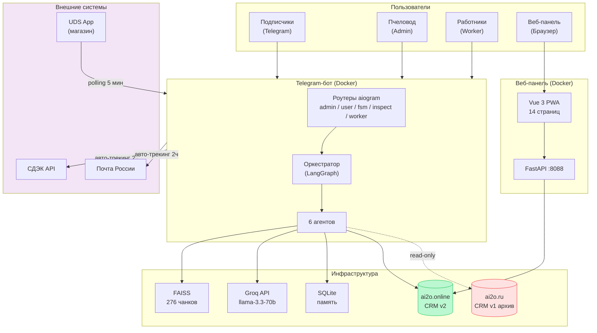
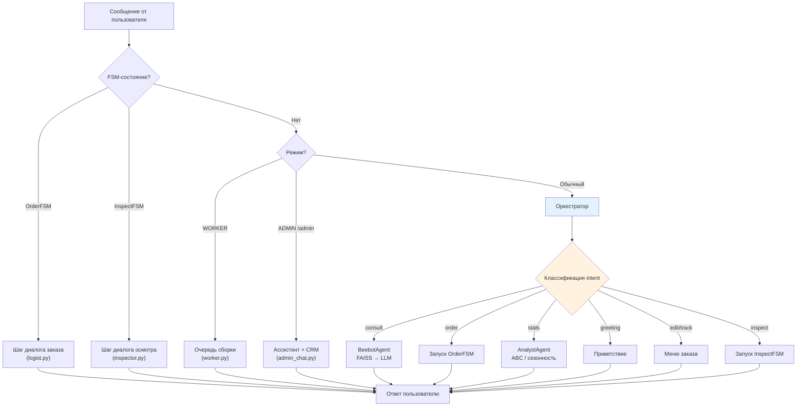
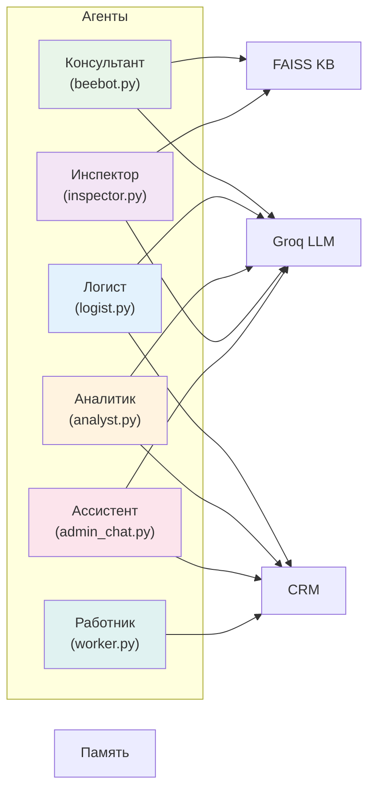
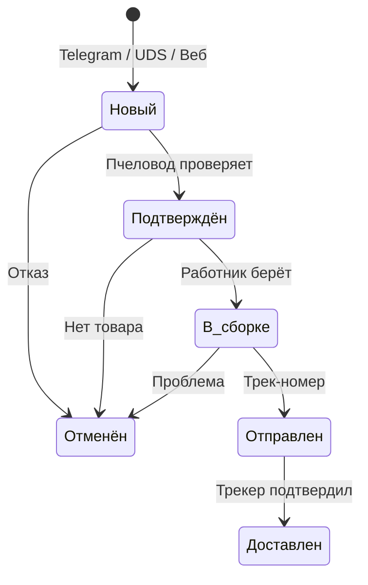
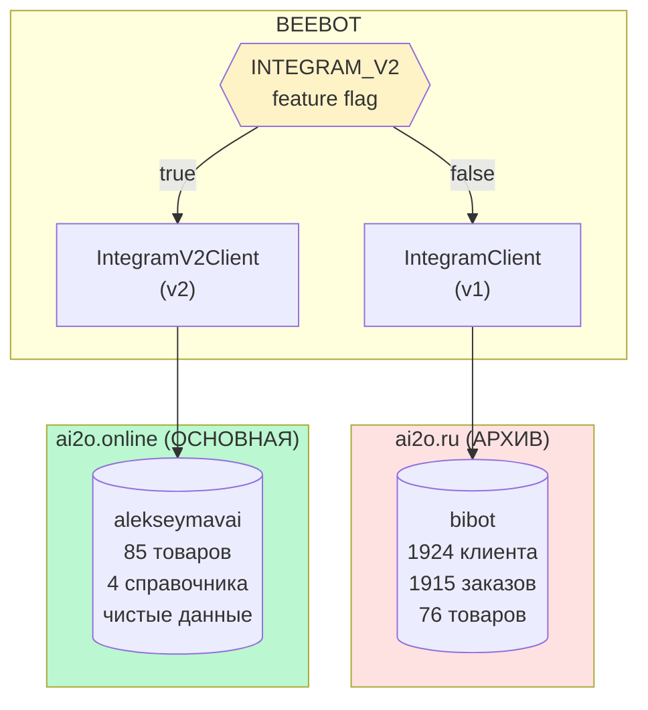
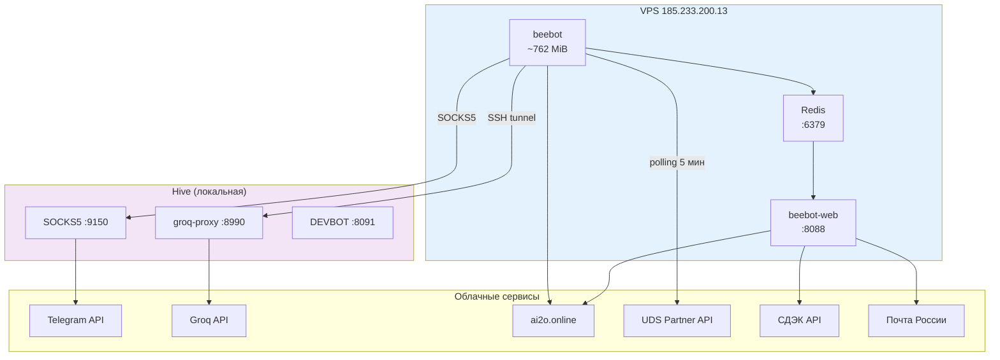
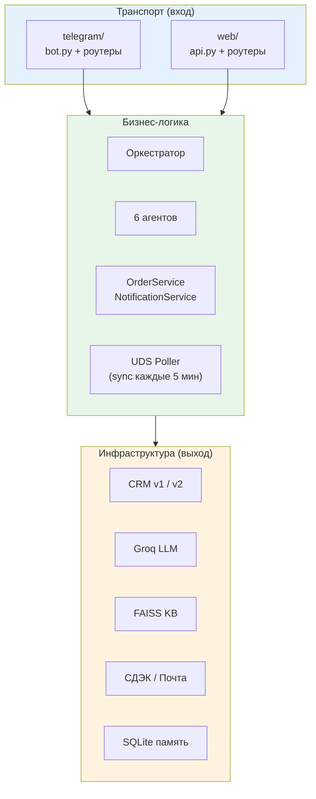
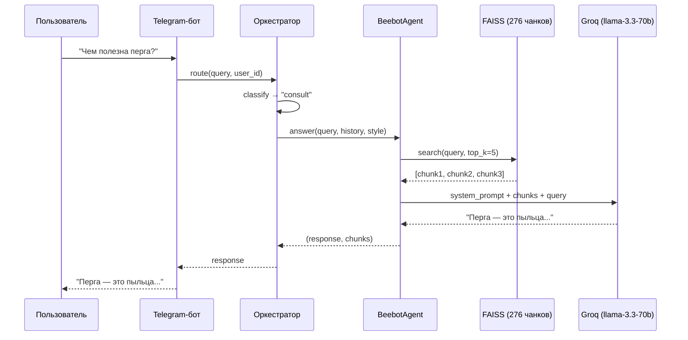
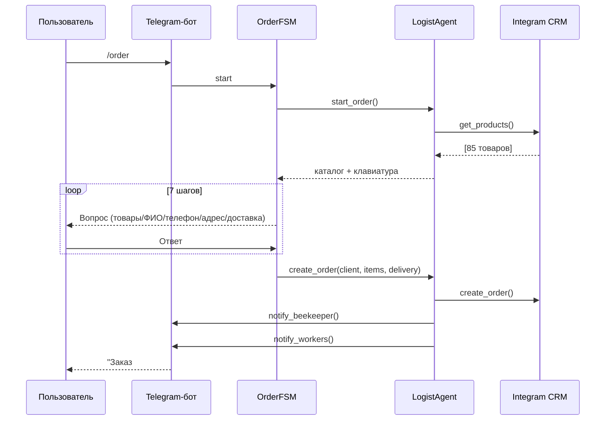
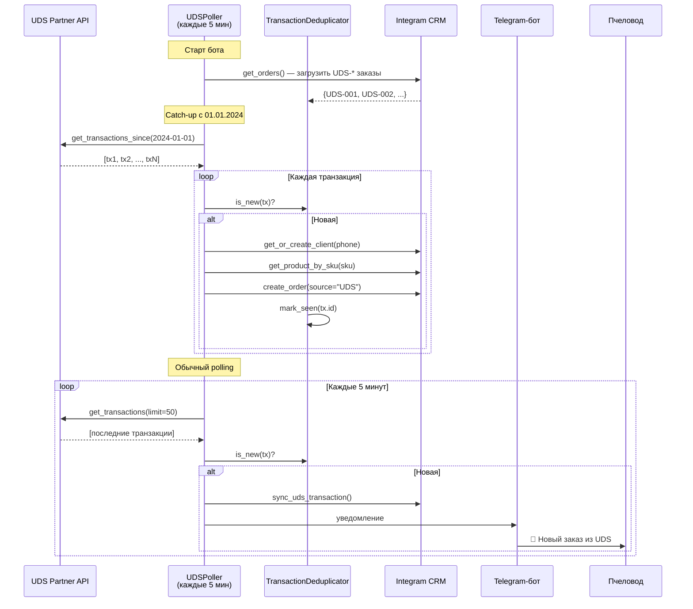

# BEEBOT — Архитектурные диаграммы

> **Версия:** 3 апреля 2026

---

## 1. Общая архитектура



---

## 2. Оркестратор: маршрутизация интентов



---

## 3. Агенты: зависимости и возможности



### Сравнительная таблица агентов

| Агент | KB | CRM | LLM | Вход | Выход |
|---|---|---|---|---|---|
| Консультант | Чтение | — | Groq | consult | Текст + источники |
| Логист | — | Запись | Groq | order (FSM) | Заказ в CRM |
| Аналитик | — | Чтение | Groq | stats | Отчёт (текст) |
| Инспектор | Чтение | — | Groq | /inspect (FSM) | Рекомендация |
| Ассистент | — | CrmSnapshot | Groq | /admin | Диалог |
| Работник | — | Чтение+Запись | — | /start (worker) | Кнопки |

---

## 4. Жизненный цикл заказа



### Источники заказов

| Источник | Как попадает | Уведомления |
|----------|-------------|-------------|
| Telegram FSM | logist.py → CRM | Пчеловод + работники |
| UDS-магазин | uds.py → CRM | Пчеловод + работники |
| Веб-панель | orders.py → CRM | Только пчеловод |

---

## 5. CRM: две системы



### Схема таблиц CRM v2

```mermaid
erDiagram
    CATEGORIES["Категории (151)"] ||--o{ PRODUCTS["Товары (581)"] : "группирует"
    SOURCES["Источники (15)"] ||--o{ CLIENTS["Клиенты (52)"] : "канал"
    SOURCES ||--o{ ORDERS["Заказы (60)"] : "канал"
    STATUSES["Статусы (152)"] ||--o{ ORDERS : "текущий"
    DELIVERY["Доставка (150)"] ||--o{ ORDERS : "способ"
    CLIENTS ||--o{ ORDERS : "размещает"
    ORDERS ||--o{ ORDER_ITEMS["Позиции (78)"] : "содержит"
    PRODUCTS ||--o{ ORDER_ITEMS : "товар"

    PRODUCTS {
        int id PK
        string name
        float price
        int stock
        ref category
    }

    CLIENTS {
        int id PK
        string full_name
        string phone
        int telegram_id
        string city
    }

    ORDERS {
        int id PK
        datetime date
        ref client
        ref status
        ref delivery
        float total
        string tracking
    }

    ORDER_ITEMS {
        int id PK
        ref order
        ref product
        int quantity
        float price
    }
```

---

## 6. Инфраструктура: туннели и деплой



### Docker-контейнеры

| Контейнер | Образ | RAM | Порт |
|-----------|-------|-----|------|
| redis | redis:7-alpine | ~20 MiB | 6379 |
| beebot | Python 3.12 + FAISS + Groq | ~762 MiB | — |
| beebot-web | Python 3.12 + Vue dist | ~50 MiB | 8088 |

---

## 7. Файловая структура: три слоя



---

## 8. Поток консультации: пользователь → ответ



---

## 9. Поток заказа: FSM 7 шагов



---

## 10. UDS-синхронизация: магазин → CRM



### Компоненты UDS-интеграции

| Компонент | Файл | Назначение |
|-----------|------|-----------|
| UDSClient | src/integrations/uds.py | REST-клиент UDS Partner API v2 (Basic Auth, retry 3×) |
| UDSPoller | src/integrations/uds.py | Фоновый polling + catch-up + дедупликация |
| TransactionDeduplicator | src/integrations/uds.py | Хранит обработанные ID, загружает из CRM при старте |
| sync_uds_transaction() | src/integrations/uds.py | Транзакция → клиент → товары по SKU → заказ → уведомление |
| sync_uds_catalog() | src/integrations/uds.py | Сопоставление каталога UDS ↔ Integram по артикулу |

### Известные ограничения

- **SKU-матчинг** — если артикул UDS не совпадает с полем «Артикул UDS» в CRM, товар не находится → `product_id=0`
- **Дедупликация в RAM** — при рестарте заново загружается из CRM (надёжно, но медленно при большом числе заказов)
- **Нет обратной синхронизации** — изменения в CRM не отправляются обратно в UDS

---

## 11. Голос Улья: 5 стилей

| Стиль | Описание | Когда использовать |
|-------|---------|-------------------|
| Наставник | Тёплый, отеческий тон | По умолчанию |
| Практик | Конкретные советы, цифры | Опытные пчеловоды |
| Селекционер | Научный подход, исследования | Вопросы о генетике, породах |
| Зимовщик | Спокойный, вдумчивый | Зимний период, подготовка |
| Эколог | Природа, экосистема | Вопросы о среде обитания |

---

*Связанные документы: [analysis.md](../analysis.md) | [plan.md](../plan.md) | [README.md](../README.md)*
