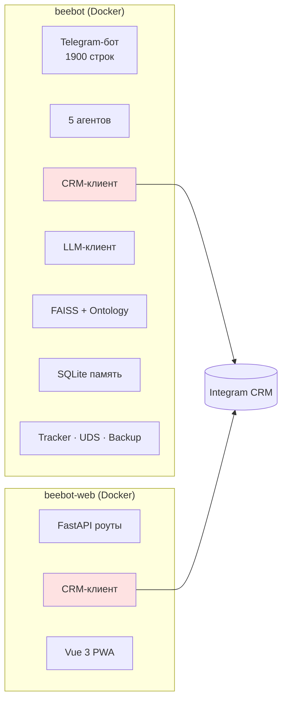
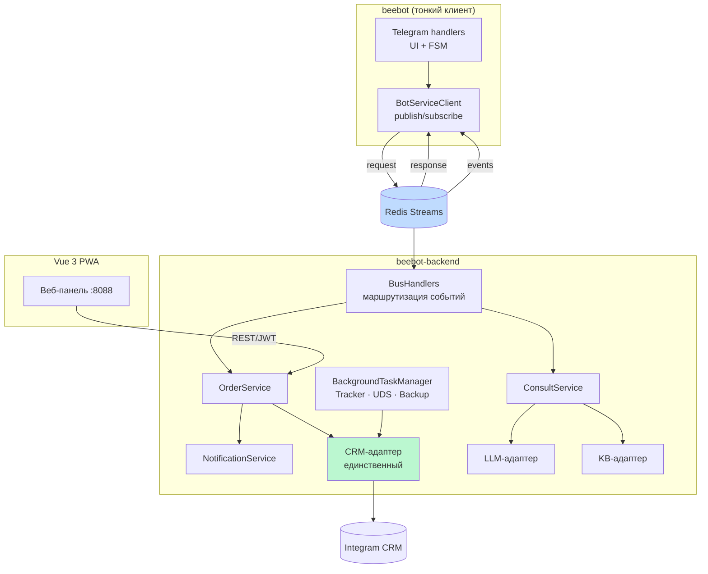
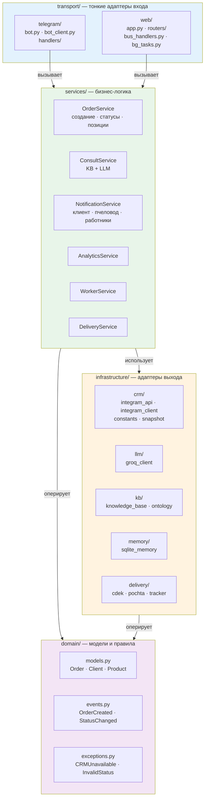
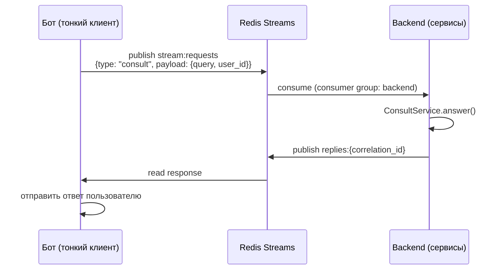
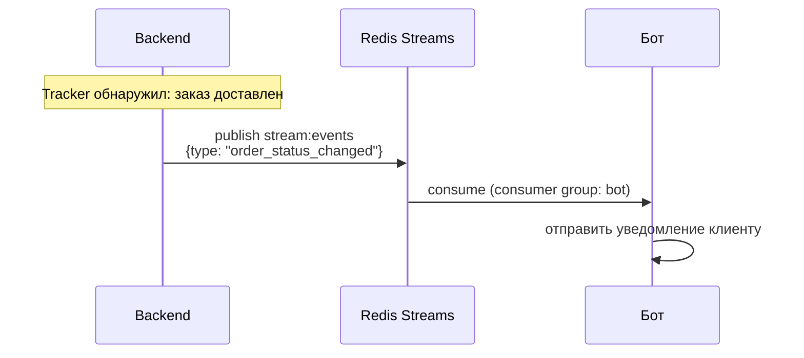
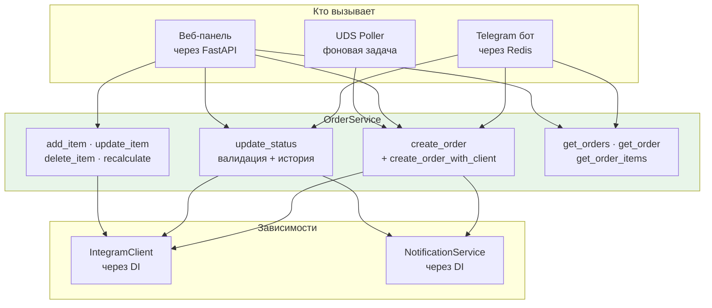
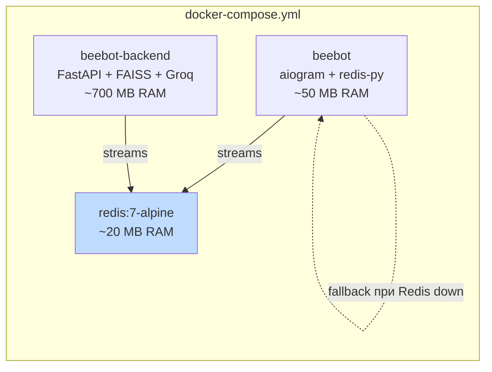
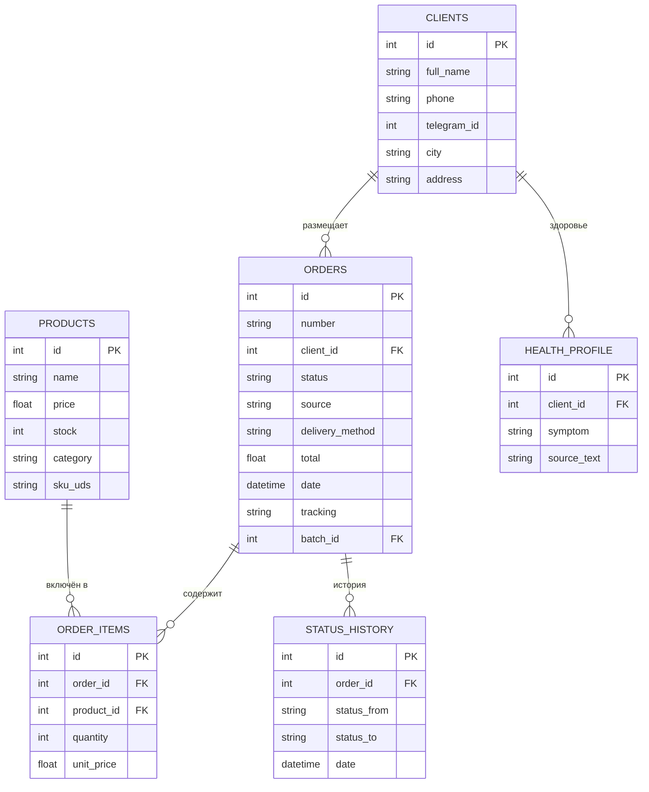
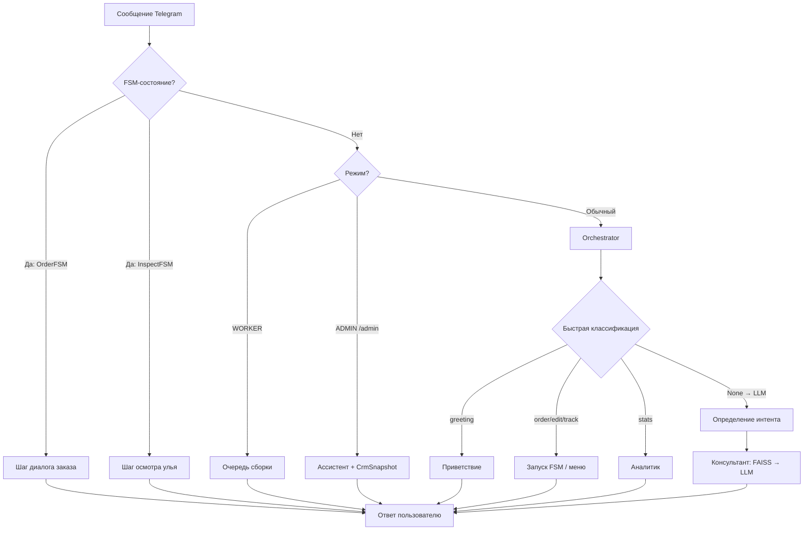
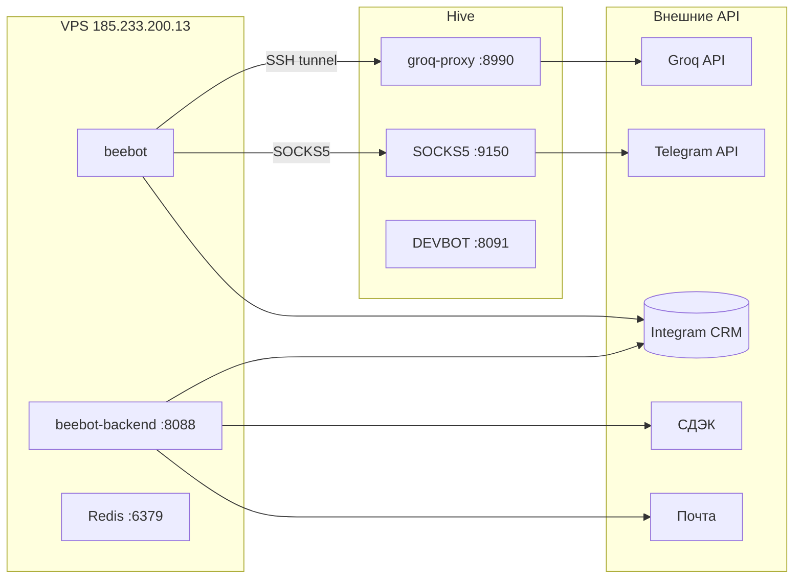

# BEEBOT — Архитектурные диаграммы

> **Версия:** 2 апреля 2026
> **Ключевое изменение:** Hexagonal Architecture (steps 0–5)

---

## 0. Было → Стало: общий обзор

### БЫЛО: два монолита с общей CRM



**Проблемы:** бизнес-логика в двух местах, CRM доступ отовсюду, бот = толстый монолит, нет общения между процессами.

### СТАЛО: три процесса + Redis Streams + Service Layer



**Что изменилось:**
- Бот не знает про CRM/LLM/KB — только кнопки + Redis
- Один OrderService для бота, веба и UDS
- CRM доступ только из infrastructure/crm/
- Фоновые задачи с авто-рестартом и мониторингом

---

## 1. Структура файлов: три слоя



---

## 2. Redis Streams: протокол событий

### Bot → Backend (запросы)



### Backend → Bot (события)



### Типы событий

| Направление | type | payload |
|---|---|---|
| Bot → Backend | `consult` | user_id, query, history, style |
| Bot → Backend | `create_order` | client_id, items, delivery |
| Bot → Backend | `update_order_status` | order_id, status, role |
| Bot → Backend | `get_orders` | client_id, status |
| Bot → Backend | `analytics_query` | query, admin_id |
| Bot → Backend | `ping` | — |
| Backend → Bot | `order_status_changed` | order_id, status, client_tg_id |
| Backend → Bot | `delivery_update` | order_id, tracking_status |
| Backend → Bot | `new_order_from_web` | order_id, order_number |

---

## 3. OrderService: единый источник правды



**Было:** 3 разных реализации создания заказа (logist.py, orders.py, uds.py).
**Стало:** один `OrderService.create_order()` с единой логикой уведомлений.

---

## 4. BackgroundTaskManager

```mermaid
graph TB
    MGR[BackgroundTaskManager]

    MGR --> T1[CRM Snapshot<br/>каждые 5 мин]
    MGR --> T2[OrderTracker<br/>каждые 2 часа]
    MGR --> T3[UDS Poller<br/>каждые 5 мин]
    MGR --> T4[TunnelMonitor<br/>каждые 60 сек]
    MGR --> T5[BackupManager<br/>ежедневно]

    T1 & T2 & T3 & T4 & T5 -->|crash| MGR
    MGR -->|auto-restart<br/>+ алерт пчеловоду| T1 & T2 & T3 & T4 & T5

    HEALTH[GET /api/health] --> MGR
    MGR -->|status()| HEALTH
```

**Было:** `asyncio.create_task()` — fire-and-forget, падение незаметно.
**Стало:** авто-рестарт при падении, экспоненциальный backoff, алерты, `/api/health`.

---

## 5. Docker: три контейнера



**Независимый деплой:**
- `docker compose stop beebot` → веб-панель работает
- `docker compose stop beebot-backend` → бот отвечает «Сервис недоступен»

---

## 6. CRM: схема данных



---

## 7. Поток запроса: Telegram → ответ



---

## 8. Агенты: сравнительная таблица

| Агент | KB | CRM | LLM | Вход | Особенности |
|---|---|---|---|---|---|
| Консультант | FAISS | — | Groq | consult | Голос Улья (5 стилей) |
| Логист | — | Запись | Groq | order | FSM 7 шагов |
| Аналитик | — | Чтение | Groq | stats | ABC, сезонность, прогноз |
| Инспектор | FAISS | — | Groq | /inspect | 3 вопроса → рекомендация |
| Ассистент | — | CrmSnapshot | Groq | /admin | Свободный диалог |
| Worker | — | Чтение+Запись | — | /start | inbox + DEFERRED |
| CrmAgent | — | Единственный | — | внутренний | Через GiftBroker |
| DEVBOT | — | DEV-таблицы | Claude | /dev | Только hive |

---

## 9. Источники заказов

| Источник | Через что попадает | Позиции | Уведомления |
|---|---|---|---|
| Telegram (FSM) | OrderService.create_order_with_client | Полные | Пчеловод + работники |
| UDS-магазин | OrderService.create_order | По sku_uds | Пчеловод + работники |
| Веб-панель | OrderService.create_order | Ручной ввод | Пчеловод + работники |
| ВК / Instagram | Ручной ввод через веб | Ручной | — |

---

## 10. Инфраструктура: туннели



---

*Связанные документы: [analysis.md](../analysis.md) · [plan.md](../plan.md)*
