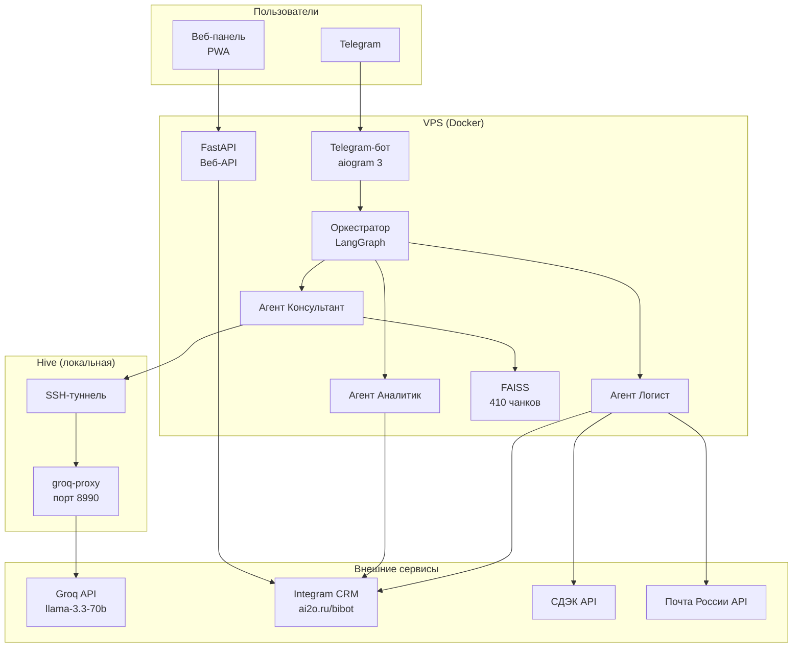
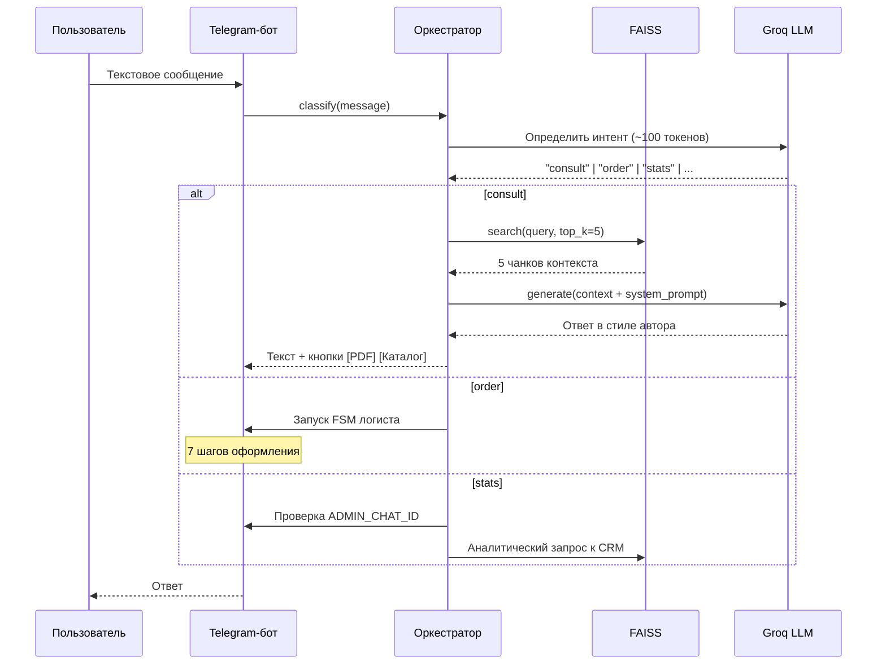
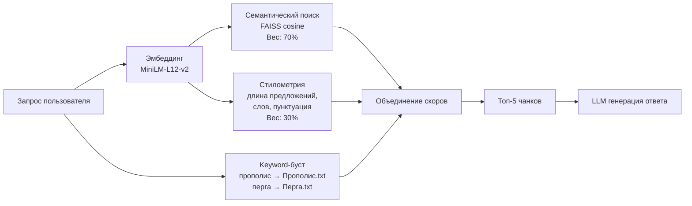
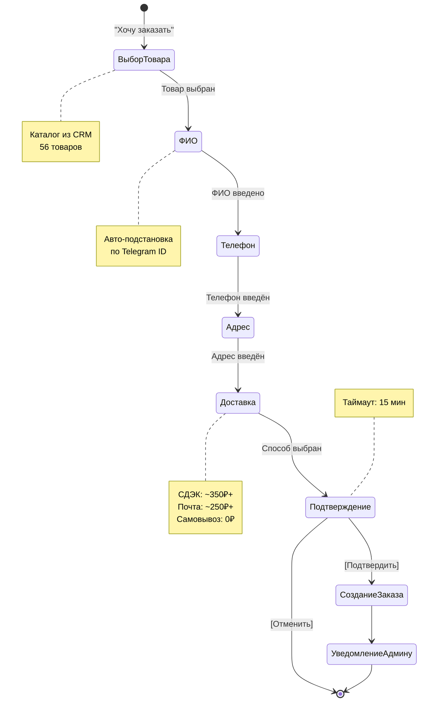
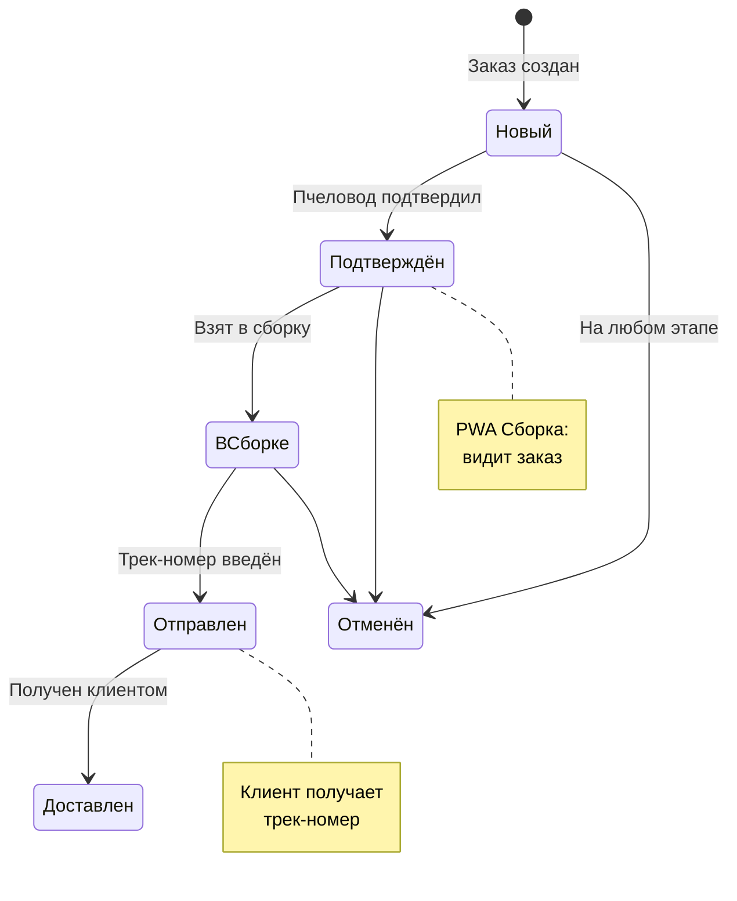
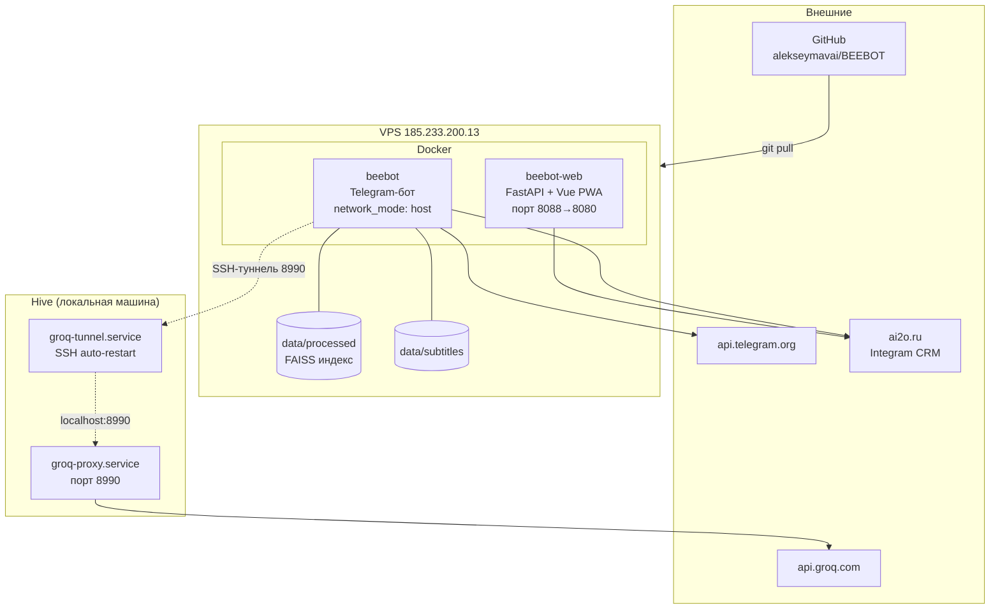

# BEEBOT — Архитектурные диаграммы

> Версия: 16 марта 2026

---

## 1. Общая архитектура системы



---

## 2. Поток обработки сообщения



---

## 3. Гибридный поиск в базе знаний



**Источники данных:**

| Тип | Кол-во | Описание |
|-----|--------|----------|
| PDF-инструкции | 19 | Перга, прополис, ПЖВМ, гомогенат и др. |
| Тексты | 21 | Очищенные выдержки из PDF |
| YouTube | 26 | Расшифровки видео с канала @a.dmitrov |

---

## 4. FSM оформления заказа (Логист)



---

## 5. Жизненный цикл заказа



---

## 6. Инфраструктура и деплой



---

## 7. Веб-панель (PWA)

```mermaid
graph LR
    subgraph Frontend["Vue 3 + PrimeVue"]
        DASH[Дашборд<br/>графики, статистика]
        ORD[Заказы<br/>список, детали, создание]
        CLI[Клиенты<br/>список, карточка]
        PROD[Товары<br/>каталог, CRUD]
        PACK[Сборка<br/>PWA терминал]
        STOCK[Склад<br/>PWA терминал]
        JOUR[Журнал<br/>по месяцам]
    end

    subgraph PWA["PWA / Offline"]
        SW[Service Worker<br/>кэш статики]
        IDB[IndexedDB<br/>кэш API + sync queue]
    end

    subgraph Backend["FastAPI"]
        AUTH[JWT Auth]
        APIO[/api/orders]
        APIC[/api/clients]
        APIP[/api/products]
        APID[/api/dashboard]
    end

    DASH --> APID
    ORD --> APIO
    CLI --> APIC
    PROD --> APIP
    PACK --> APIO
    STOCK --> APIP
    PACK -.-> IDB
    STOCK -.-> IDB
    Frontend --> AUTH
    AUTH --> Backend
```

---

## 8. Сравнение модулей

| Модуль | Строк кода | Зависимости | Состояние |
|--------|-----------|-------------|-----------|
| `bot.py` | ~900 | aiogram, LangGraph | Production, работает |
| `orchestrator.py` | ~250 | LangGraph, Groq | Production |
| `agents/beebot.py` | ~150 | FAISS, Groq | Production |
| `agents/logist.py` | ~200 | CRM, доставка | Beta (нет записи в CRM) |
| `agents/analyst.py` | ~180 | CRM | Beta |
| `integram_api.py` | ~400 | httpx | Production |
| `integram_client.py` | ~300 | httpx | Дубликат integram_api |
| `web/api.py` | ~910 | FastAPI, CRM | Production |
| `delivery/cdek.py` | ~100 | httpx | Заглушка (hardcoded) |
| `delivery/pochta.py` | ~80 | httpx | Заглушка (hardcoded) |
| `integrations/uds.py` | ~350 | httpx | Нерабочий (баг) |
| `knowledge_base.py` | ~200 | FAISS, transformers | Production |
| `web/server.py` | ~80 | starlette | Production, PWA |

---

*Анализ проблем: [analysis.md](../analysis.md)*
*План развития: [plan.md](../plan.md)*
