# BEEBOT — Архитектурные диаграммы

> **Версия:** 3 апреля 2026 (обновлено: Service Layer refactoring)

---

## 1. Общая архитектура

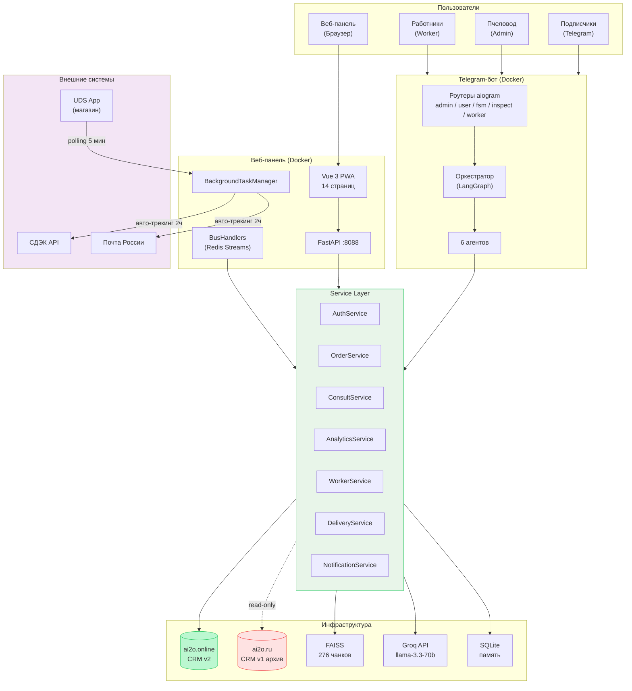

---

## 2. Service Layer: архитектура слоёв

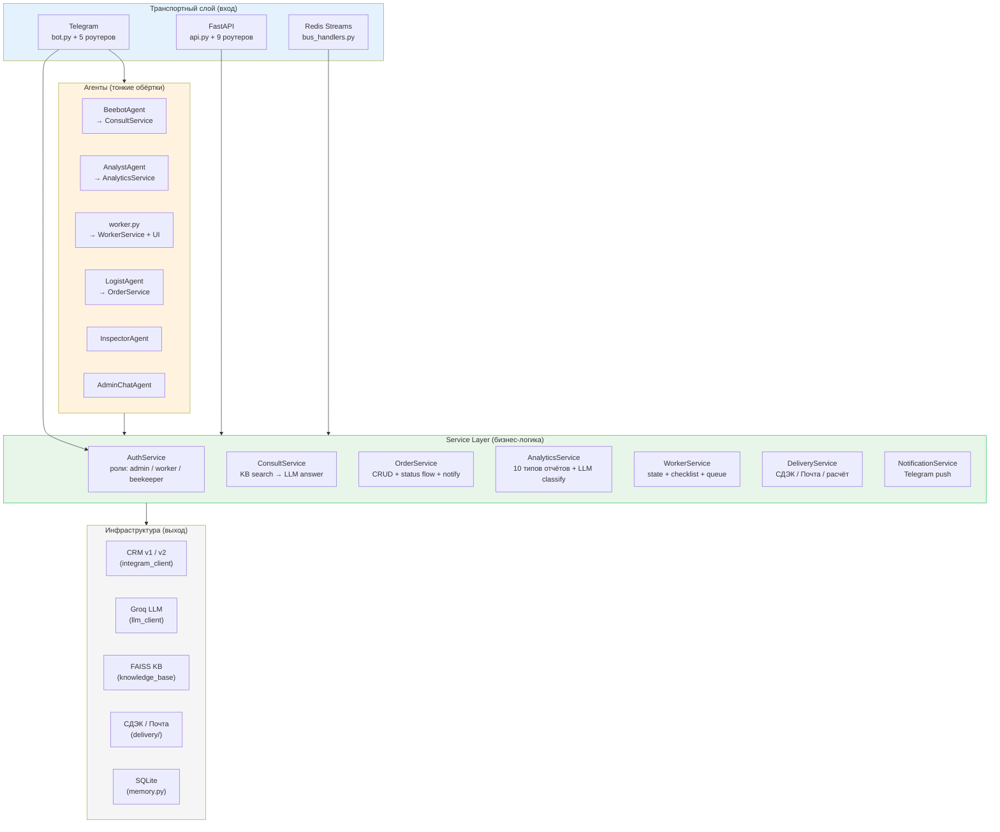

### Таблица сервисов

| Сервис | Файл | Зависимости | Ответственность |
|--------|------|-------------|----------------|
| AuthService | `services/auth_service.py` | config (IDs) | Проверка ролей: admin, worker, beekeeper |
| ConsultService | `services/consult_service.py` | KB, LLM, TunnelMonitor | Поиск по KB + генерация ответа, FAQ fallback |
| OrderService | `services/order_service.py` | CRM, NotificationService | CRUD заказов, status flow, валидация |
| AnalyticsService | `services/analytics_service.py` | CRM, Groq | 10 типов отчётов, LLM/keyword classify |
| WorkerService | `services/worker_service.py` | — (in-memory) | Состояние работника, чеклисты, очередь |
| DeliveryService | `services/delivery_service.py` | Calculator, Tracker | Расчёт доставки, трекинг |
| NotificationService | `services/notification_service.py` | TelegramSender callback | Push в Telegram: пчеловод, клиент, работники |

---

## 3. Оркестратор: маршрутизация интентов

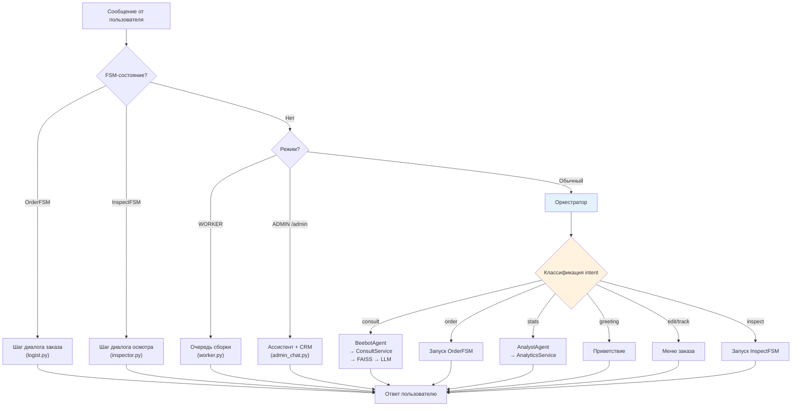

---

## 4. Агенты: зависимости и делегирование

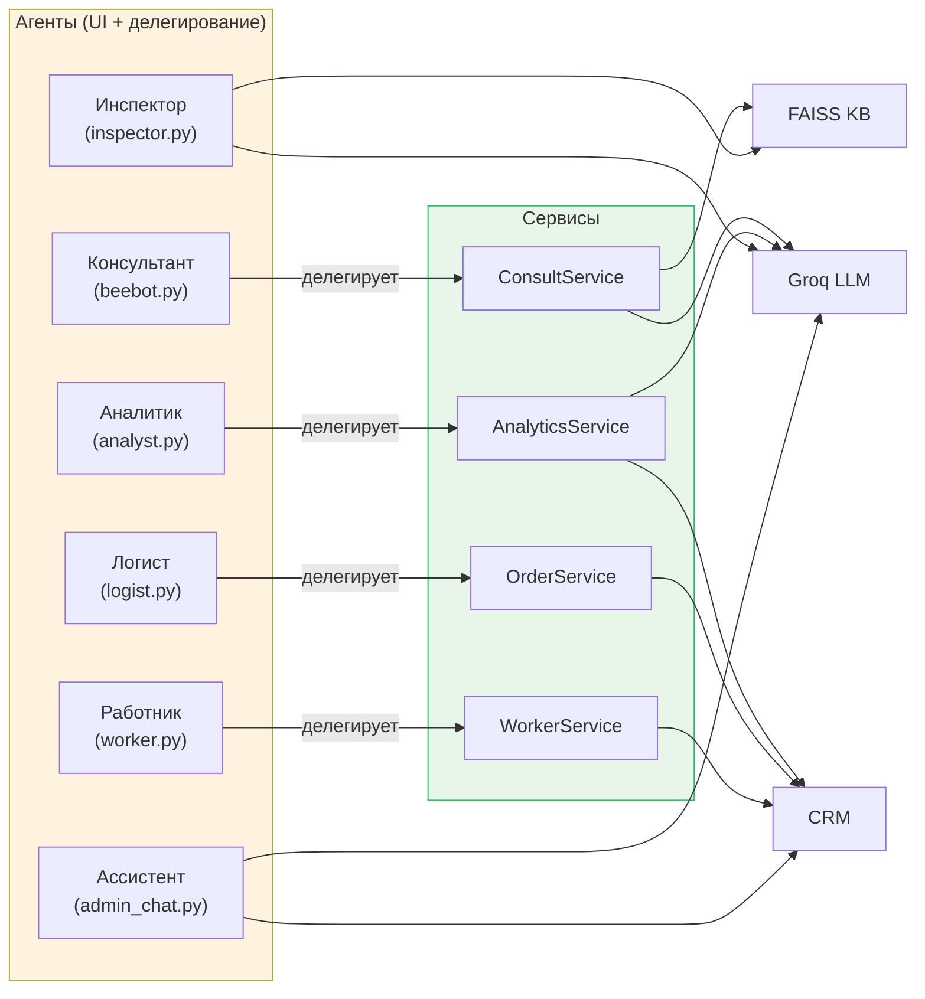

### Сравнительная таблица агентов

| Агент | Сервис | KB | CRM | LLM | Вход | Выход |
|---|---|---|---|---|---|---|
| Консультант | ConsultService | Чтение | — | Groq | consult | Текст + источники |
| Логист | OrderService | — | Запись | Groq | order (FSM) | Заказ в CRM |
| Аналитик | AnalyticsService | — | Чтение | Groq | stats | Отчёт (текст) |
| Инспектор | — | Чтение | — | Groq | /inspect (FSM) | Рекомендация |
| Ассистент | — | — | CrmSnapshot | Groq | /admin | Диалог |
| Работник | WorkerService | — | Чтение+Запись | — | /start (worker) | Кнопки |

---

## 5. BackgroundTaskManager: фоновые задачи

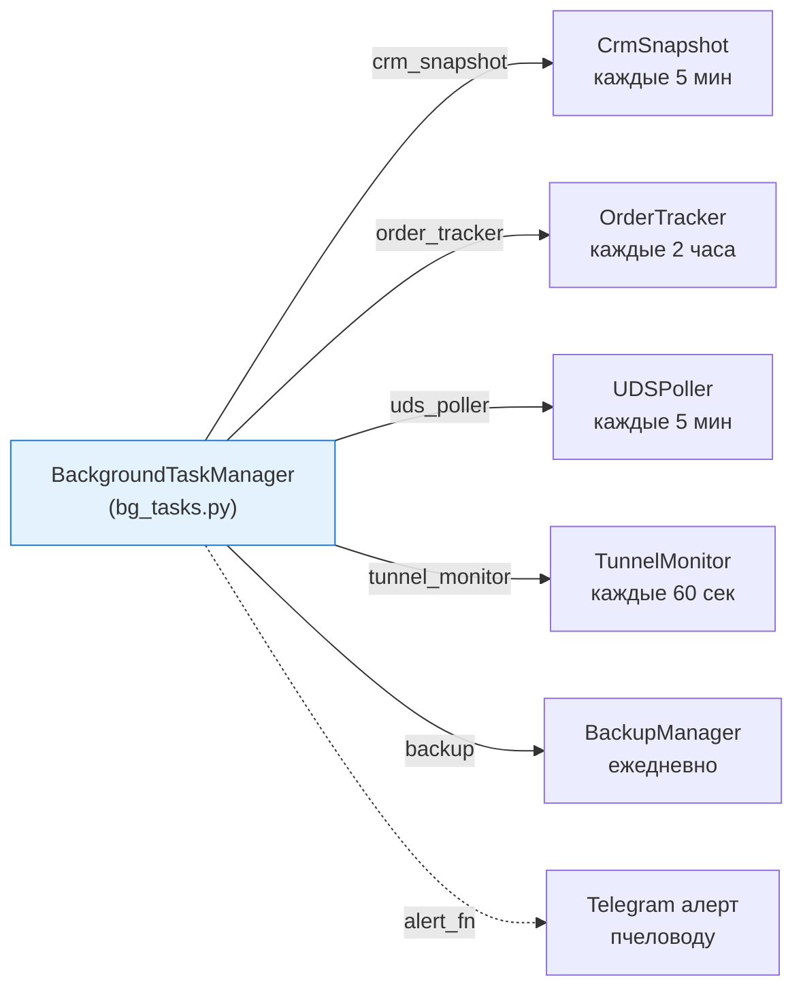

**Возможности:**
- Авто-рестарт при падении (экспоненциальная пауза, макс 60 сек)
- Мониторинг: `bg.status()` → состояние, uptime, число рестартов
- Graceful shutdown: `bg.stop_all()` при остановке бота

---

## 6. Жизненный цикл заказа

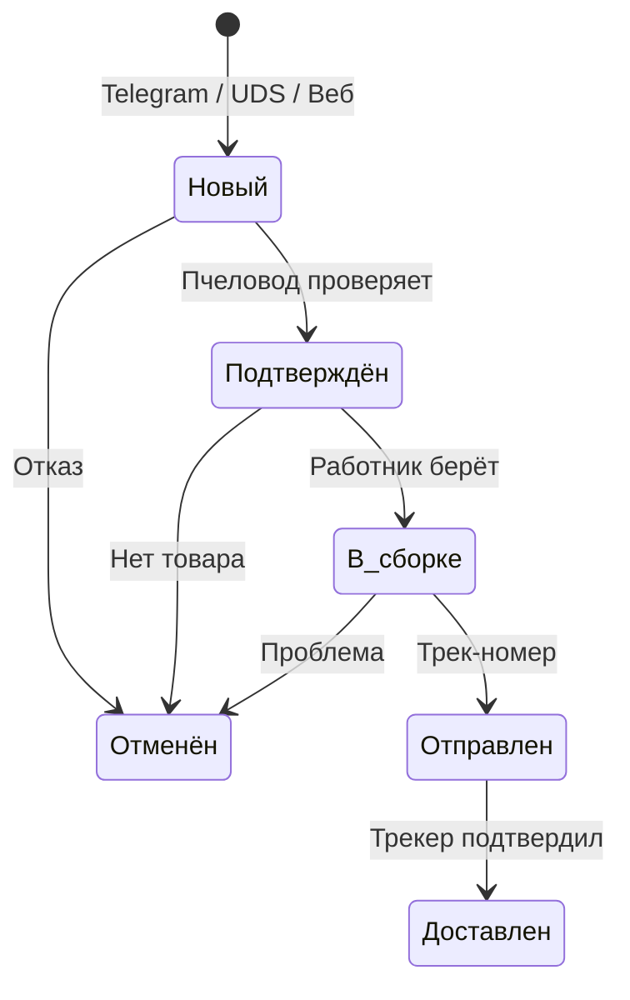

### Источники заказов

| Источник | Как попадает | Уведомления |
|----------|-------------|-------------|
| Telegram FSM | LogistAgent → OrderService → CRM | Пчеловод + работники |
| UDS-магазин | UDSPoller → CRM | Пчеловод + работники |
| Веб-панель | orders.py → CRM | Только пчеловод |

---

## 7. CRM: две системы

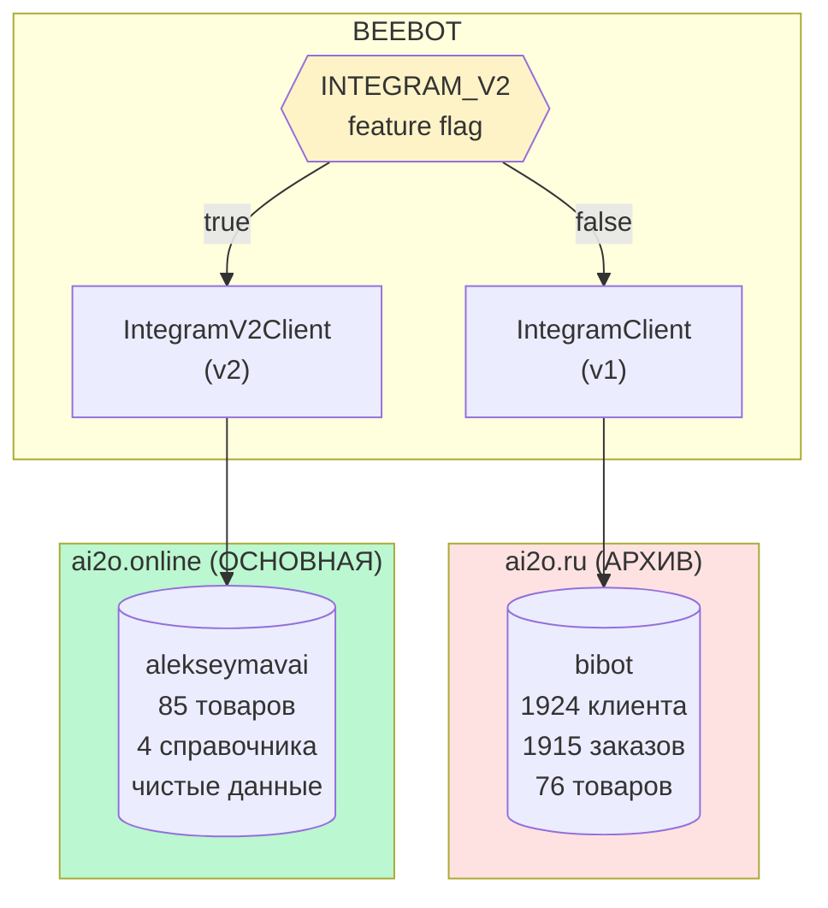

### Схема таблиц CRM v2

```mermaid
erDiagram
    CATEGORIES["Категории (151)"] ||--o{ PRODUCTS["Товары (581)"] : "группирует"
    SOURCES["Источники (15)"] ||--o{ CLIENTS["Клиенты (52)"] : "канал"
    SOURCES ||--o{ ORDERS["Заказы (60)"] : "канал"
    STATUSES["Статусы (152)"] ||--o{ ORDERS : "текущий"
    DELIVERY["Доставка (150)"] ||--o{ ORDERS : "способ"
    CLIENTS ||--o{ ORDERS : "размещает"
    ORDERS ||--o{ ORDER_ITEMS["Позиции (78)"] : "содержит"
    PRODUCTS ||--o{ ORDER_ITEMS : "товар"

    PRODUCTS {
        int id PK
        string name
        float price
        int stock
        ref category
    }

    CLIENTS {
        int id PK
        string full_name
        string phone
        int telegram_id
        string city
    }

    ORDERS {
        int id PK
        datetime date
        ref client
        ref status
        ref delivery
        float total
        string tracking
    }

    ORDER_ITEMS {
        int id PK
        ref order
        ref product
        int quantity
        float price
    }
```

---

## 8. Инфраструктура: туннели и деплой

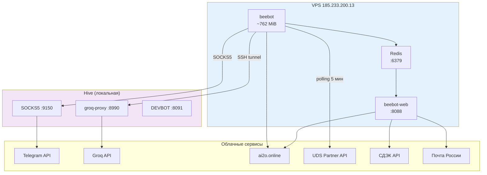

### Docker-контейнеры

| Контейнер | Образ | RAM | Порт |
|-----------|-------|-----|------|
| redis | redis:7-alpine | ~20 MiB | 6379 |
| beebot | Python 3.12 + FAISS + Groq | ~762 MiB | — |
| beebot-web | Python 3.12 + Vue dist | ~50 MiB | 8088 |

---

## 9. Файловая структура: четыре слоя

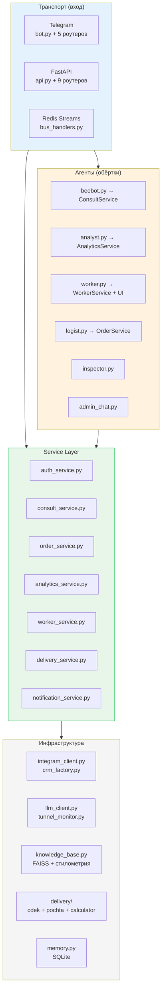

---

## 10. Поток консультации: пользователь → ответ

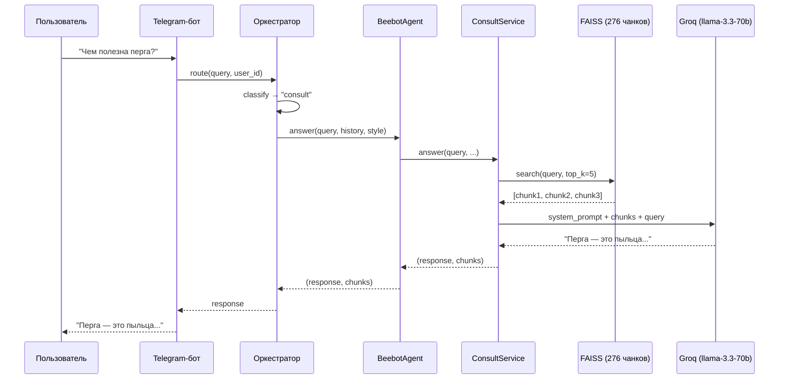

---

## 11. Поток заказа: FSM 7 шагов

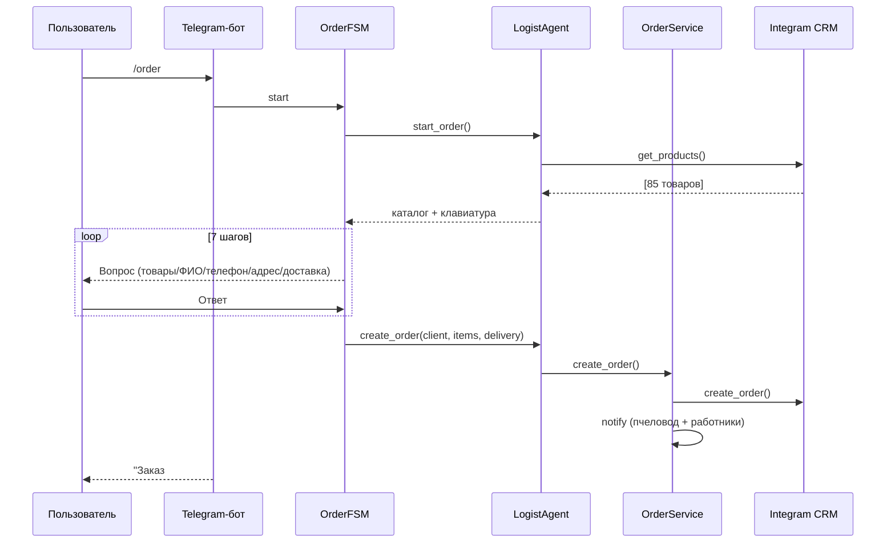

---

## 12. UDS-синхронизация: магазин → CRM

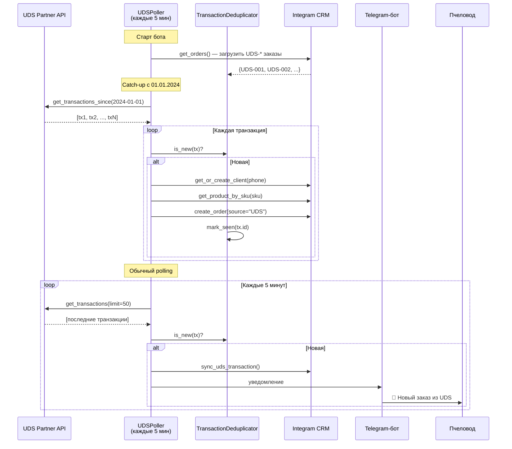

### Компоненты UDS-интеграции

| Компонент | Файл | Назначение |
|-----------|------|-----------|
| UDSClient | src/integrations/uds.py | REST-клиент UDS Partner API v2 (Basic Auth, retry 3×) |
| UDSPoller | src/integrations/uds.py | Фоновый polling + catch-up + дедупликация |
| TransactionDeduplicator | src/integrations/uds.py | Хранит обработанные ID, загружает из CRM при старте |
| sync_uds_transaction() | src/integrations/uds.py | Транзакция → клиент → товары по SKU → заказ → уведомление |
| sync_uds_catalog() | src/integrations/uds.py | Сопоставление каталога UDS ↔ Integram по артикулу |

---

## 13. Голос Улья: 5 стилей

| Стиль | Описание | Когда использовать |
|-------|---------|-------------------|
| Наставник | Тёплый, отеческий тон | По умолчанию |
| Практик | Конкретные советы, цифры | Опытные пчеловоды |
| Селекционер | Научный подход, исследования | Вопросы о генетике, породах |
| Зимовщик | Спокойный, вдумчивый | Зимний период, подготовка |
| Эколог | Природа, экосистема | Вопросы о среде обитания |

---

*Связанные документы: [analysis.md](../analysis.md) | [plan.md](../plan.md) | [README.md](../README.md)*
