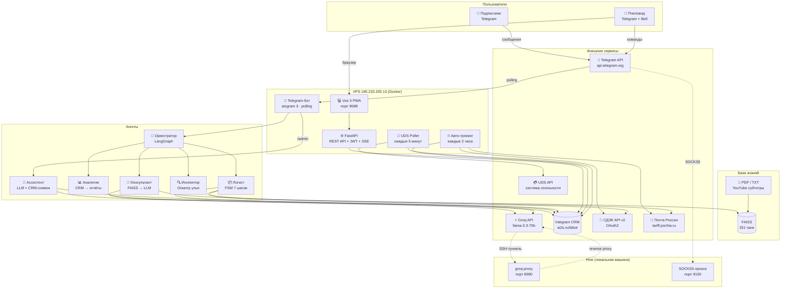
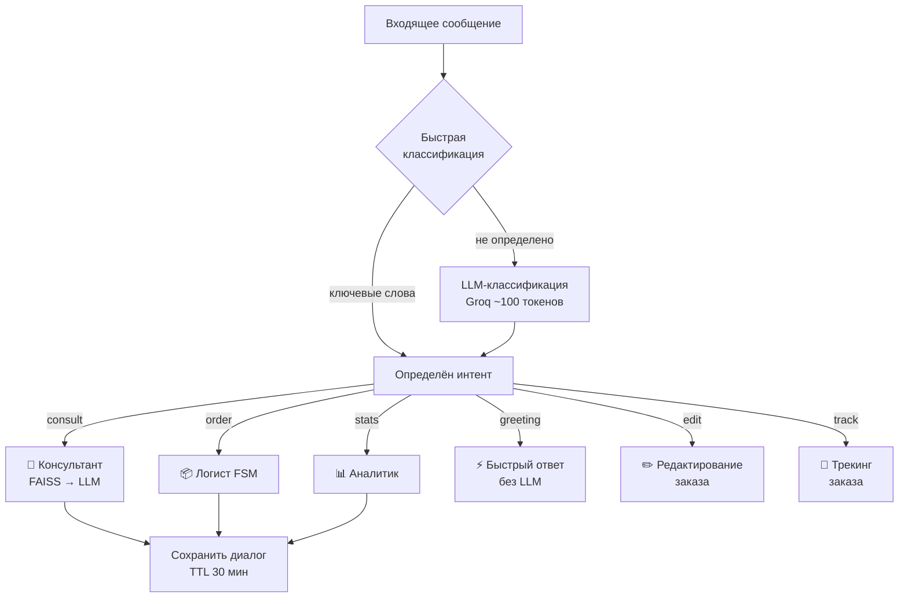
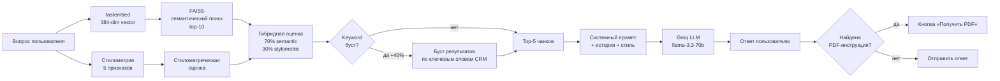
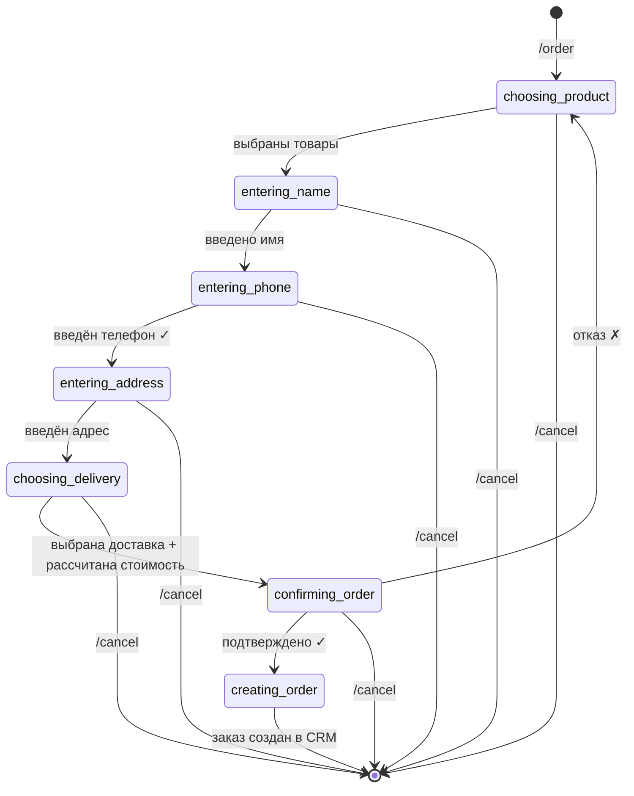
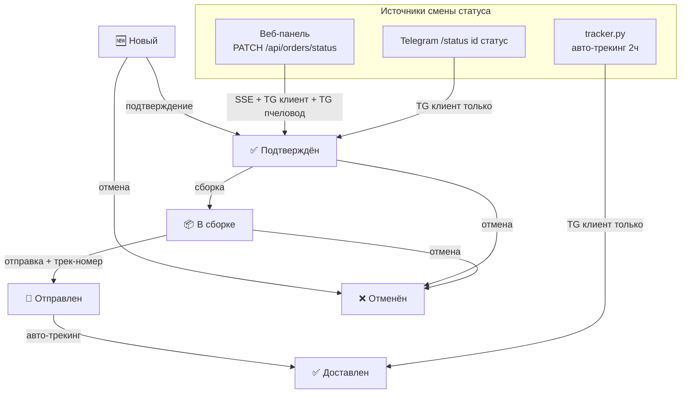
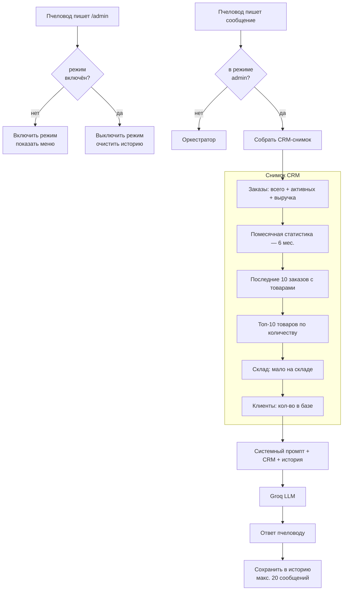
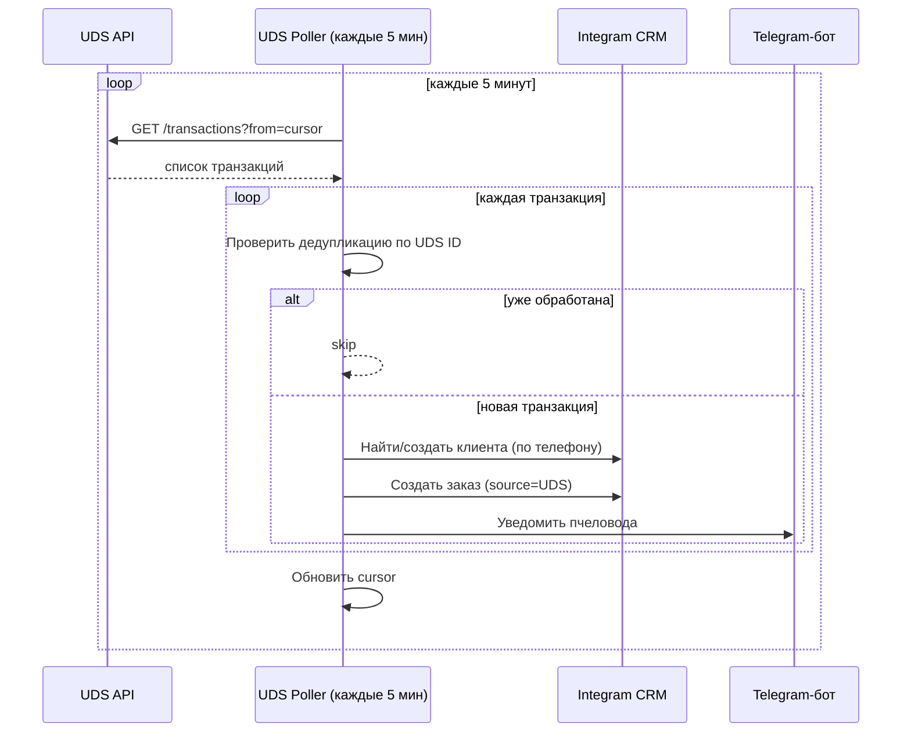
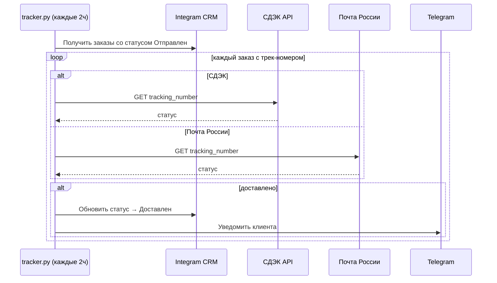

# BEEBOT — Архитектурные диаграммы

> **Версия:** 24 марта 2026

---

## 1. Общая архитектура системы



---

## 2. Оркестратор — Маршрутизация интентов



### Быстрая классификация (keyword matching)

| Интент | Ключевые слова |
|--------|---------------|
| greeting | привет, здравствуйте, добрый день, hi, hello |
| order | заказать, купить, хочу заказ, оформить |
| edit | изменить заказ, поменять адрес, скорректировать |
| track | где мой заказ, трек, отслеживание, статус заказа |
| stats | выручка, статистика, продажи, отчёт, ABC, сезонность, прогноз (только ADMIN) |

---

## 3. Консультант — Гибридный поиск



### Базы знаний

| Источник | Файлов | Чанков | Примечание |
|----------|--------|--------|-----------|
| Тексты (data/texts/) | 21 | ~190 | Основной источник, вручную очищенные |
| YouTube субтитры | 26 | ~61 | Расшифровки видео @a.dmitrov |
| PDFs (data/pdfs/) | 19 | — | Перекрыты текстами, не индексируются |
| **Итого** | **47** | **251** | |

---

## 4. Логист — FSM оформления заказа (7 шагов)



### Тайм-ауты и предзаполнение

| Событие | Действие |
|---------|----------|
| Таймаут 15 мин | FSM автоматически сбрасывается |
| Повторный клиент | Имя и телефон предзаполняются из CRM |
| Повторный адрес | Предлагается последний адрес доставки |
| Расчёт доставки | СДЭК / Почта России / Самовывоз |

### Создание заказа в CRM

```
LogistAgent.create_order()
  → IntegramClient.create_order(client_id, items, delivery, ...)
    → IntegramAPI.create_object(TABLE_ORDERS, number, reqs)
    → для каждого товара: IntegramAPI.create_object(TABLE_ORDER_ITEMS, ...)
  → Notifier.new_order(order) → бот пчеловоду
  → notify_client(client_tg_id) → клиенту (если есть TG)
```

---

## 5. Цикл жизни заказа — Статусы и уведомления



> **⚠️ Конфликт:** TG-команда `/status` и авто-трекинг не отправляют SSE и не уведомляют пчеловода. Требует унификации (план 3.2).

---

## 6. Веб-панель — Архитектура

```mermaid
graph LR
    subgraph Frontend["Frontend (Vue 3 + PrimeVue, PWA)"]
        LOGIN[LoginView<br/>JWT auth]
        DASH[DashboardView<br/>6 карточек + 4 графика]
        ORDERS[OrdersView<br/>список + фильтры]
        CLIENTS[ClientsView]
        PRODUCTS[ProductsView]
        PACKING[PackingView<br/>offline PWA]
        STOCK[StockView<br/>offline PWA]
        MONTHLY[MonthlyOrders]
        USERS[UsersView]
    end

    subgraph Backend["Backend (FastAPI, src/web/api.py — 1 384 строки)"]
        AUTH[/api/auth/token]
        DASH_API[/api/dashboard]
        ORDERS_API[/api/orders/*]
        CLIENTS_API[/api/clients/*]
        PRODUCTS_API[/api/products/*]
        SSE[/api/events SSE]
        HEALTH[/api/health]
    end

    subgraph CRM["Integram CRM"]
        DB[(bibot DB<br/>ai2o.ru)]
    end

    DASH --> DASH_API
    ORDERS --> ORDERS_API
    CLIENTS --> CLIENTS_API
    PRODUCTS --> PRODUCTS_API
    LOGIN --> AUTH
    ORDERS --> SSE

    ORDERS_API --> DB
    CLIENTS_API --> DB
    PRODUCTS_API --> DB
    DASH_API --> DB
```

### Offline-режим (PWA)

```
Первый запуск
  → Vue загружает данные из API → сохраняет в IndexedDB
  → Service Worker кэширует статику

Offline
  → PackingView/StockView читают из IndexedDB
  → Изменения пишутся в Sync Queue (IndexedDB)

Reconnect
  → Sync Queue отправляется на сервер
  → IndexedDB обновляется свежими данными
```

---

## 7. Ассистент пчеловода (AdminChatAgent)



---

## 8. UDS-интеграция



---

## 9. Авто-трекинг доставки



---

## 10. LLM-цепочка (через hive)

```
beebot (VPS) → localhost:8990
  → SSH reverse tunnel: VPS:8990 ← hive:8990
  → groq-proxy.service (hive) → api.groq.com

beebot-web (VPS) → SOCKS5 localhost:9150
  → SSH reverse tunnel: VPS:9150 ← hive:9150
  → tg-socks.service (hive) → api.telegram.org
```

### systemd-сервисы на hive

| Сервис | Порт | Назначение |
|--------|------|-----------|
| `groq-proxy.service` | 8990 | Reverse proxy hive → api.groq.com |
| `groq-tunnel.service` | — | SSH-туннель VPS↔hive (8990 + 9150) |
| `tg-socks.service` | 9150 | SOCKS5-прокси для Telegram API |

---

## 11. Сравнительная таблица агентов

| Агент | Вход | Хранение состояния | LLM | CRM | KB |
|-------|------|--------------------|-----|-----|----|
| Оркестратор | сообщение | in-memory + TTL 30мин | ✅ (классификация) | ❌ | ❌ |
| Консультант | запрос + история | in-memory | ✅ (ответ) | ❌ | ✅ FAISS |
| Логист | шаги FSM | aiogram FSMContext | ✅ (подтверждение) | ✅ создание | ❌ |
| Аналитик | запрос аналитики | нет | ✅ (парсинг запроса) | ✅ чтение | ❌ |
| Инспектор | шаги диалога | in-memory | ✅ (вопросы + рекомендация) | ❌ | ✅ FAISS |
| Ассистент | свободный диалог | in-memory (20 сообщ.) | ✅ (диалог) | ✅ снимок | ❌ |

---

## 12. Сравнительная таблица доставки

| Параметр | СДЭК | Почта России | Самовывоз |
|----------|------|-------------|-----------|
| API | v2 REST (OAuth2) | tariff.pochta.ru | — |
| Авторизация | Client ID + Secret | Токен | — |
| Стоимость | по тарифу | по тарифу | 0 ₽ |
| Трекинг | ✅ | ✅ | ❌ |
| Fallback | фикс. 350₽+50₽/кг | фикс. 250₽+30₽/кг | — |
| Кэш локаций | in-memory (города) | почтовые индексы (50+ городов) | — |

---

## 13. Сравнительная таблица уведомлений (текущее состояние)

| Событие | SSE в браузер | TG клиенту | TG пчеловоду | Код |
|---------|:---:|:---:|:---:|-----|
| Смена статуса — **веб** | ✅ | ✅ | ✅ | `web/api.py` + `web/notifications.py` |
| Смена статуса — **TG /status** | ❌ | ✅ | ❌ | `admin.py` + `notifications.py` (Notifier) |
| Смена статуса — **авто-трекинг** | ❌ | ✅ | ❌ | `tracker.py` + `notifications.py` |
| Новый заказ — **бот** | N/A | ✅ | ✅ | `notifications.py` (Notifier) |
| Новый заказ — **UDS** | N/A | N/A | ✅ | `integrations/uds.py` |

> **⚠️ Требует исправления (план 3.2):** Единая функция `update_status_and_notify()` для всех трёх точек смены статуса.

---

*Связанные документы: [analysis.md](../analysis.md) · [plan.md](../plan.md)*
