# BEEBOT — Архитектурные диаграммы

> **Версия:** 30 марта 2026 · Добавлен раздел 10: Эволюция архитектуры (было → станет)

---

## 1. Общая архитектура системы

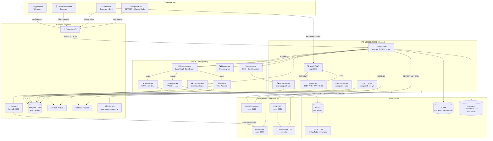

---

## 2. Поток запроса через оркестратор

```mermaid
flowchart TD
    A[📱 Сообщение Telegram] --> B{Это FSM-состояние?}
    B -->|Да — LogistFSM| C[LogistAgent FSM<br/>шаг диалога]
    B -->|Да — InspectFSM| D[InspectorAgent FSM<br/>шаг диалога]
    B -->|Нет| E{Режим пользователя?}

    E -->|WORKER| F[WorkerAgent<br/>очередь сборки]
    E -->|ADMIN /admin| G[AdminChatAgent<br/>CrmSnapshot → LLM]
    E -->|Обычный| H[Orchestrator.route]

    H --> I{_fast_classify}
    I -->|greeting/order/edit/track| J[Немедленный результат<br/>без LLM]
    I -->|None| K[_classify_intent<br/>Groq ~5 токенов]

    J --> L{Intent}
    K --> L

    L -->|consult| M[BeebotAgent<br/>FAISS search → LLM]
    L -->|order| N[passthrough →<br/>bot.py запускает FSM]
    L -->|edit| O[passthrough →<br/>bot.py показывает меню]
    L -->|track| P[passthrough →<br/>bot.py ищет трек]
    L -->|stats| Q[AnalystAgent<br/>CRM → отчёт]
    L -->|greeting| R[Приветствие по имени]

    M --> S[Загрузить SQLite факты<br/>+ онтологическую рекомендацию]
    S --> T[LLM ответ в Голосе Улья]
    T --> U[FAQ-счётчик++<br/>extract_fact → SQLite]
    U --> V[📤 Ответ пользователю]

    C --> V
    D --> V
    F --> V
    G --> V
    N --> V
    O --> V
    P --> V
    Q --> V
    R --> V
```

---

## 3. FSM оформления заказа (LogistAgent)

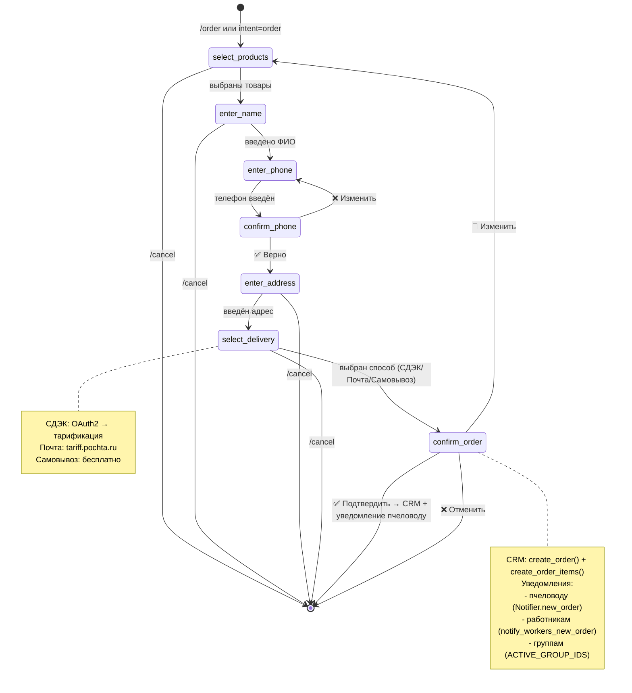

---

## 4. Поток UDS → CRM

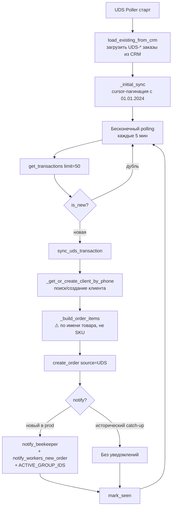

---

## 5. DEVBOT — жизненный цикл задачи

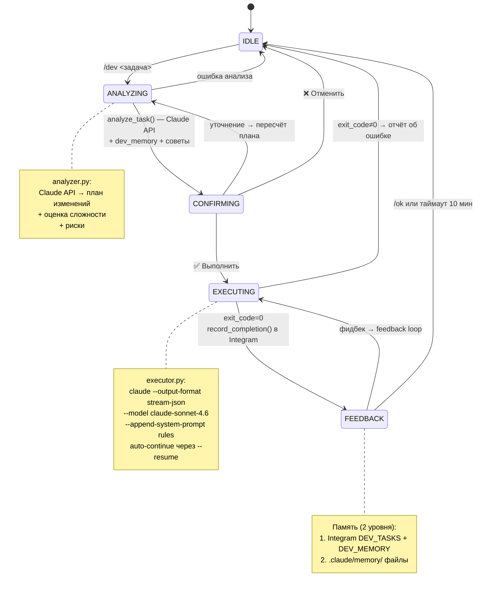

---

## 6. WorkerAgent — поток сборки заказов

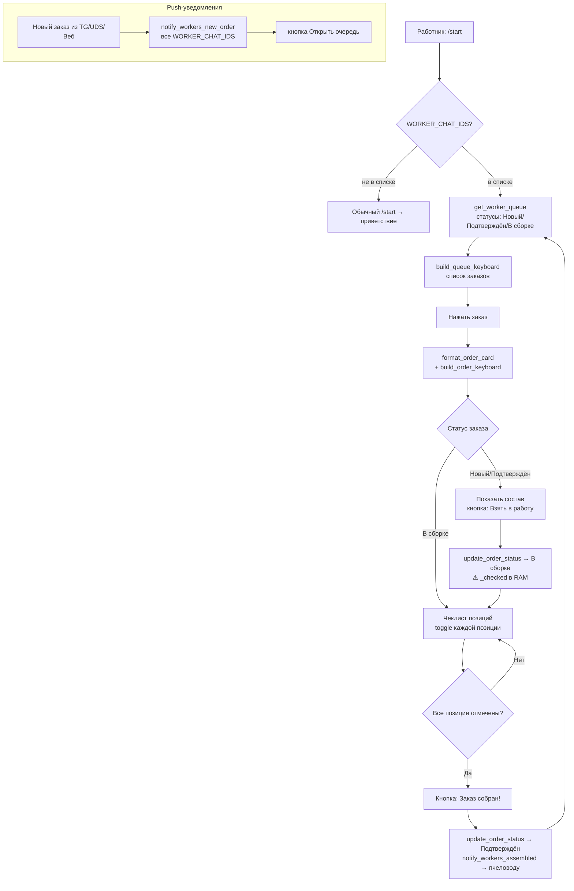

---

## 7. Инфраструктура: туннели и прокси

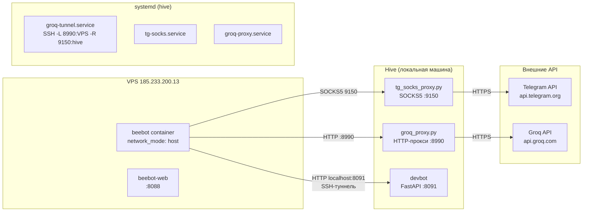

---

## 8. CRM: схема данных Integram

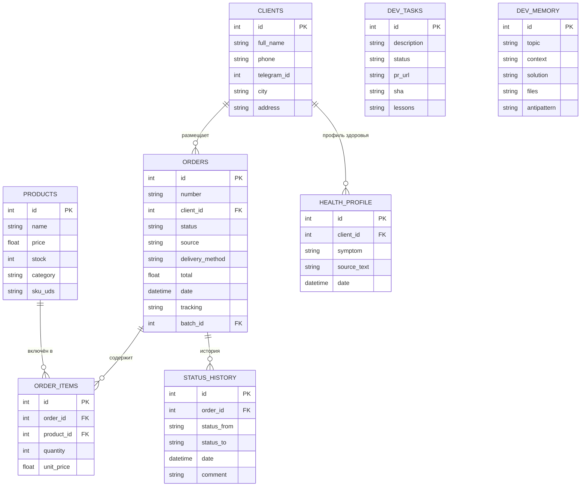

---

## 9. Сравнительные таблицы

### 9.1 Агенты: возможности и ограничения

| Агент | Доступ к KB | Доступ к CRM | Интент | Ограничения |
|-------|-------------|--------------|--------|-------------|
| Консультант (Beebot) | ✅ FAISS поиск | ❌ | consult | Только знания из KB |
| Логист | ❌ | ✅ Запись | order | Только FSM-диалог |
| Аналитик | ❌ | ✅ Чтение | stats | Только ADMIN_CHAT_ID |
| Инспектор | ✅ FAISS поиск | ❌ | /inspect | Только через команду |
| Ассистент пчеловода | ❌ | ✅ CrmSnapshot | /admin | Только ADMIN_CHAT_ID |
| WorkerAgent | ❌ | ✅ Чтение+Запись | /start (worker) | Только WORKER_CHAT_IDS |
| DEVBOT | ❌ | ✅ DEV-таблицы | /dev | Только hive, только admin |

### 9.2 Источники заказов и их обработка

| Источник | Как попадает в CRM | Позиции | Клиент | Уведомления |
|----------|-------------------|---------|--------|-------------|
| Telegram-бот (FSM) | LogistAgent.confirm → CRM | ✅ Полные | Telegram ID | Пчеловод + Работники |
| UDS система лояльности | UDSPoller → sync_uds_transaction | ⚠️ По имени (SKU=0) | Телефон (telegram_id=0) | Пчеловод + Работники |
| Веб-панель | POST /api/orders | ✅ Ручной ввод | Выбор из CRM | Пчеловод + Работники |
| WhatsApp/ВК/Instagram | Ручной ввод | Ручной ввод | Ручной ввод | Нет |
| DEVBOT (/dev) | Нет — это задачи разработки | — | — | — |

### 9.3 Способы доставки

| Способ | Расчёт стоимости | Трекинг | Авто-уведомление |
|--------|-----------------|---------|-----------------|
| СДЭК | OAuth2 + tariff API | ✅ По трек-номеру | ✅ Каждые 2 ч |
| Почта России | tariff.pochta.ru | ✅ По трек-номеру | ✅ Каждые 2 ч |
| Самовывоз | 0 ₽ (фиксированно) | ❌ | ❌ |

### 9.4 Права доступа

| Роль | Как определяется | Возможности |
|------|-----------------|------------|
| Пользователь | Любой chat_id | consult, /order, /products, /inspect, /voice, /help |
| Работник | `WORKER_CHAT_IDS` в .env | Очередь сборки (/start), статусы В сборке |
| Администратор | `ADMIN_CHAT_ID` / `ADMIN_IDS` | /admin, /stats, /faq, /yt_check, /yt_update, /status, /orders, /clients |
| Веб-пользователь | JWT (WEB_PASSWORD) | Полная веб-панель |

### 9.5 LLM использование по компонентам

| Компонент | LLM-вызов | Токенов/вызов | Цель |
|-----------|-----------|---------------|------|
| Classify intent | Groq | ~100 | Маршрутизация запроса |
| Консультант | Groq | ~2000 | Ответ в стиле автора |
| AdminChatAgent | Groq | ~4000 | Диалог с пчеловодом |
| Аналитик | Groq | ~3000 | Анализ CRM-статистики |
| DEVBOT Analyzer | Claude API (Sonnet) | ~2000 | Анализ задачи → план |
| DEVBOT Executor | Claude Code CLI | ~20000+ | Реализация задачи |

---

*Связанные документы: [analysis.md](../analysis.md) · [plan.md](../plan.md)*

---

## 10. Эволюция архитектуры: было → станет

> Раздел описывает переход к **Gift Protocol + CRM-агент + SharedContext**.
> Сформулировано 30 марта 2026 на основе анализа роста проекта и принципов dronedoc2026 AgentBus.

---

### 10.1 Было: CRM как общий ресурс

Сейчас `IntegramClient` вызывается напрямую из 10+ мест. Нет единого владельца CRM-домена.

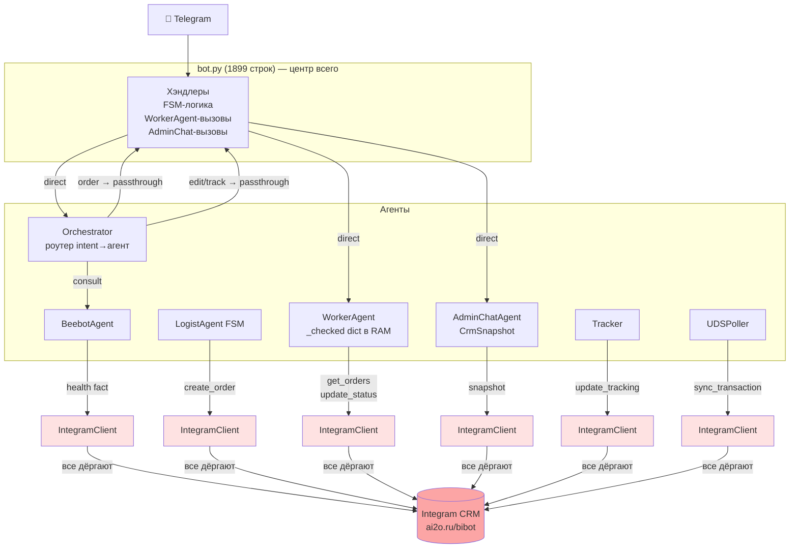

**Проблемы текущей схемы:**
- Integram недоступен → падает всё и везде одновременно
- Бизнес-логика CRM размазана по 6+ файлам
- `bot.py` — единая точка отказа и 1899 строк монолита
- `WorkerAgent._checked` — dict в RAM, теряется при рестарте
- `_node_logist` в оркестраторе возвращает `""` — FSM живёт в bot.py

---

### 10.2 Станет: Gift Protocol + CRM-агент

Единый контур с Gift Broker в центре. CRM — один агент, владеющий доменом.

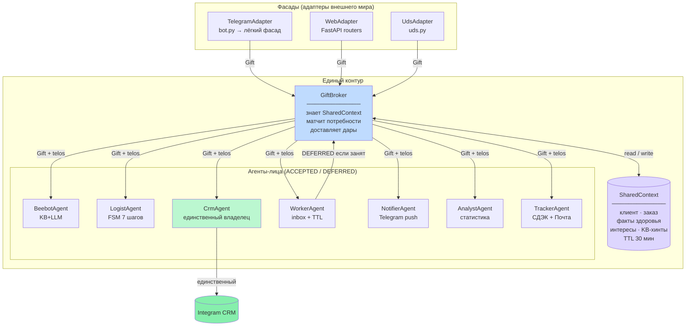

---

### 10.3 Оркестратор: роутер → Gift Broker

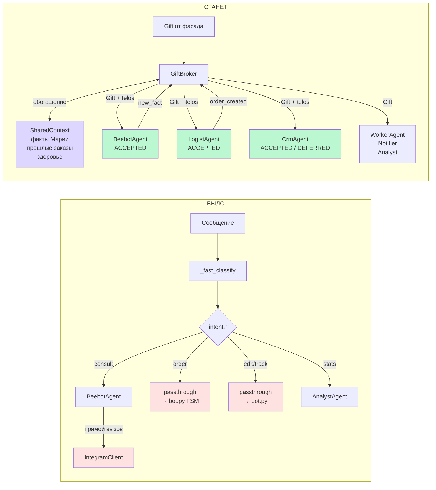

---

### 10.4 WorkerAgent: RAM → DEFERRED + SharedContext

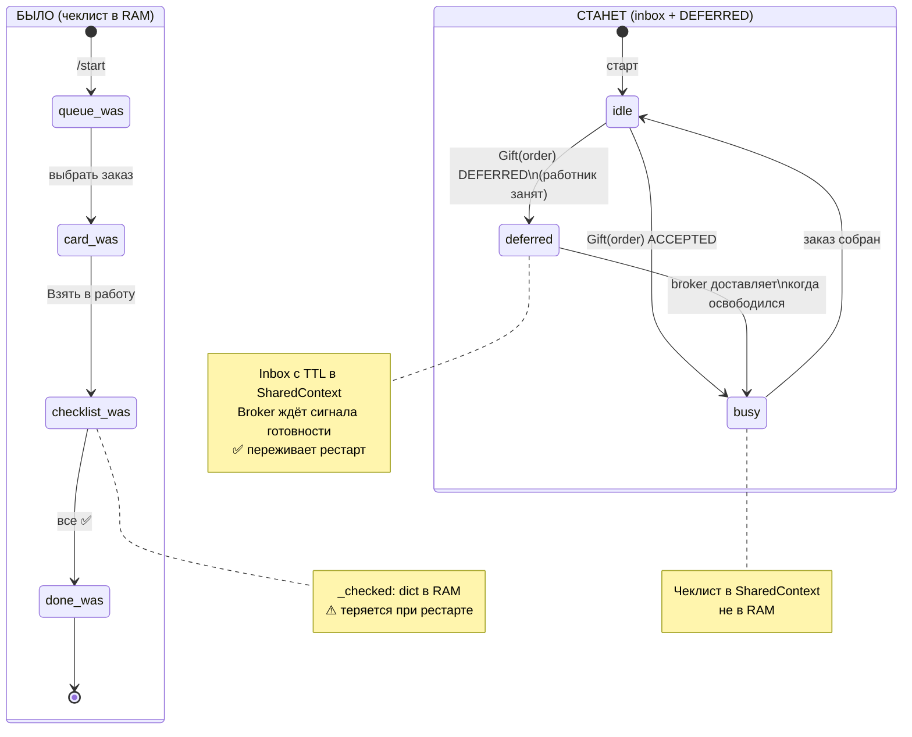

---

### 10.5 Сквозной сценарий: Мария заказывает прополис

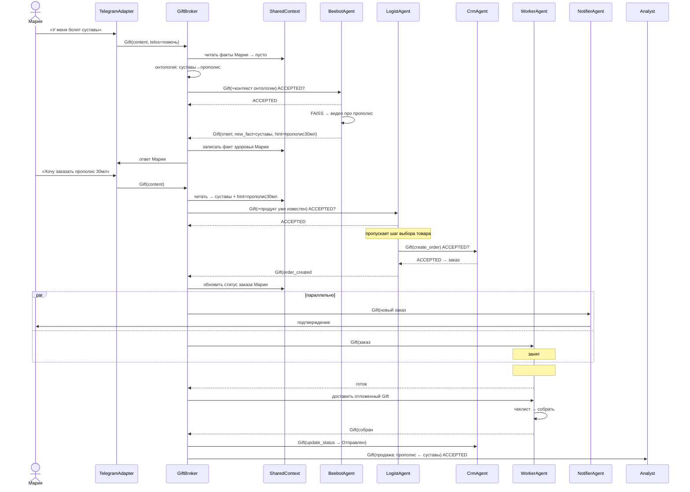

---

### 10.6 Сравнение: было vs станет

| Аспект | Было | Станет |
|--------|------|--------|
| **Orchestrator** | Роутер: intent → агент → END | Gift Broker: знает SharedContext, матчит telos |
| **CRM-доступ** | 10+ прямых вызовов IntegramClient | Один CrmAgent — единственный владелец |
| **SharedContext** | Частичный: history + SQLite | Единый: клиент · заказ · здоровье · интересы |
| **WorkerAgent** | `_checked` dict в RAM, нет DEFERRED | Inbox с TTL, DEFERRED, чеклист в SharedContext |
| **LogistAgent** | FSM в bot.py, passthrough из оркестратора | Агент с ACCEPTED, знает контекст из SharedContext |
| **Отказ Integram** | Падает всё везде | CrmAgent: DEFERRED + retry очередь |
| **bot.py** | 1899 строк — монолит | Лёгкий TelegramAdapter (фасад) |
| **Читаемость потока** | Трасси́ровать по 5 файлам | Gift log = полная история события |
| **Агент знает зачем** | Нет (только intent) | Да (telos в каждом подарке) |
| **Свобода агента** | Нет (синхронный вызов) | ACCEPTED / DEFERRED (A5 Gift Ontology) |

---

### 10.7 Эволюционный план: три шага без переписывания

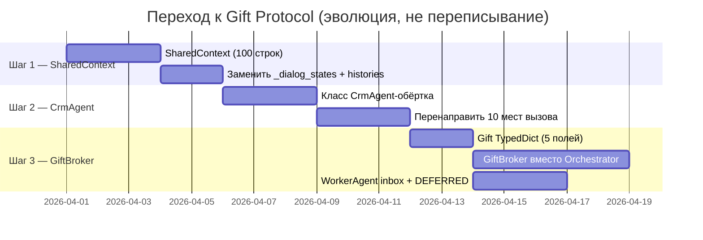

**Шаг 1 — SharedContext** (малый риск, ~100 строк)
Один `dict` + TTL на user_id. Заменяет `_dialog_states` + `_histories` + разрозненные SQLite-факты. Остальной код не меняется.

**Шаг 2 — CrmAgent** (средний риск, ~150 строк)
Класс-обёртка над существующим `IntegramClient`. Все 10 мест прямого вызова переводятся на один класс. Логика не меняется — меняется маршрут вызова.

**Шаг 3 — GiftBroker** (высокий выхлоп, ~200 строк)
`Gift` как `TypedDict` с пятью полями. `GiftBroker` заменяет `Orchestrator._build_graph()`. LangGraph остаётся внутри — просто получает обогащённый контекст из SharedContext.

---

*Связанные документы: [analysis.md](../analysis.md) · [plan.md](../plan.md)*
