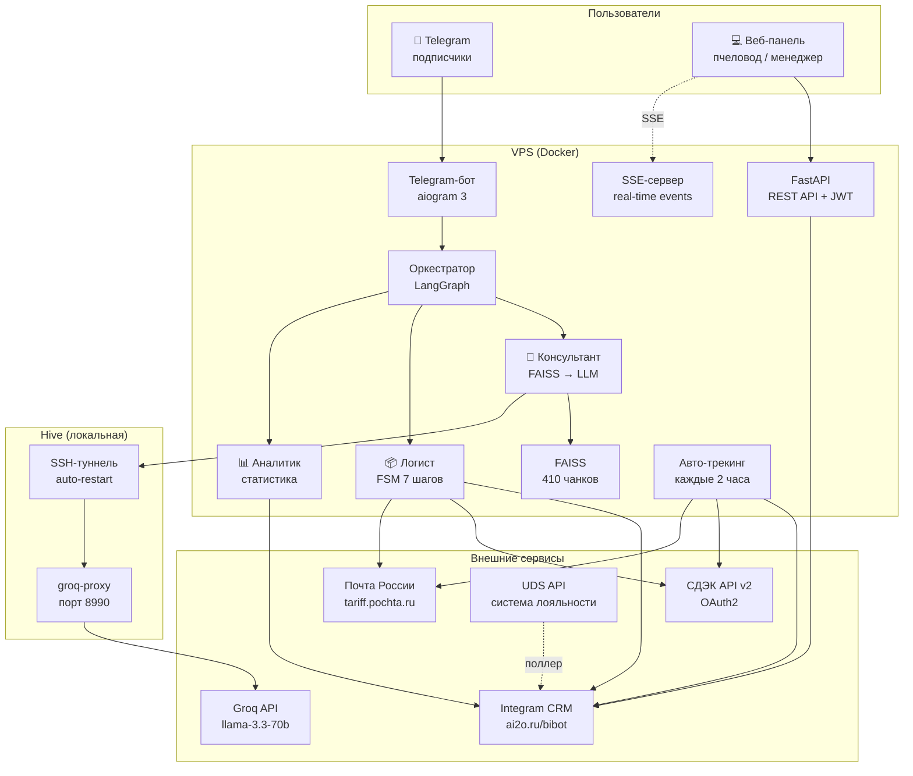
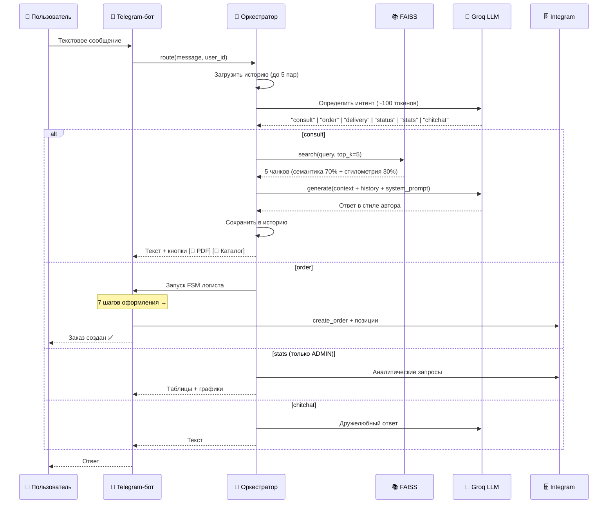
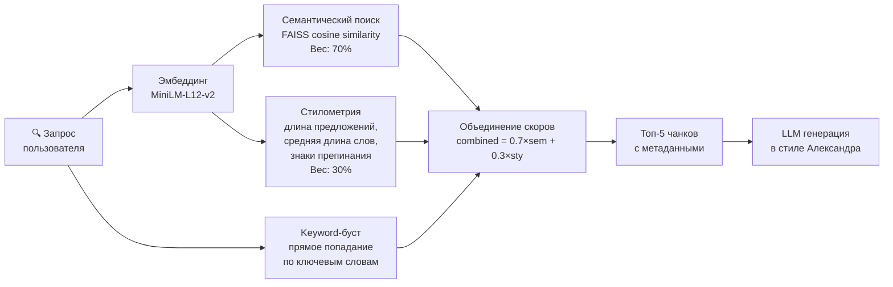
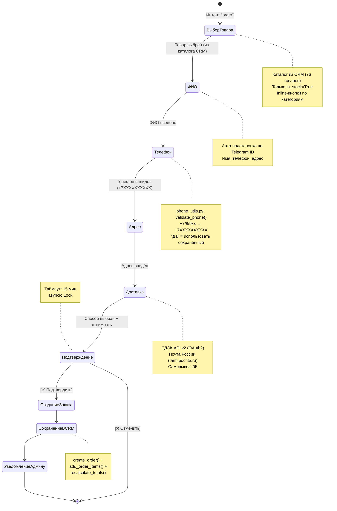
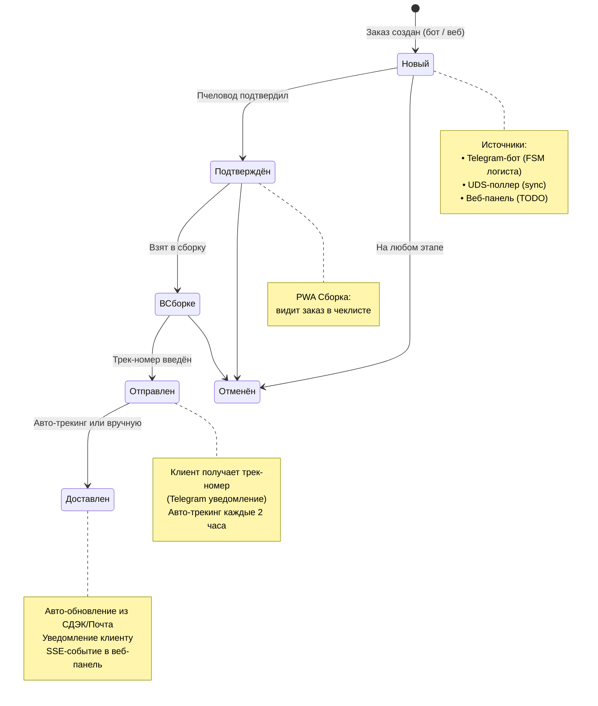
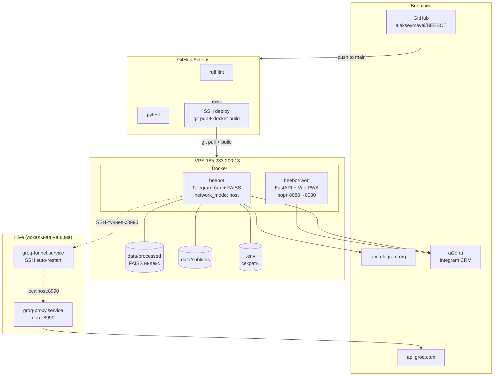
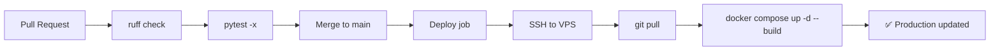
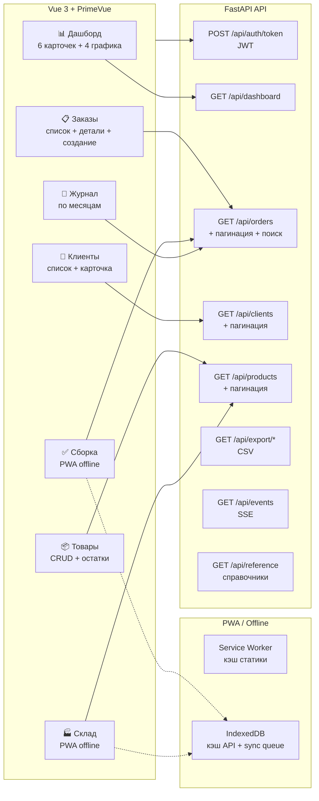
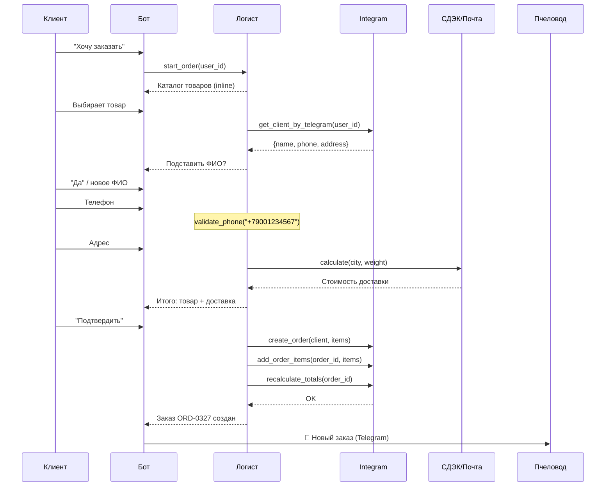
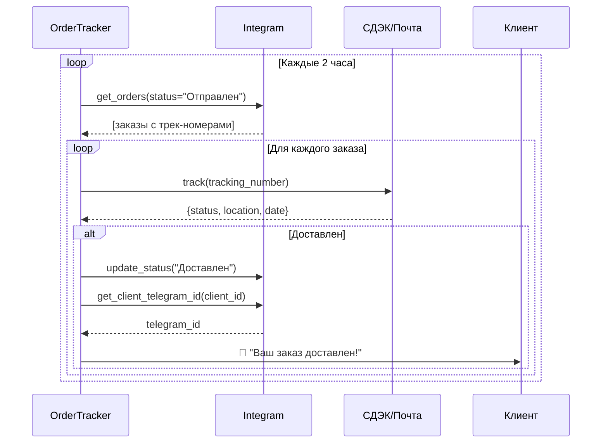

# BEEBOT — Архитектурные диаграммы

> Версия: 18 марта 2026

---

## 1. Общая архитектура системы



---

## 2. Поток обработки сообщения



---

## 3. Гибридный поиск в базе знаний



**Источники данных (410 чанков):**

| Тип | Кол-во файлов | Описание |
|-----|---------------|----------|
| PDF-инструкции | 19 | Перга, прополис, ПЖВМ, гомогенат, маточное молочко и др. |
| Тексты | 21 | Очищенные выдержки из PDF |
| YouTube субтитры | 26 | Расшифровки видео с канала @a.dmitrov |

**Алгоритм keyword-буста:**
```
Запрос: "как принимать пергу"
  → ключевое слово "перга" найдено
  → чанки из "Перга.txt" получают +0.5 к скору
  → гарантированное попадание нужного документа в топ-5
```

---

## 4. FSM оформления заказа (Логист)



---

## 5. Жизненный цикл заказа



---

## 6. Каналы уведомлений

```mermaid
graph TB
    subgraph Триггеры
        T1[Новый заказ<br/>бот / UDS]
        T2[Смена статуса<br/>веб-панель]
        T3[Трек-номер<br/>веб-панель]
        T4[Доставлен<br/>авто-трекинг]
    end

    subgraph Каналы
        TG_ADMIN[📱 Telegram<br/>пчеловоду]
        TG_CLIENT[📱 Telegram<br/>клиенту]
        SSE_WEB[🖥️ SSE<br/>веб-панель]
    end

    T1 -->|notify_admin()| TG_ADMIN
    T2 -->|notify_client_status_change()| TG_CLIENT
    T2 -->|push_event()| SSE_WEB
    T3 -->|notify_client_tracking()| TG_CLIENT
    T3 -->|push_event()| SSE_WEB
    T4 -->|notify_fn()| TG_CLIENT

    style T1 fill:#e1f5fe
    style T4 fill:#e8f5e9
```

**Известное расхождение:** Смена статуса через бота НЕ отправляет SSE. Смена через веб-панель НЕ уведомляет пчеловода в Telegram.

---

## 7. Инфраструктура и деплой



### CI/CD пайплайн



---

## 8. Веб-панель (PWA)



---

## 9. CRM-архитектура (Integram)

```mermaid
graph TB
    subgraph Код["Python-слой"]
        API_LOW[IntegramAPI<br/>integram_api.py<br/>HTTP: get/post/set_requisites]
        API_HIGH[IntegramClient<br/>integram_client.py<br/>get_orders, create_order, ...]
        SCHEMA[crm_schema.py<br/>TYPE_IDS, REQ_IDS]
        CONST[crm_constants.py<br/>STATUS_IDS, SOURCE_IDS]
    end

    subgraph CRM["Integram CRM (ai2o.ru/bibot)"]
        T_ORDERS[📋 Заказы<br/>type_id=212]
        T_CLIENTS[👥 Клиенты<br/>type_id=213]
        T_PRODUCTS[📦 Товары<br/>type_id=214]
        T_ITEMS[📝 Позиции<br/>type_id=215]
        L_STATUS[Статусы (6)]
        L_SOURCE[Источники (6)]
        L_DELIVERY[Доставка (3)]
        L_CATEGORY[Категории (8)]
    end

    API_HIGH --> API_LOW
    API_LOW --> CRM
    API_HIGH --> SCHEMA
    API_HIGH --> CONST
```

### Таблицы CRM

| Таблица | ID типа | Записей | Ключевые поля |
|---------|---------|---------|---------------|
| Товары | 214 | 76 | Название, Цена, Категория, В наличии, SKU UDS |
| Клиенты | 213 | 285+ | ФИО, Телефон, Telegram ID, Город, Источник |
| Заказы | 212 | 326+ | Номер, Клиент, Статус, Доставка, Сумма, Трек |
| Позиции заказа | 215 | ~800 | Заказ, Товар, Количество, Цена, Сумма |

### Справочники

| Справочник | Значения |
|-----------|----------|
| Статусы | Новый, Подтверждён, В сборке, Отправлен, Доставлен, Отменён |
| Источники | Telegram, UDS, Сайт, Звонок, WhatsApp, Другое |
| Доставка | СДЭК, Почта России, Самовывоз |
| Категории | Мёд, Перга, Прополис, ПЖВМ, Маточное молочко, Воск, Настойки, Программы |

---

## 10. Сравнение модулей

| Модуль | Строк | Тестов | Зависимости | Состояние |
|--------|-------|--------|-------------|-----------|
| `bot.py` | 980 | ~10 | aiogram, LangGraph, CRM | ✅ Production |
| `orchestrator.py` | 371 | ~30 | LangGraph, Groq, history | ✅ Production |
| `agents/beebot.py` | 86 | ~35 | FAISS, Groq | ✅ Production |
| `agents/logist.py` | 442 | ~40 | CRM, доставка, phone_utils | ✅ Production |
| `agents/analyst.py` | 483 | ~28 | CRM | ✅ Production |
| `web/api.py` | 1242 | 22 | FastAPI, CRM, SSE, CSV | ✅ Production |
| `integram_api.py` | 339 | 24 | httpx, auto re-auth | ✅ Production |
| `integram_client.py` | 570 | — | integram_api | ✅ Production |
| `delivery/cdek.py` | 254 | ~10 | httpx, OAuth2 | ✅ Production |
| `delivery/pochta.py` | 269 | ~10 | httpx | ✅ Production |
| `delivery/tracker.py` | 117 | — | CRM, доставка | ✅ Production |
| `integrations/uds.py` | 697 | 28 | httpx, CRM | ✅ Production |
| `knowledge_base.py` | 227 | 16 | FAISS, sentence-transformers | ✅ Production |
| `phone_utils.py` | 60 | 24 | — | ✅ Production |

---

## 11. Потоки данных

### Создание заказа через бота



### Авто-трекинг доставки



---

*Анализ проблем: [analysis.md](../analysis.md)*
*План развития: [plan.md](../plan.md)*
