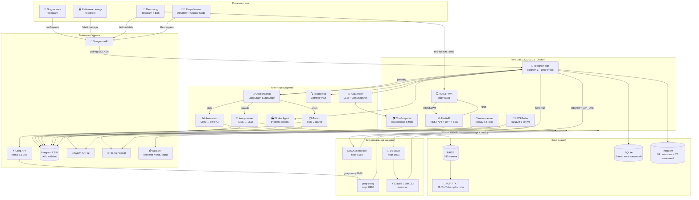
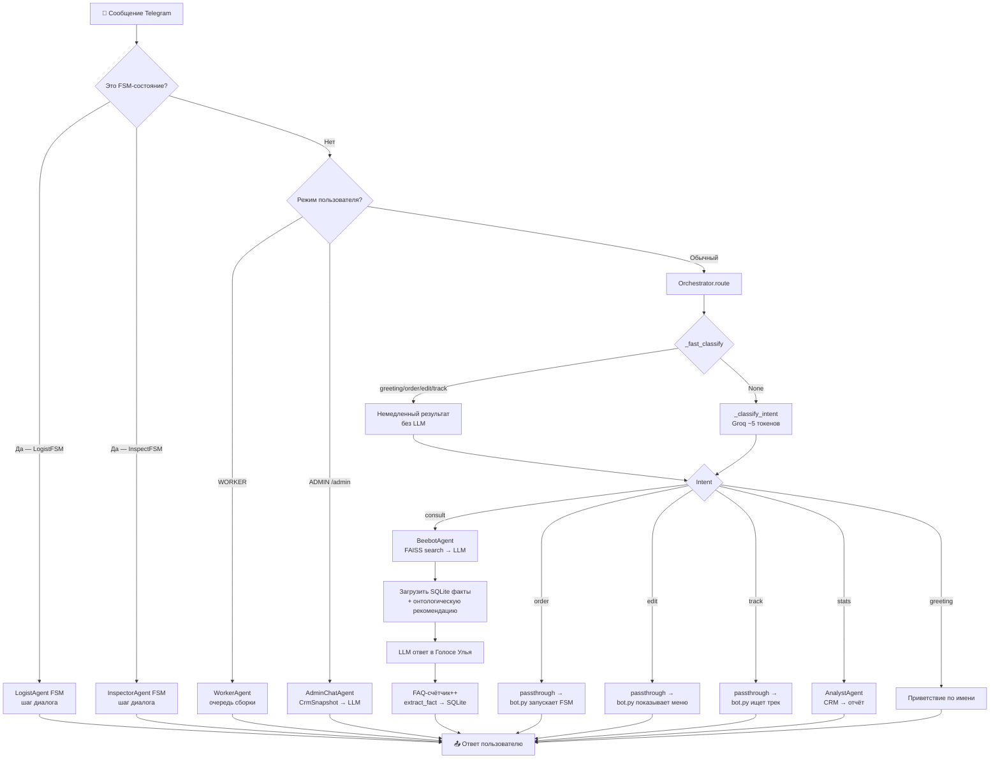
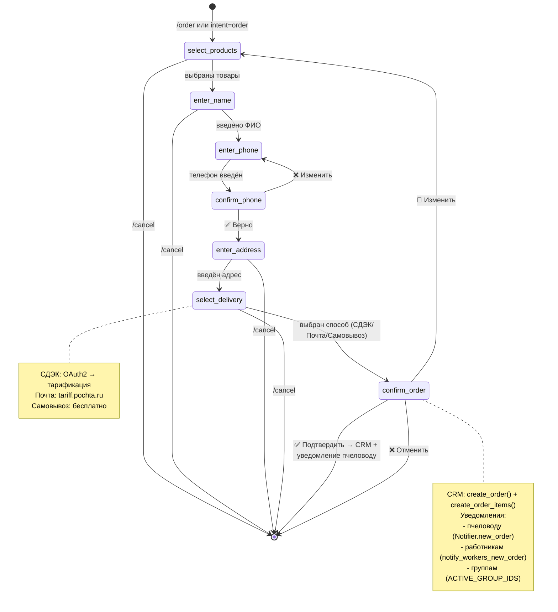
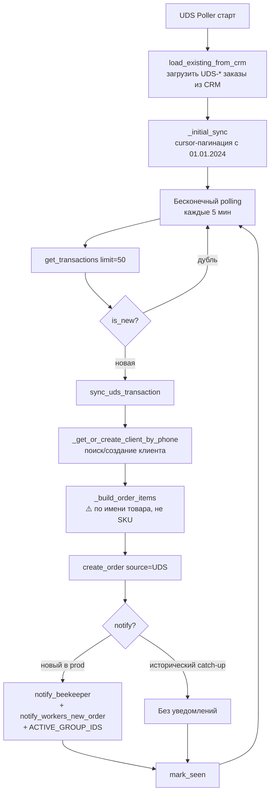
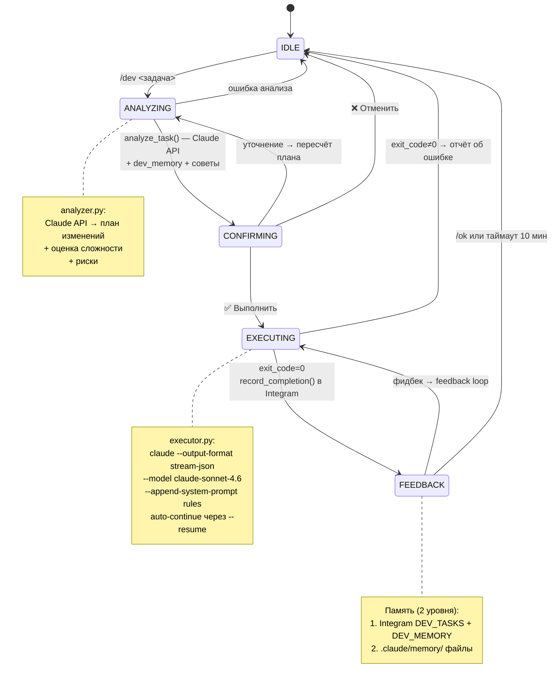
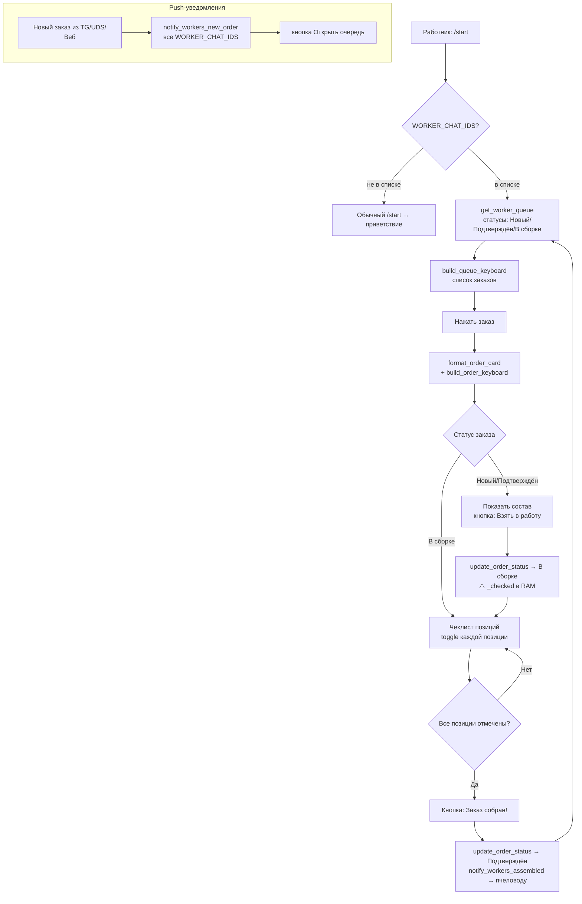
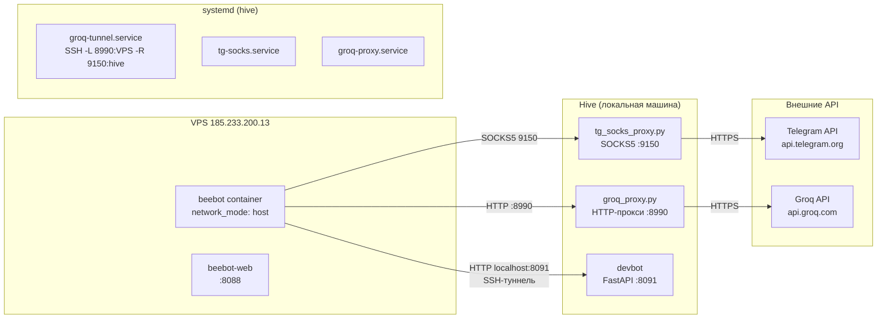
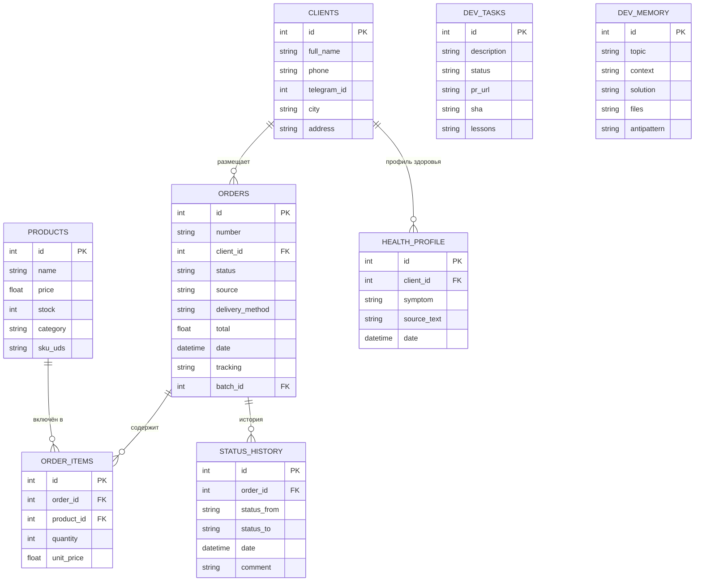

# BEEBOT — Архитектурные диаграммы

> **Версия:** 29 марта 2026

---

## 1. Общая архитектура системы

---

## 2. Поток запроса через оркестратор

---

## 3. FSM оформления заказа (LogistAgent)

---

## 4. Поток UDS → CRM

---

## 5. DEVBOT — жизненный цикл задачи

---

## 6. WorkerAgent — поток сборки заказов

---

## 7. Инфраструктура: туннели и прокси

---

## 8. CRM: схема данных Integram

---

## 9. Сравнительные таблицы

### 9.1 Агенты: возможности и ограничения

| Агент | Доступ к KB | Доступ к CRM | Интент | Ограничения |
|-------|-------------|--------------|--------|-------------|
| Консультант (Beebot) | ✅ FAISS поиск | ❌ | consult | Только знания из KB |
| Логист | ❌ | ✅ Запись | order | Только FSM-диалог |
| Аналитик | ❌ | ✅ Чтение | stats | Только ADMIN_CHAT_ID |
| Инспектор | ✅ FAISS поиск | ❌ | /inspect | Только через команду |
| Ассистент пчеловода | ❌ | ✅ CrmSnapshot | /admin | Только ADMIN_CHAT_ID |
| WorkerAgent | ❌ | ✅ Чтение+Запись | /start (worker) | Только WORKER_CHAT_IDS |
| DEVBOT | ❌ | ✅ DEV-таблицы | /dev | Только hive, только admin |

### 9.2 Источники заказов и их обработка

| Источник | Как попадает в CRM | Позиции | Клиент | Уведомления |
|----------|-------------------|---------|--------|-------------|
| Telegram-бот (FSM) | LogistAgent.confirm → CRM | ✅ Полные | Telegram ID | Пчеловод + Работники |
| UDS система лояльности | UDSPoller → sync_uds_transaction | ⚠️ По имени (SKU=0) | Телефон (telegram_id=0) | Пчеловод + Работники |
| Веб-панель | POST /api/orders | ✅ Ручной ввод | Выбор из CRM | Пчеловод + Работники |
| WhatsApp/ВК/Instagram | Ручной ввод | Ручной ввод | Ручной ввод | Нет |
| DEVBOT (/dev) | Нет — это задачи разработки | — | — | — |

### 9.3 Способы доставки

| Способ | Расчёт стоимости | Трекинг | Авто-уведомление |
|--------|-----------------|---------|-----------------|
| СДЭК | OAuth2 + tariff API | ✅ По трек-номеру | ✅ Каждые 2 ч |
| Почта России | tariff.pochta.ru | ✅ По трек-номеру | ✅ Каждые 2 ч |
| Самовывоз | 0 ₽ (фиксированно) | ❌ | ❌ |

### 9.4 Права доступа

| Роль | Как определяется | Возможности |
|------|-----------------|------------|
| Пользователь | Любой chat_id | consult, /order, /products, /inspect, /voice, /help |
| Работник | `WORKER_CHAT_IDS` в .env | Очередь сборки (/start), статусы В сборке |
| Администратор | `ADMIN_CHAT_ID` / `ADMIN_IDS` | /admin, /stats, /faq, /yt_check, /yt_update, /status, /orders, /clients |
| Веб-пользователь | JWT (WEB_PASSWORD) | Полная веб-панель |

### 9.5 LLM использование по компонентам

| Компонент | LLM-вызов | Токенов/вызов | Цель |
|-----------|-----------|---------------|------|
| Classify intent | Groq | ~100 | Маршрутизация запроса |
| Консультант | Groq | ~2000 | Ответ в стиле автора |
| AdminChatAgent | Groq | ~4000 | Диалог с пчеловодом |
| Аналитик | Groq | ~3000 | Анализ CRM-статистики |
| DEVBOT Analyzer | Claude API (Sonnet) | ~2000 | Анализ задачи → план |
| DEVBOT Executor | Claude Code CLI | ~20000+ | Реализация задачи |

---

*Связанные документы: [analysis.md](../analysis.md) · [plan.md](../plan.md)*
