# BEEBOT — Архитектурные диаграммы

> **Версия:** 4 апреля 2026 (обновлено: Backend as Single Entry Point)

---

## 1. Общая архитектура: Backend как единая точка входа

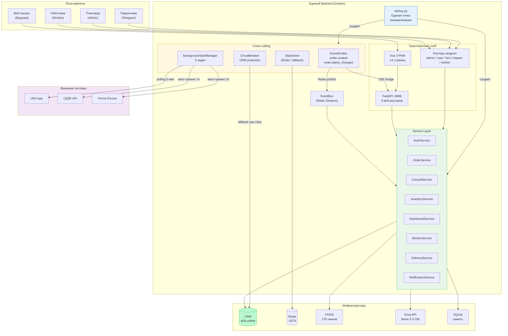

---

## 2. Единая инициализация: startup.py

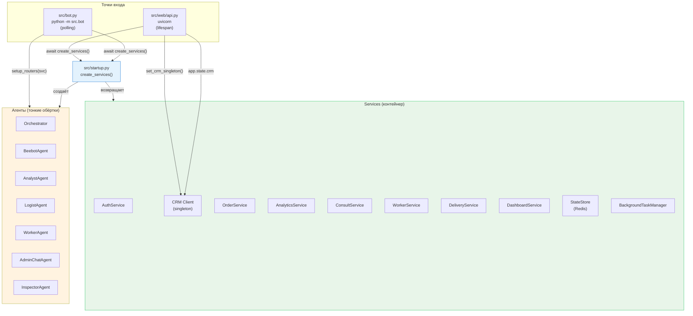

**Anti-pattern avoided:** «Creating new DB connections or HTTP clients inside each route handler.» Теперь один CRM-клиент на весь процесс.

---

## 3. Service Layer: архитектура слоёв

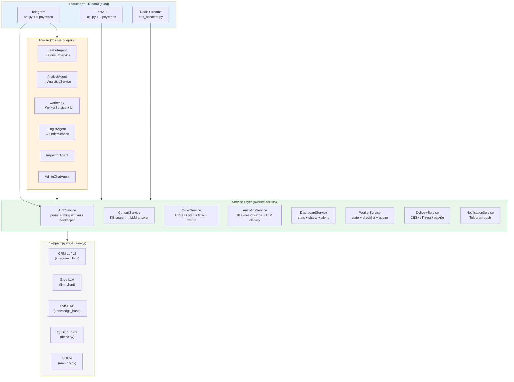

### Таблица сервисов

| Сервис | Файл | Зависимости | Ответственность |
|--------|------|-------------|----------------|
| AuthService | `services/auth_service.py` | config (IDs) | Проверка ролей: admin, worker, beekeeper |
| ConsultService | `services/consult_service.py` | KB, LLM, TunnelMonitor | Поиск по KB + генерация ответа, FAQ fallback |
| OrderService | `services/order_service.py` | CRM, NotificationService, EventEmitter | CRUD заказов, status flow, валидация, события |
| AnalyticsService | `services/analytics_service.py` | CRM, Groq | 10 типов отчётов, LLM/keyword classify |
| DashboardService | `services/dashboard_service.py` | CRM | Статистика, графики, алерты для веб-панели |
| WorkerService | `services/worker_service.py` | — | Состояние работника, чеклисты, очередь |
| DeliveryService | `services/delivery_service.py` | Calculator, Tracker | Расчёт доставки, трекинг |
| NotificationService | `services/notification_service.py` | TelegramSender callback | Push в Telegram: пчеловод, клиент, работники |
| StateStore | `services/state_store.py` | Redis (fallback in-memory) | Голос улья, admin mode, worker checklists |
| EventEmitter | `services/event_emitter.py` | EventBus (опц.) | Бизнес-события → SSE + Redis |
| CircuitBreaker | `services/circuit_breaker.py` | — | Защита от каскадных сбоев CRM |

---

## 4. Event-Driven: CQRS + Events

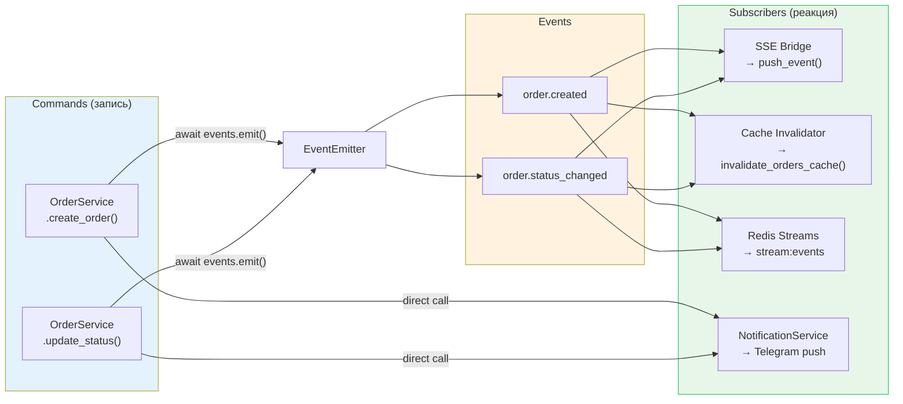

**CQRS (простой):**
- **Queries (чтение):** `get_orders_cache()`, `get_items_cache()` — TTL-кэш, инвалидируется событиями
- **Commands (запись):** `create_order()`, `update_status()` — пишут в CRM, эмитят события, инвалидируют кэш

---

## 5. Оркестратор: маршрутизация интентов

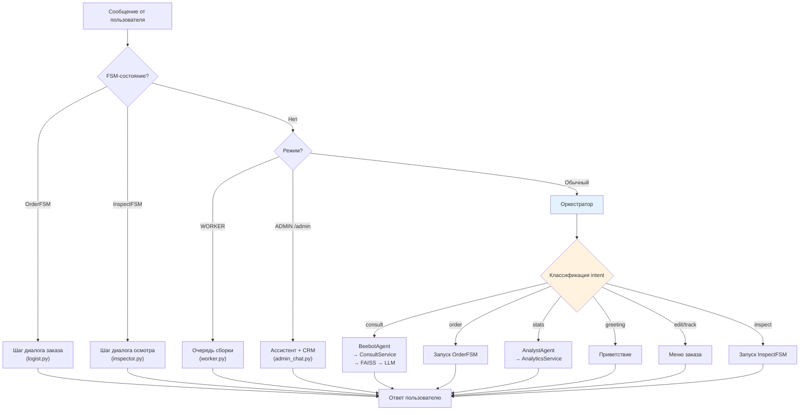

---

## 6. Circuit Breaker + Health Check

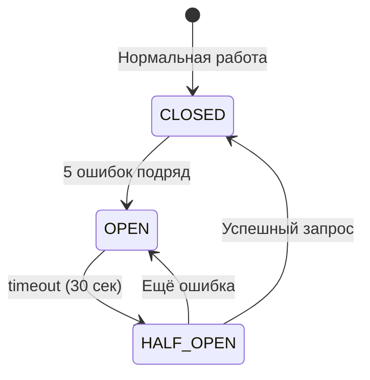

**`/api/health` возвращает:**
```json
{
  "status": "healthy | degraded | unhealthy",
  "checks": {
    "crm": {"status": "up"},
    "order_service": {"status": "up"},
    "analytics_service": {"status": "up"},
    "bg_tasks": {"crm_snapshot": {"state": "работает", "uptime_sec": 3600}},
    "event_bus": {"status": "up"},
    "crm_circuit_breaker": {"state": "closed", "failures": 0, "threshold": 5}
  }
}
```

---

## 7. StateStore: Redis shared state

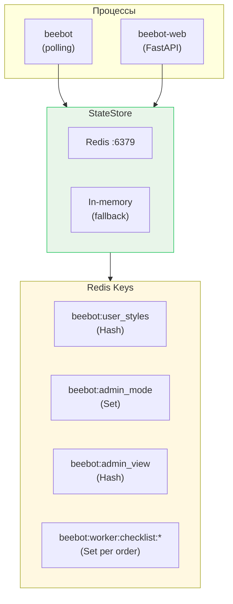

**Best practice:** Состояние переживает рестарт. Worker checklists не теряются.

---

## 8. BackgroundTaskManager: фоновые задачи

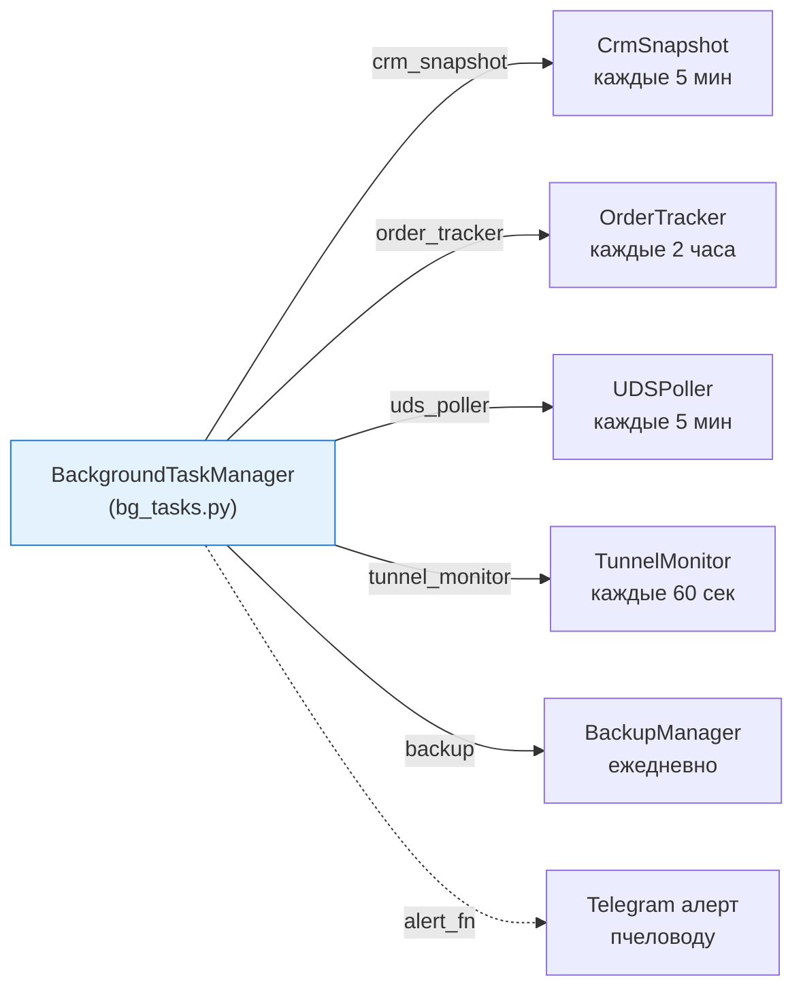

**Возможности:**
- Авто-рестарт при падении (экспоненциальная пауза, макс 60 сек)
- Мониторинг: `bg.status()` → состояние, uptime, число рестартов
- Graceful shutdown: `bg.stop_all()` при остановке

---

## 9. Жизненный цикл заказа

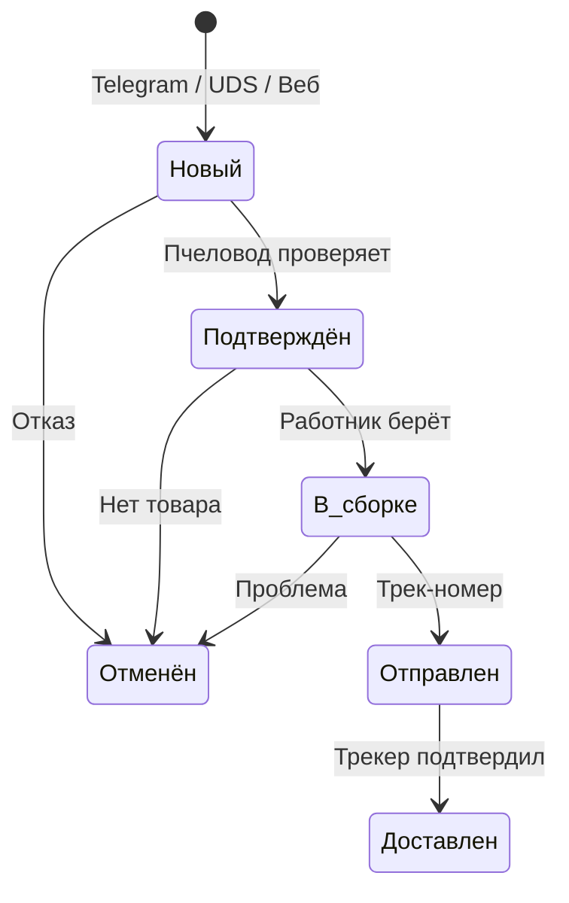

### Источники заказов

| Источник | Как попадает | Уведомления |
|----------|-------------|-------------|
| Telegram FSM | LogistAgent → OrderService → CRM → EventEmitter | Пчеловод + работники + SSE |
| UDS-магазин | UDSPoller → CRM | Пчеловод + работники |
| Веб-панель | orders.py → OrderService → CRM → EventEmitter | Пчеловод + SSE |

---

## 10. CRM: две системы

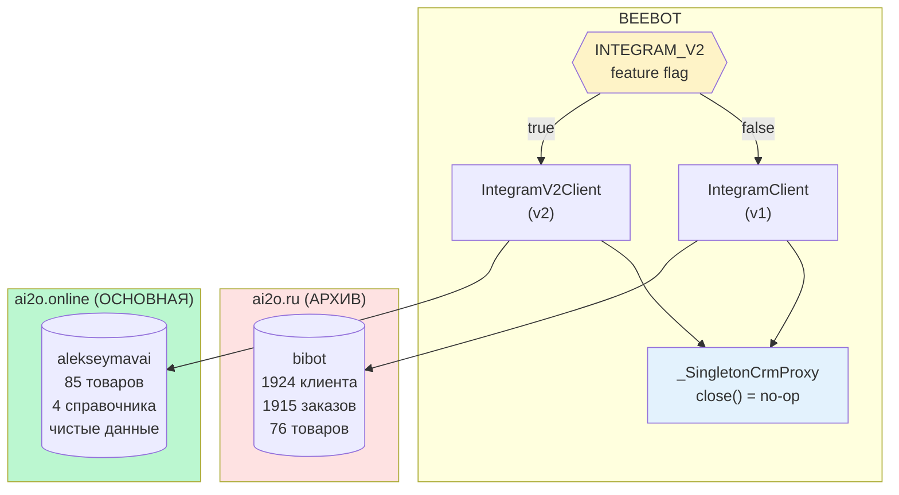

**Singleton CRM:** создаётся один раз в `startup.py`, оборачивается в `_SingletonCrmProxy` (close() — no-op), раздаётся 37 роутерам через `_get_crm()`.

---

## 11. Инфраструктура: единый Docker-образ

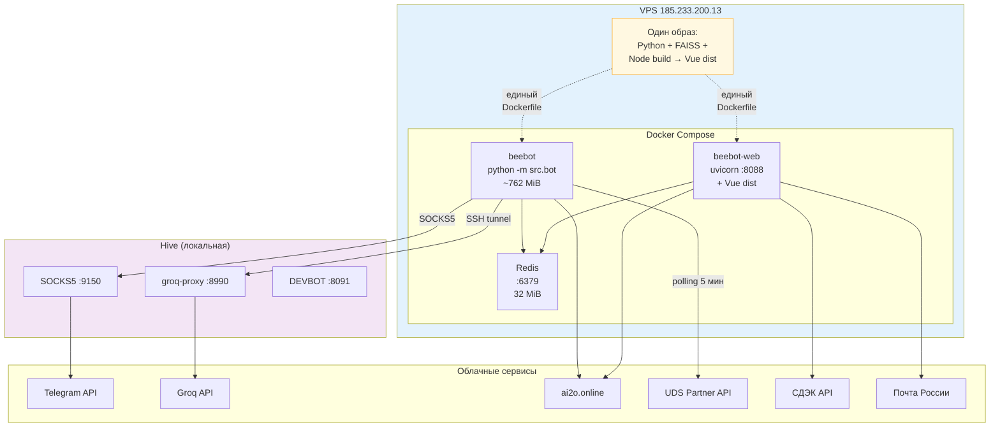

### Docker-контейнеры

| Контейнер | Образ | Команда | RAM | Порт |
|-----------|-------|---------|-----|------|
| redis | redis:7-alpine | — | ~20 MiB | 6379 |
| beebot | **Единый** (Python + FAISS + Vue) | `python -m src.bot` | ~762 MiB | — |
| beebot-web | **Единый** (тот же образ) | `uvicorn src.web.server:app` | ~200 MiB | 8088 |

**Было:** два Dockerfile (Dockerfile + Dockerfile.web). **Стало:** один Dockerfile с multi-stage (Node → Vue build + Python deps).

---

## 12. Файловая структура: пять слоёв

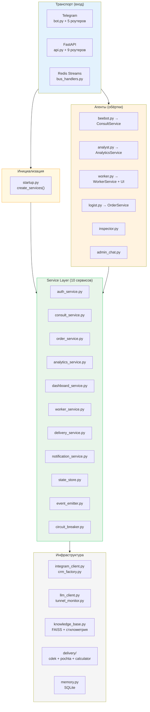

---

## 13. Поток консультации: пользователь → ответ

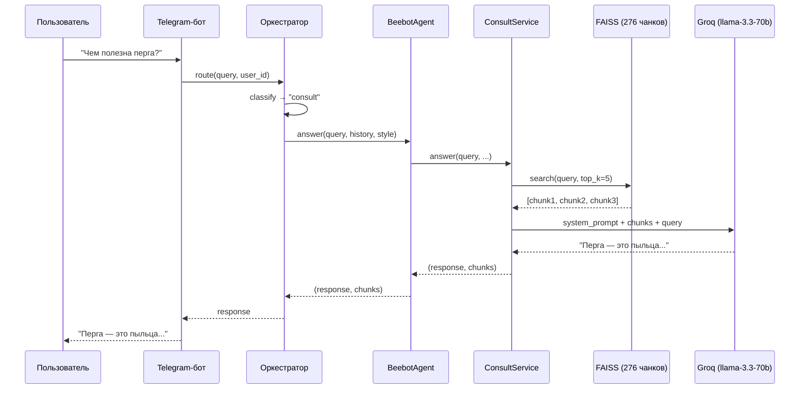

---

## 14. Поток заказа: FSM → OrderService → Events

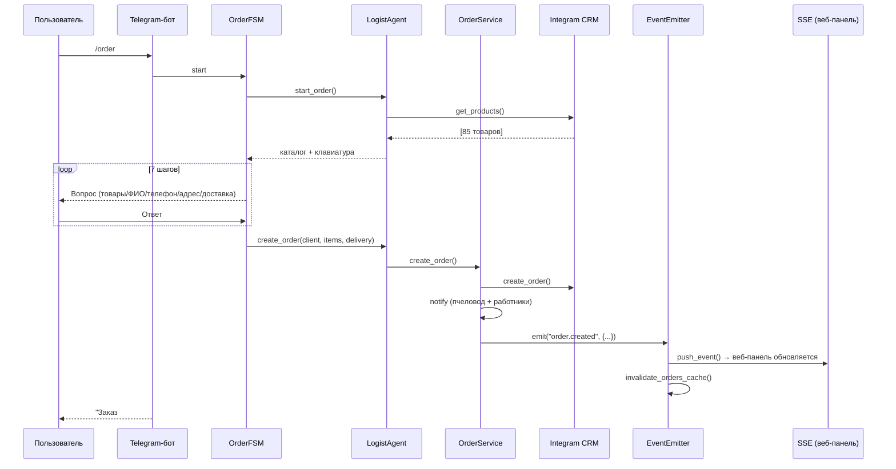

---

## 15. UDS-синхронизация: магазин → CRM

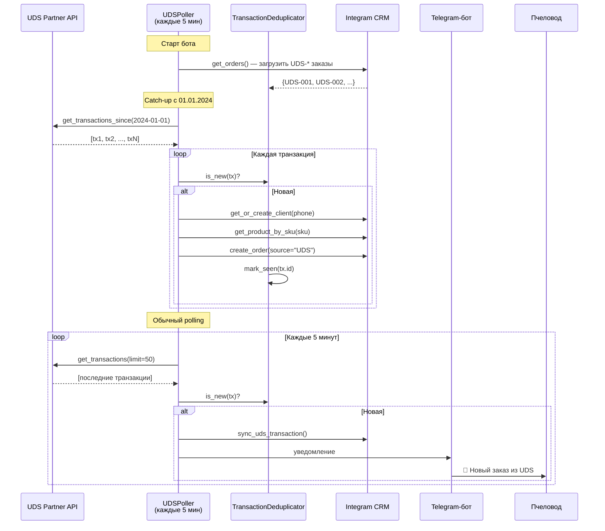

---

## 16. Голос Улья: 5 стилей

| Стиль | Описание | Когда использовать |
|-------|---------|-------------------|
| Наставник | Тёплый, отеческий тон | По умолчанию |
| Практик | Конкретные советы, цифры | Опытные пчеловоды |
| Селекционер | Научный подход, исследования | Вопросы о генетике, породах |
| Зимовщик | Спокойный, вдумчивый | Зимний период, подготовка |
| Эколог | Природа, экосистема | Вопросы о среде обитания |

---

*Связанные документы: [analysis.md](../analysis.md) | [plan.md](../plan.md) | [README.md](../README.md)*
