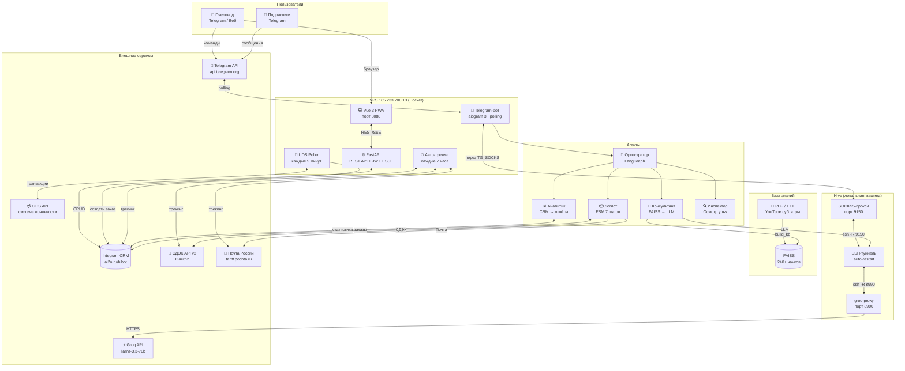

# BEEBOT — Архитектурные диаграммы

> **Версия:** 21 марта 2026

---

## 1. Общая архитектура системы



---

## 2. Поток обработки сообщения (Консультант)

```
Пользователь пишет: "Как принимать пергу при язве?"
         │
         ▼
┌────────────────────┐
│  aiogram: polling  │  (SOCKS5 через hive)
└────────┬───────────┘
         │
         ▼
┌────────────────────┐
│   Оркестратор      │  LangGraph classify_intent()
│   intent → consult │  LLM: Groq llama-3.3-70b (через SSH-туннель)
└────────┬───────────┘
         │
         ▼
┌────────────────────────────────────────────┐
│  Консультант (agents/beebot.py)            │
│                                            │
│  1. _keyword_chunks("перга") → 2 чанка     │
│  2. _encode([query]) → вектор 389-dim      │
│     └─ 384 (семантика) + 5 (стилометрия)  │
│  3. faiss.search(combined_query, top_k*2) │
│  4. Дедупликация + merge с keyword         │
│  5. TOP-5 чанков → context                 │
└────────┬───────────────────────────────────┘
         │ context (5 чанков)
         ▼
┌────────────────────────────────────────────┐
│  LLM Client (llm_client.py)                │
│                                            │
│  Системный промпт: стиль Александра Дм.   │
│  + Голос Улья (если выбран пользователем) │
│  + История: последние 5 пар (TTL 30 мин)  │
│  Запрос → Groq API → ответ                 │
└────────┬───────────────────────────────────┘
         │ текст ответа
         ▼
┌────────────────────┐
│  bot.py            │
│  reply + keyboard  │  (PDF-кнопка + «Все продукты»)
└────────────────────┘
```

---

## 3. FSM-диалог оформления заказа (Логист)

```
/order
  │
  ▼
┌──────────────────────┐
│ choosing_product     │  Каталог из CRM (только в наличии)
│                      │  Формат: "1, 3" или "2 Перга"
└──────────┬───────────┘
           │ cart[]
           ▼
┌──────────────────────┐
│ entering_name        │  Предзаполнение из CRM по telegram_id
│                      │  "да" → использовать предыдущее
└──────────┬───────────┘
           │ full_name
           ▼
┌──────────────────────┐
│ entering_phone       │  Валидация: +7/8/9xx → +7XXXXXXXXXX
│                      │  Предзаполнение последнего номера
└──────────┬───────────┘
           │ phone
           ▼
┌──────────────────────┐
│ entering_address     │  Предзаполнение последнего адреса
│                      │  "да" → использовать предыдущий
└──────────┬───────────┘
           │ address
           ▼
┌──────────────────────┐
│ choosing_delivery    │  Расчёт: СДЭК / Почта / Самовывоз
│                      │  Реальные тарифы + вес корзины
└──────────┬───────────┘
           │ delivery + cost
           ▼
┌──────────────────────┐
│ confirming_order     │  Сводка + ✅ Да / ❌ Нет
└──────────┬───────────┘
           │ "да"
           ▼
┌──────────────────────┐
│ creating_order       │  IntegramClient.create_order()
│                      │  → notify_beekeeper() (TG)
│                      │  ← ответ клиенту
└──────────────────────┘

Таймаут: 15 минут на каждом шаге
/cancel — прервать диалог в любой момент
```

---

## 4. UDS-синхронизация (поток событий)

```
При старте бота:
┌─────────────────────────────────────────────────┐
│ UDSPoller.__init__()                             │
│ TransactionDeduplicator.load_existing_from_crm() │
│   └─ загрузить все UDS-* заказы из Integram      │
│   └─ пометить как уже обработанные              │
└────────────────────────┬────────────────────────┘
                         │
                         ▼
┌─────────────────────────────────────────────────┐
│ _initial_sync() — catch-up с 17.03.2026         │
│   get_transactions_since(since=17.03.2026)       │
│   cursor-пагинация (до 429 rate limit)           │
│   для каждой: is_new()? → sync_uds_transaction() │
└────────────────────────┬────────────────────────┘
                         │
                         ▼ каждые 5 минут
┌─────────────────────────────────────────────────┐
│ _poll_once()                                     │
│   get_transactions(limit=50)                     │
│   для каждой: is_new(since=17.03.2026)?          │
│     → sync_uds_transaction():                    │
│       1. get_or_create_client (по телефону)      │
│       2. _build_order_items (по SKU из Integram) │
│       3. create_order (number="UDS-{id}")        │
│       4. _notify_beekeeper (Telegram)            │
│     → mark_seen(tx_id)                           │
└─────────────────────────────────────────────────┘
```

---

## 5. Авто-трекинг (tracker.py)

```
каждые 7200 секунд (2 часа):
┌─────────────────────────────────────────────────┐
│ OrderTracker.run()                               │
│                                                  │
│ get_orders(status="Отправлен")                   │
│   для каждого заказа с трек-номером:             │
│     ├─ cdek.track(number) → новый статус?        │
│     └─ pochta.track(number) → новый статус?      │
│                                                  │
│   если статус изменился:                         │
│     update_order_status(order_id, new_status)    │
│     notify_client_status_change(client, status)  │
│       └─ bot.send_message(client.telegram_id)   │
│                                                  │
│   если "Доставлен":                              │
│     update_order_status("Доставлен")             │
└─────────────────────────────────────────────────┘
```

---

## 6. Сетевая архитектура (Groq + Telegram)

```
VPS (185.233.200.13)          hive (локальная машина)
┌─────────────────────┐       ┌──────────────────────────┐
│                     │       │                          │
│  beebot (Docker)    │       │  groq-proxy.service      │
│  ┌───────────────┐  │       │  (порт 8990)             │
│  │ Groq-запросы  │  │       │  └─ → api.groq.com       │
│  │ → localhost:  │  │  SSH  │                          │
│  │   8990        ├──┼───────┤  groq-tunnel.service     │
│  └───────────────┘  │  -R   │  └─ VPS:8990 → hive:8990 │
│                     │ 8990  │                          │
│  ┌───────────────┐  │       │  tg-socks.service        │
│  │ Telegram API  │  │  -R   │  (порт 9150)             │
│  │ SOCKS5 proxy  ├──┼───────┤  └─ SOCKS5 TCP tunnel   │
│  │ localhost:9150│  │ 9150  │                          │
│  └───────────────┘  │       └──────────────────────────┘
│                     │
│  beebot-web         │          Groq API
│  (порт 8088)        │       (api.groq.com)
└─────────────────────┘
```

---

## 7. Веб-панель: архитектура запроса

```
Браузер пчеловода
       │ Vue Router
       ▼
┌──────────────────────────────────────────┐
│  Vue 3 + PrimeVue + Pinia                │
│                                          │
│  stores/auth.js  ←── JWT token           │
│  api.js          ←── axios + interceptor │
│                                          │
│  GET /api/orders?page=1&per_page=20      │
│    + Authorization: Bearer <token>       │
└──────────────────┬───────────────────────┘
                   │ HTTPS
                   ▼
┌──────────────────────────────────────────┐
│  FastAPI (src/web/api.py)                │
│                                          │
│  slowapi: 60 req/min                     │
│  JWT verify → CurrentUser                │
│  IntegramClient.get_orders(page=1, ...)  │
│  → {items: [...], total: 326, pages: 17} │
│                                          │
│  SSE /api/events → push_event()          │
└──────────────────┬───────────────────────┘
                   │
                   ▼
        Integram CRM (ai2o.ru/bibot)
```

---

## 8. Сравнительные таблицы

### 8.1 Агенты: возможности и ограничения

| Агент | Когда активен | Доступ к CRM | Доступ к KB | Доступ к LLM |
|-------|--------------|:---:|:---:|:---:|
| Консультант | consult-интент | ❌ | ✅ | ✅ |
| Логист | order-интент | ✅ | ❌ | ❌ (шаблоны) |
| Аналитик | stats-интент | ✅ | ❌ | ✅ |
| Инспектор | /inspect | ❌ | ✅ | ✅ |

### 8.2 Способы доставки

| Способ | API | Расчёт стоимости | Трекинг |
|--------|-----|:---:|:---:|
| СДЭК | v2 OAuth2 | ✅ (tariff) | ✅ |
| Почта России | tariff.pochta.ru | ✅ | ✅ |
| Самовывоз | — | ✅ (0₽) | ❌ |

### 8.3 Источники данных базы знаний

| Тип | Количество | Размер чанка | Перекрытие |
|-----|-----------|:---:|:---:|
| PDF-инструкции | 19 документов | 900 символов | 150 |
| Текстовые файлы | 21 файл | 900 символов | 150 |
| YouTube-субтитры | 26 расшифровок | 1200 символов | 250 |

### 8.4 Уведомления — матрица покрытия

| Событие | TG → пчеловод | TG → клиент | SSE → веб |
|---------|:---:|:---:|:---:|
| Новый заказ (бот) | ✅ | ✅ | ❌ |
| Новый заказ (UDS) | ✅ | ❌ | ❌ |
| Новый заказ (веб) | ❌ | ❌ | ✅ |
| Смена статуса (бот) | ❌ | ❌ | ❌ |
| Смена статуса (веб) | ❌ | ✅ | ✅ |
| Авто-трекинг | ❌ | ✅ | ❌ |

> ⚠️ Красные ячейки — известный архитектурный дефект. План исправления: [plan.md §3.4](plan.md)

---

## 9. Схема данных CRM (Integram bibot)

```
┌─────────────────┐    ┌─────────────────┐    ┌─────────────────┐
│    Клиенты      │    │     Заказы      │    │     Товары      │
├─────────────────┤    ├─────────────────┤    ├─────────────────┤
│ id              │    │ id              │    │ id              │
│ full_name       │    │ number (UDS-*)  │    │ name            │
│ phone           │◄───┤ client_id       │    │ price           │
│ telegram_id     │    │ status          │    │ weight          │
│ address         │    │ delivery_method │    │ stock_quantity  │
│ source          │    │ delivery_cost   │    │ category        │
│ created_at      │    │ tracking_number │    │ sku_uds         │
└─────────────────┘    │ total           │    └────────┬────────┘
                       │ date            │             │
                       └────────┬────────┘             │
                                │                      │
                       ┌────────▼────────┐             │
                       │  Позиции заказа │             │
                       ├─────────────────┤             │
                       │ order_id        │             │
                       │ product_id      ├─────────────┘
                       │ quantity        │
                       │ unit_price      │
                       └─────────────────┘
```

---

## 10. Жизненный цикл заказа

```
                    ┌──────────┐
          [создан]  │  Новый   │ ← Telegram-бот / UDS / Веб-панель
                    └────┬─────┘
                         │ пчеловод подтверждает
                    ┌────▼─────┐
                    │Подтверждён│
                    └────┬─────┘
                         │ начало сборки
                    ┌────▼─────┐
                    │В сборке  │
                    └────┬─────┘
                         │ отправлен (трек-номер)
                    ┌────▼─────┐
                    │Отправлен │ ← авто-трекинг каждые 2 часа
                    └────┬─────┘
                         │ подтверждение доставки
                    ┌────▼─────┐
                    │Доставлен │
                    └──────────┘

     Из любого состояния → ┌──────────┐
                            │ Отменён  │
                            └──────────┘
```
