# BEEBOT — Архитектурные диаграммы

> **Версия:** 4 апреля 2026 — Unified Process (бот + веб в одном контейнере)
> **CRM:** v2 (ai2o.online, singleflight) + v1 архив (ai2o.ru)

---

## 1. Общая архитектура: один процесс

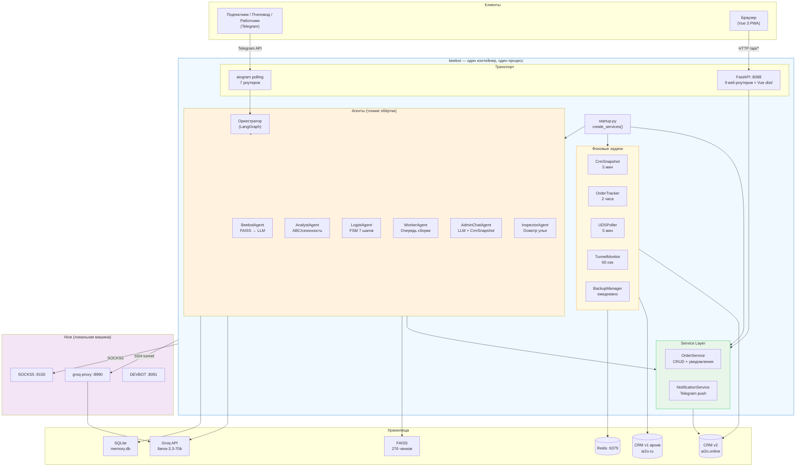

**Ключевой принцип: Bot → Service Layer ← Frontend**

Два клиента — Telegram и браузер. Оба обращаются к Service Layer через разный транспорт. Один процесс — нет IPC, -400 MiB RAM.

---

## 2. Маршрутизация сообщений: от пользователя к агенту

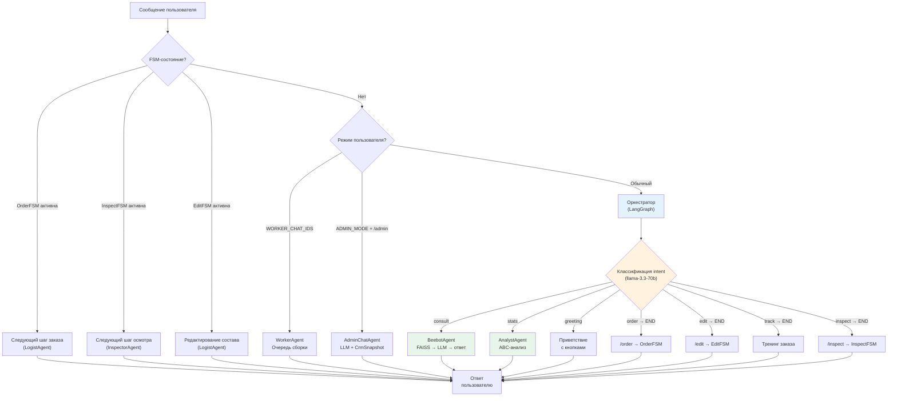

---

## 3. Поток консультации: вопрос → ответ

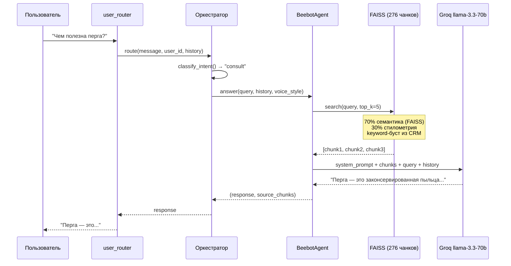

---

## 4. Поток заказа: FSM → OrderService → Events

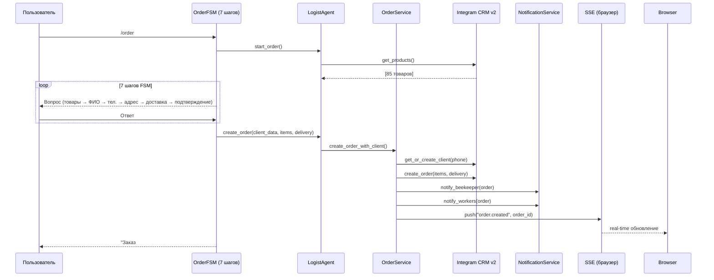

---

## 5. CRM v2: архитектура клиента и singleflight

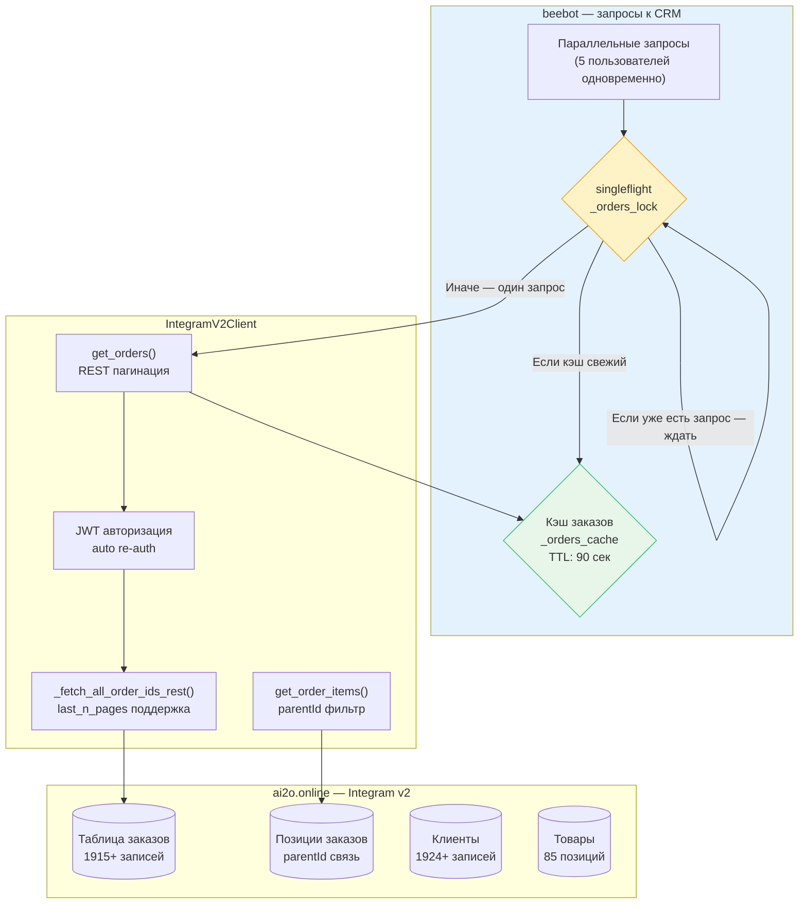

**Singleflight:** при 5 одновременных запросах `get_orders()` — только 1 HTTP-запрос к CRM. Остальные 4 ждут результат первого. Кэш 90 сек предотвращает лавину при частых запросах.

---

## 6. CRM v1 vs v2 — сравнение

```mermaid
graph LR
    subgraph FACTORY["crm_factory.py"]
        FLAG{{"INTEGRAM_V2\nenv flag"}}
    end

    subgraph V1["ai2o.ru — CRM v1 (АРХИВ)"]
        V1_CL["IntegramClient\n(849 строк)"]
        V1_AUTH["Cookie-based auth"]
        V1_DB[("bibot DB\n1924 клиента\n1915 заказов")]
    end

    subgraph V2["ai2o.online — CRM v2 (ОСНОВНАЯ)"]
        V2_CL["IntegramV2Client\n(1002 строки, 27 тестов)"]
        V2_AUTH["JWT auth\nauto re-auth"]
        V2_DB[("alekseymavai workspace\n85 товаров\n+ заказы/клиенты)"]
    end

    FLAG -->|"false (сейчас)"| V1_CL --> V1_AUTH --> V1_DB
    FLAG -->|"true (цель A.7)"| V2_CL --> V2_AUTH --> V2_DB

    style V1 fill:#fee2e2,stroke:#ef4444
    style V2 fill:#bbf7d0,stroke:#22c55e
    style FLAG fill:#fef3c7,stroke:#f59e0b
```

| Характеристика | v1 (ai2o.ru) | v2 (ai2o.online) |
|---------------|-------------|-----------------|
| Аутентификация | Cookie-based | JWT (auto re-auth) |
| Адресация полей | По REQ_ID (числа) | По имени колонки |
| Пагинация | Отдельный REST API | REST + AI Tools |
| Параллельность | Нет защиты | Singleflight + кэш |
| Тесты | Есть | 27 unit-тестов |
| Статус в prod | ✅ Используется | ⏳ Ожидает A.7 |
| Данные | 1924 клиента, 1915 заказов | 85 товаров (растёт) |

---

## 7. Жизненный цикл заказа

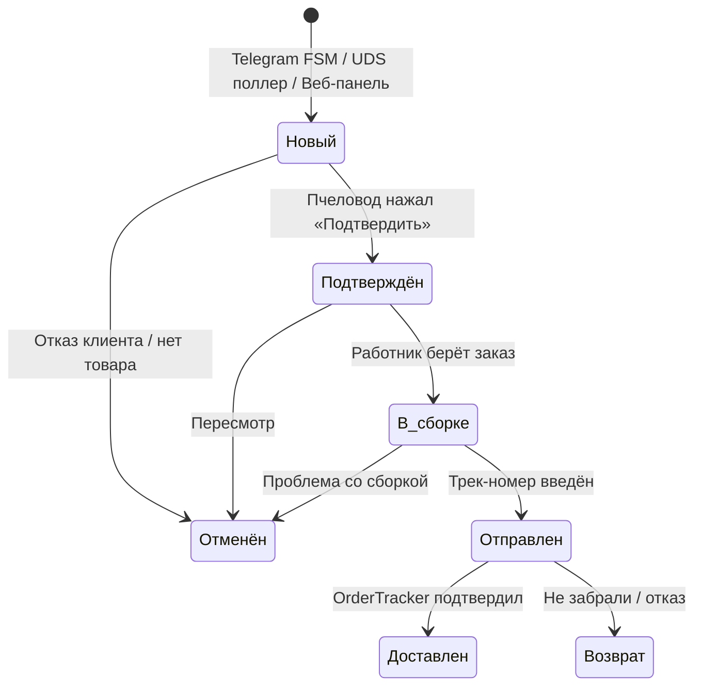

### Три источника заказов

| Источник | Путь | Уведомления |
|----------|------|-------------|
| Telegram FSM | LogistAgent → OrderService → CRM | Пчеловод + работники + SSE |
| UDS-магазин | UDSPoller → OrderService → CRM | Пчеловод + работники |
| Веб-панель | POST /api/orders → OrderService → CRM | Пчеловод + SSE |

---

## 8. UDS-синхронизация

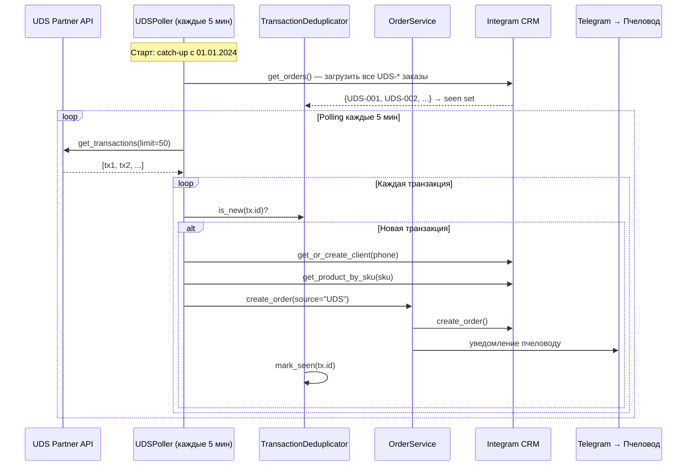

---

## 9. Память агентов: пять механизмов

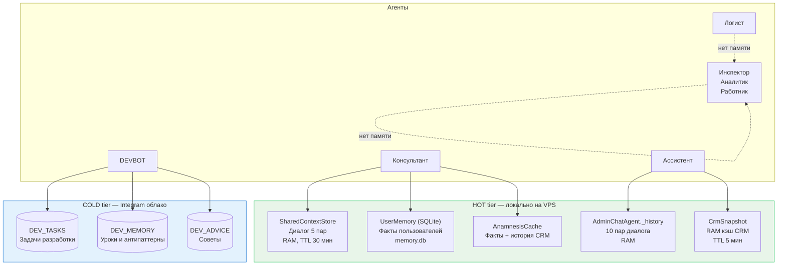

**Разрыв:** только Консультант имеет полноценную память. LangGraph Checkpointer не используется — вся история в RAM теряется при рестарте.

---

## 10. Веб-панель: стек и страницы

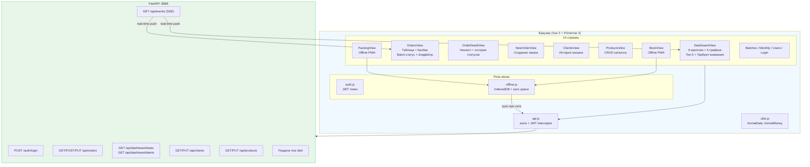

---

## 11. Инфраструктура деплоя

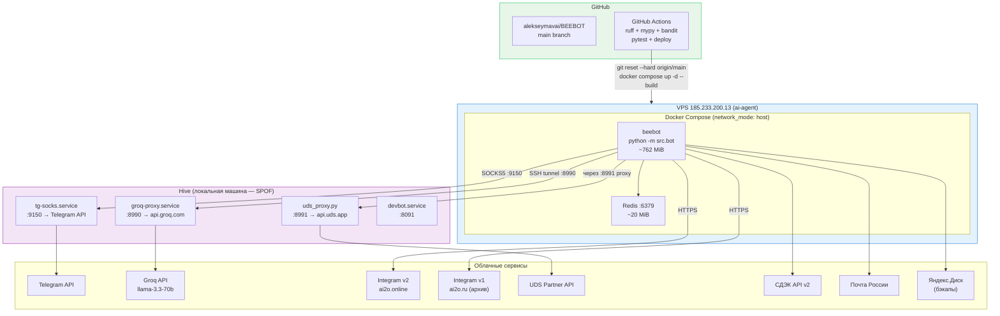

| Сервис | Машина | Порт | RAM | Управление |
|--------|--------|------|-----|-----------|
| beebot | VPS | 8088 | ~762 MiB | docker compose |
| redis | VPS | 6379 | ~20 MiB | docker compose |
| groq-proxy | hive | 8990 | ~10 MiB | systemd |
| tg-socks | hive | 9150 | ~5 MiB | systemd |
| uds_proxy | hive | 8991 | ~5 MiB | manual |
| devbot | hive | 8091 | ~50 MiB | systemd |

---

## 12. CI/CD pipeline

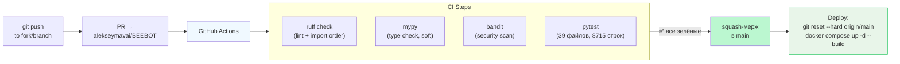

---

## 13. DEVBOT: автономный разработчик

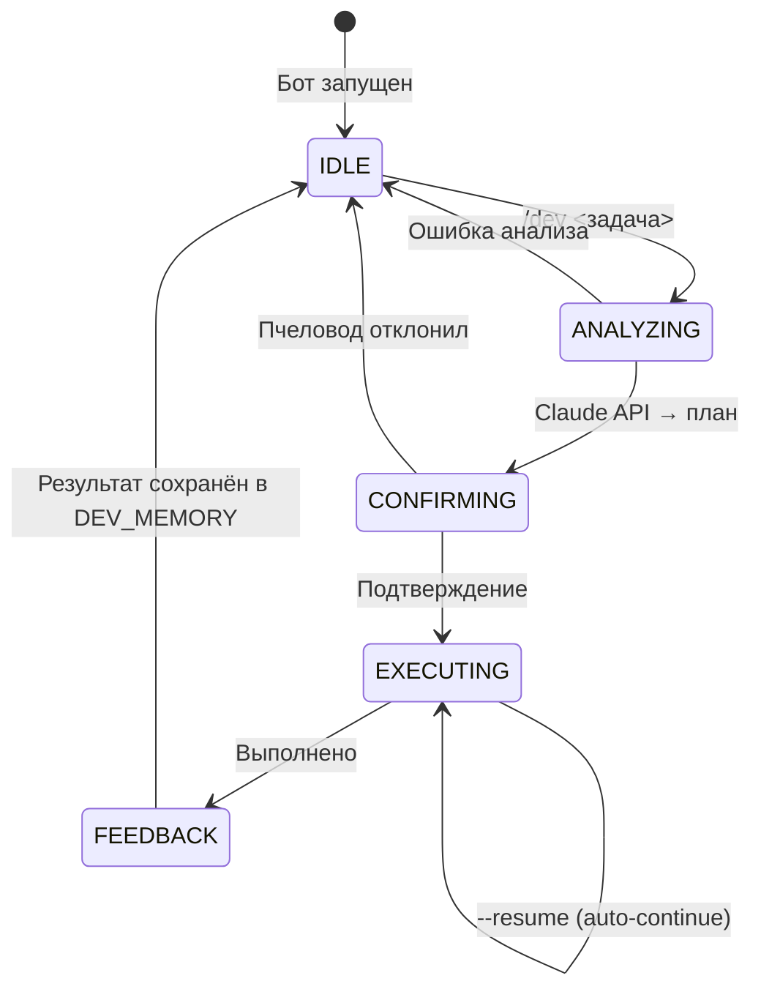

**Цепочка:** `/dev задача` (Telegram) → HTTP POST → DEVBOT API (hive:8091) → Claude API (analyzer) → plan → Anthropic CLI executor → git push → deploy.

---

## 14. Поток события: заказ создан → браузер обновился

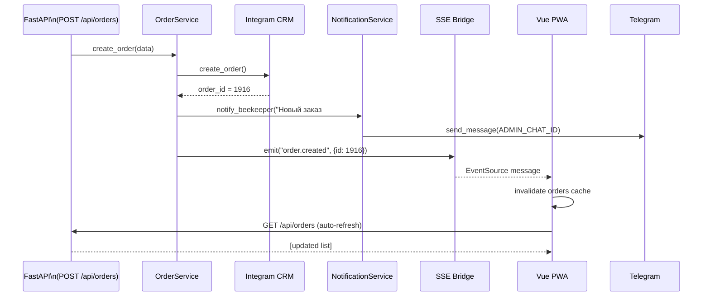

---

## 15. Gift Protocol: передача контекста между агентами

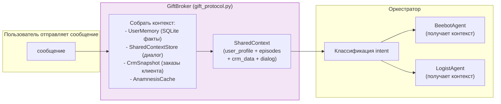

---

## 16. Структура: четыре слоя

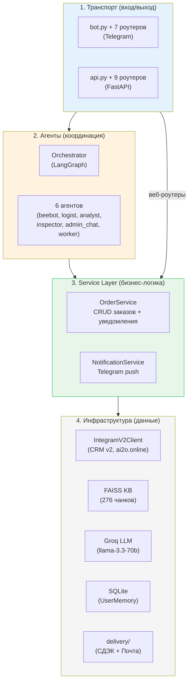

---

## Сравнительные таблицы

### Агенты

| Агент | Файл | Строк | Триггер | Сервис | Состояние |
|-------|------|-------|---------|--------|-----------|
| BeebotAgent | beebot.py | 134 | consult intent | FAISS + LLM | ✅ RAM (SharedContext) |
| LogistAgent | logist.py | 491 | /order FSM | OrderService | ✅ FSM state |
| AnalystAgent | analyst.py | 56 | stats intent | orchestrator | ⚠️ Stub |
| InspectorAgent | inspector.py | 158 | /inspect FSM | FAISS + LLM | ✅ FSM state |
| AdminChatAgent | admin_chat.py | 282 | /admin mode | CrmSnapshot | ⚠️ Двойная загрузка |
| WorkerAgent | worker.py | 169 | WORKER_CHAT_IDS | CRM напрямую | ⚠️ RAM (теряется) |

### Веб-роутеры

| Роутер | Методы | Строк | CRM операции |
|--------|--------|-------|-------------|
| orders.py | GET/POST/PUT/batch | 441 | list, get, create, update, batch |
| dashboard.py | GET stats, alerts | 84 | stats, alerts, top products |
| clients.py | GET/PUT | 169 | list, get, merge |
| products.py | GET/PUT | 123 | list, get, update |
| batches.py | GET/POST/PUT | 114 | list, create, ship |
| auth.py | POST login | 67 | — |
| export.py | GET csv | 114 | list orders |
| report.py | GET pdf | 124 | list orders |
| sse.py | GET events | ~50 | — |

---

*Связанные документы: [analysis.md](../analysis.md) | [plan.md](../plan.md) | [README.md](../README.md)*
