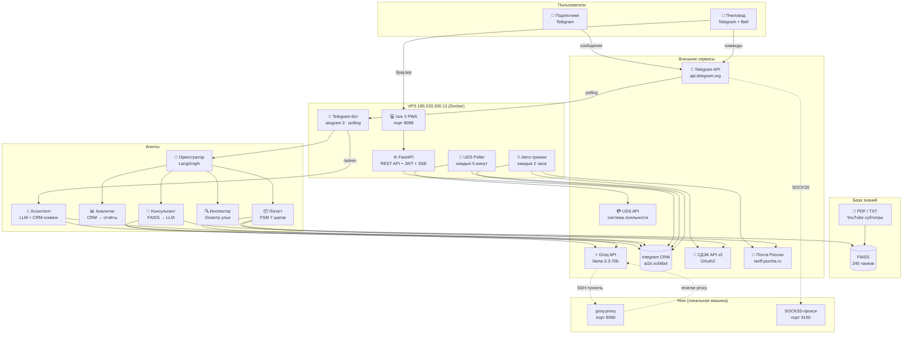
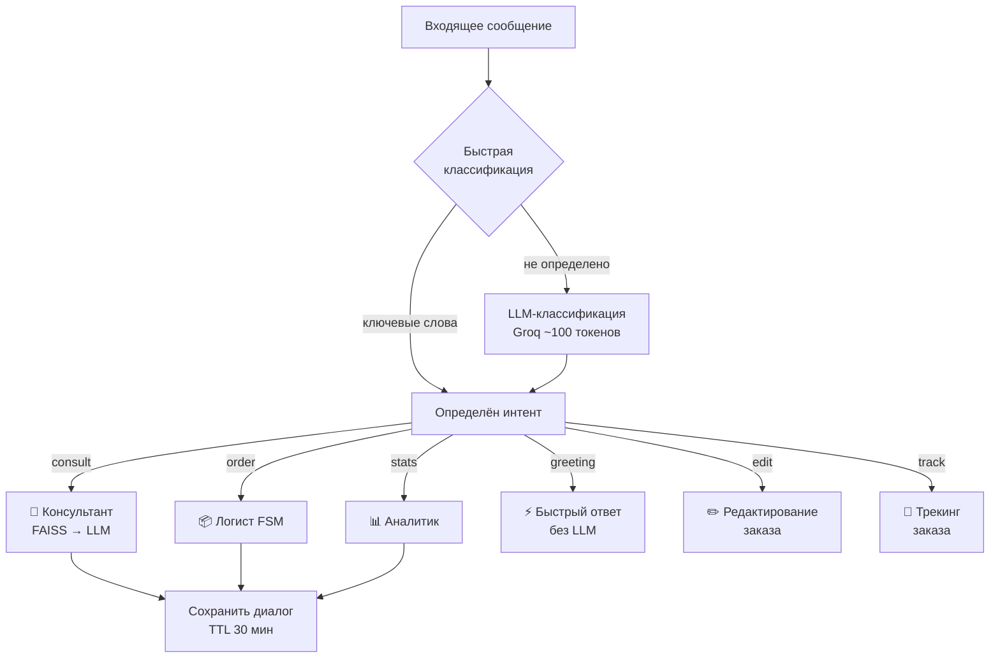
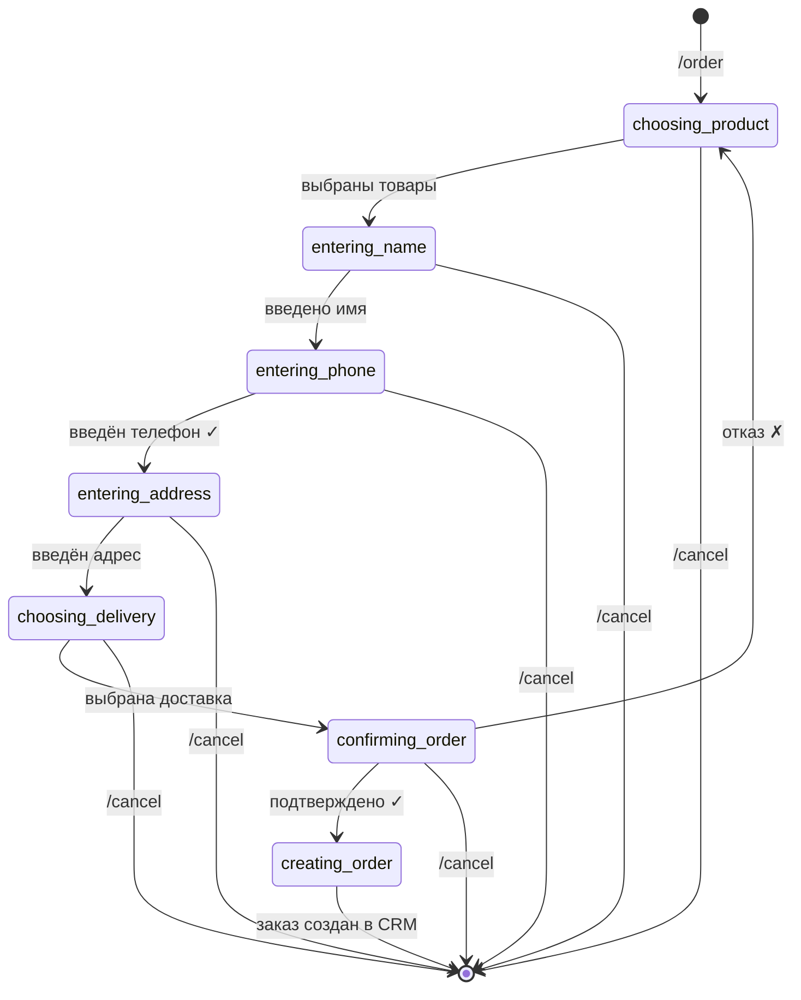
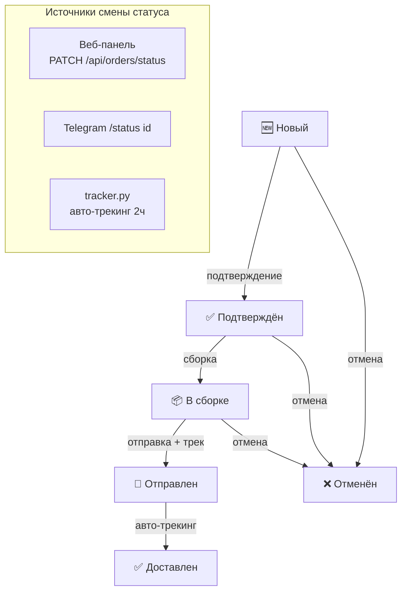
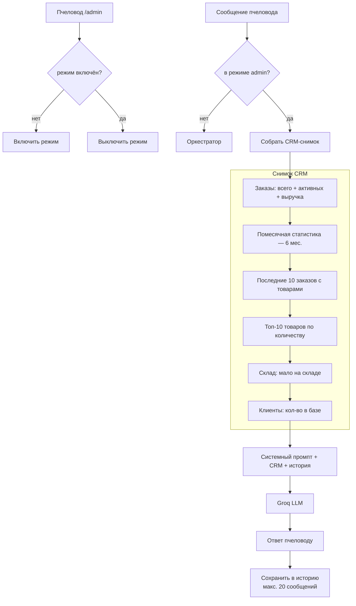
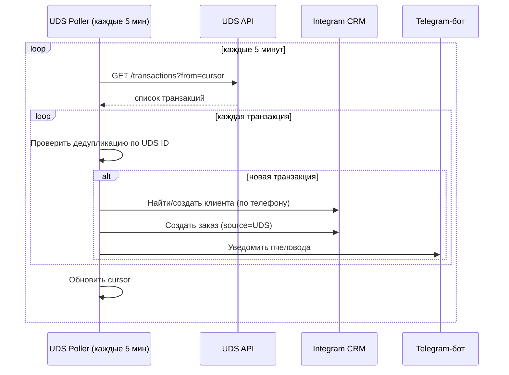
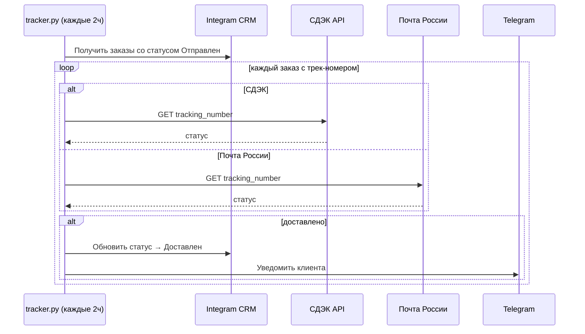

# BEEBOT — Архитектура системы

> **Версия:** 28 марта 2026
> Подробные диаграммы отдельными файлами: [`diagrams/`](diagrams/)

---

## Содержание

1. [Общая архитектура](#1-общая-архитектура)
2. [Оркестратор — маршрутизация интентов](#2-оркестратор--маршрутизация-интентов)
3. [Консультант — гибридный поиск](#3-консультант--гибридный-поиск)
4. [Логист — FSM оформления заказа](#4-логист--fsm-оформления-заказа)
5. [Цикл жизни заказа](#5-цикл-жизни-заказа)
6. [Веб-панель](#6-веб-панель)
7. [Ассистент пчеловода](#7-ассистент-пчеловода)
8. [UDS-интеграция](#8-uds-интеграция)
9. [Авто-трекинг доставки](#9-авто-трекинг-доставки)
10. [LLM-цепочка через hive](#10-llm-цепочка-через-hive)
11. [Сравнительные таблицы](#11-сравнительные-таблицы)

---

## 1. Общая архитектура

BEEBOT — двухуровневая система: **Telegram-бот** (приём сообщений + мультиагентная обработка) и **Веб-панель** (управление заказами, клиентами, складом).



---

## 2. Оркестратор — маршрутизация интентов

**Файл:** `src/orchestrator.py`
**Фреймворк:** LangGraph StateGraph

Оркестратор — точка входа для каждого сообщения от пользователя. Он определяет **интент** и направляет запрос нужному агенту.

**Алгоритм:**
1. Сначала быстрая классификация по ключевым словам (без LLM)
2. Если не определено — LLM-классификация (~100 токенов)
3. Маршрутизация к агенту
4. Сохранение истории диалога (5 пар, TTL 30 мин)



### Быстрая классификация

| Интент | Ключевые слова |
|--------|---------------|
| greeting | привет, здравствуйте, добрый день, hi, hello |
| order | заказать, купить, хочу заказ, оформить |
| edit | изменить заказ, поменять адрес, скорректировать |
| track | где мой заказ, трек, отслеживание, статус заказа |
| stats | выручка, статистика, продажи, отчёт, ABC, сезонность, прогноз |

---

## 3. Консультант — гибридный поиск

**Файл:** `src/agents/beebot.py` + `src/knowledge_base.py`

Отвечает на вопросы подписчиков в стиле Александра Дмитрова, используя базу знаний.

**Алгоритм:**
1. Векторизация запроса через fastembed (384-dim)
2. FAISS-поиск top-10 (cosine similarity)
3. Стилометрическая оценка (5 признаков пасечного стиля)
4. Гибридный скоринг: 70% семантика + 30% стилометрия
5. Keyword-буст +40% для слов из CRM-товаров
6. Top-5 чанков → промпт → Groq LLM

```mermaid
flowchart LR
    Q[Вопрос пользователя] --> EMB[fastembed<br/>384-dim vector]
    EMB --> SEM[FAISS<br/>семантический поиск<br/>top-10]
    Q --> STYLE[Стилометрия<br/>5 признаков]
    STYLE --> STYLESCORE[Стилометрическая<br/>оценка]

    SEM --> HYBRID[Гибридная оценка<br/>70% semantic<br/>30% stylometric]
    STYLESCORE --> HYBRID

    HYBRID --> KWORD{Keyword<br/>буст?}
    KWORD -->|да +40%| BOOST[Буст результатов<br/>по ключевым словам CRM]
    KWORD -->|нет| TOP[Top-5 чанков]
    BOOST --> TOP

    TOP --> PROMPT[Системный промпт<br/>+ история + стиль<br/>+ советы пчеловода]
    PROMPT --> GROQ[Groq LLM<br/>llama-3.3-70b]
    GROQ --> RESP[Ответ пользователю]
    RESP --> INSTR{Найдена<br/>PDF-инструкция?}
    INSTR -->|да| BTN[Кнопка «Получить PDF»]
    INSTR -->|нет| END[Отправить ответ]
```



### База знаний

| Источник | Файлов | Чанков |
|----------|--------|--------|
| Тексты (data/texts/) | 21 | ~179 |
| YouTube субтитры | 26 | ~61 |
| PDFs (data/pdfs/) | 19 | — (перекрыты текстами) |
| **Итого** | **47** | **240** |

---

## 4. Логист — FSM оформления заказа

**Файл:** `src/agents/logist.py`

7-шаговый диалог: выбор товаров → ФИО → телефон → адрес → доставка → подтверждение → создание в CRM.



| Событие | Действие |
|---------|----------|
| Таймаут 15 мин | FSM автоматически сбрасывается |
| Повторный клиент | Имя и телефон предзаполняются из CRM |
| Повторный адрес | Предлагается последний адрес доставки |

---

## 5. Цикл жизни заказа



---

## 6. Веб-панель

**Файлы:** `src/web/` + `web/`

```mermaid
graph LR
    subgraph Frontend["Frontend (Vue 3 + PrimeVue, PWA)"]
        LOGIN[LoginView]
        DASH[DashboardView<br/>6 карточек + 4 графика]
        ORDERS[OrdersView]
        CLIENTS[ClientsView]
        PRODUCTS[ProductsView]
        PACKING[PackingView<br/>offline PWA]
        STOCK[StockView<br/>offline PWA]
    end

    subgraph Backend["Backend (FastAPI, src/web/)"]
        AUTH[/api/auth/token]
        DASH_API[/api/dashboard]
        ORDERS_API[/api/orders/*]
        CLIENTS_API[/api/clients/*]
        PRODUCTS_API[/api/products/*]
        SSE[/api/events SSE]
    end

    subgraph CRM["Integram CRM"]
        DB[(bibot DB)]
    end

    DASH --> DASH_API
    ORDERS --> ORDERS_API & SSE
    CLIENTS --> CLIENTS_API
    PRODUCTS --> PRODUCTS_API
    LOGIN --> AUTH
    ORDERS_API & CLIENTS_API & PRODUCTS_API & DASH_API --> DB
```

---

## 7. Ассистент пчеловода

**Файл:** `src/agents/admin_chat.py`
Активируется командой `/admin`. Собирает полный CRM-снимок и передаёт в LLM для свободного диалога.



---

## 8. UDS-интеграция

**Файл:** `src/integrations/uds.py`



---

## 9. Авто-трекинг доставки

**Файл:** `src/delivery/tracker.py`



---

## 10. LLM-цепочка через hive

Groq API блокирует IP VPS, поэтому запросы проходят через SSH-туннель на локальную машину (hive):

```
beebot (VPS) → localhost:8990
  → SSH reverse tunnel: VPS:8990 ← hive:8990
  → groq-proxy.service (hive) → api.groq.com

Telegram API (VPS) → SOCKS5 localhost:9150
  → SSH reverse tunnel: VPS:9150 ← hive:9150
  → tg-socks.service (hive) → api.telegram.org
```

| Сервис | Порт | Назначение |
|--------|------|-----------|
| `groq-proxy.service` | 8990 | Reverse proxy hive → api.groq.com |
| `groq-tunnel.service` | — | SSH-туннель VPS↔hive (8990 + 9150) |
| `tg-socks.service` | 9150 | SOCKS5-прокси для Telegram API |
| `devbot.service` | 8091 | DEVBOT автономный разработчик |

---

## 11. Сравнительные таблицы

### Агенты

| Агент | Вход | Состояние | LLM | CRM | KB |
|-------|------|-----------|-----|-----|----|
| Оркестратор | сообщение | in-memory + TTL 30мин | ✅ классификация | ❌ | ❌ |
| Консультант | запрос + история | in-memory | ✅ ответ | ❌ | ✅ FAISS |
| Логист | шаги FSM | aiogram FSMContext | ✅ подтверждение | ✅ создание | ❌ |
| Аналитик | запрос аналитики | нет | ✅ парсинг запроса | ✅ чтение | ❌ |
| Инспектор | шаги диалога | in-memory | ✅ вопросы + рекомендация | ❌ | ✅ FAISS |
| Ассистент | свободный диалог | in-memory (20 сообщ.) | ✅ диалог | ✅ снимок | ❌ |

### Доставка

| Параметр | СДЭК | Почта России | Самовывоз |
|----------|------|-------------|-----------|
| API | v2 REST (OAuth2) | tariff.pochta.ru | — |
| Трекинг | ✅ | ✅ | ❌ |
| Fallback | 350₽+50₽/кг | 250₽+30₽/кг | — |

### Уведомления

| Событие | SSE | TG клиенту | TG пчеловоду |
|---------|:---:|:---:|:---:|
| Смена статуса — веб | ✅ | ✅ | ✅ |
| Смена статуса — TG /status | ❌ | ✅ | ✅ |
| Смена статуса — авто-трекинг | ❌ | ✅ | ✅ |
| Новый заказ — бот | N/A | ✅ | ✅ |
| Новый заказ — UDS | N/A | N/A | ✅ |

---

*Связанные документы: [analysis.md](../../analysis.md) · [plan.md](../../plan.md)*
