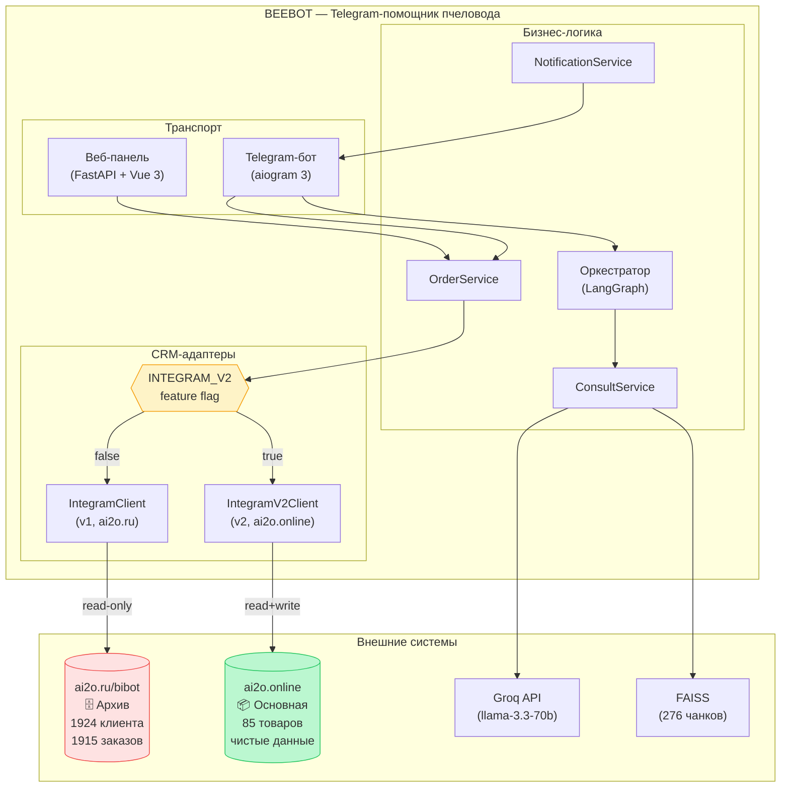
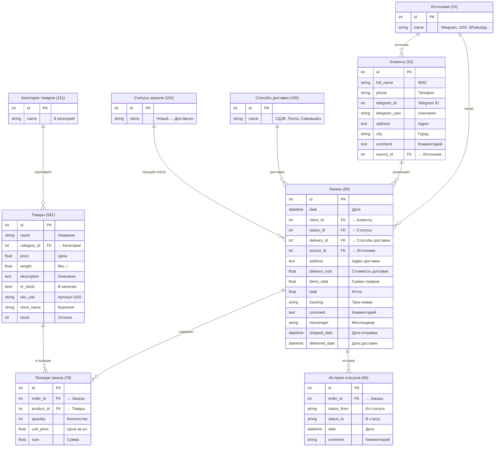
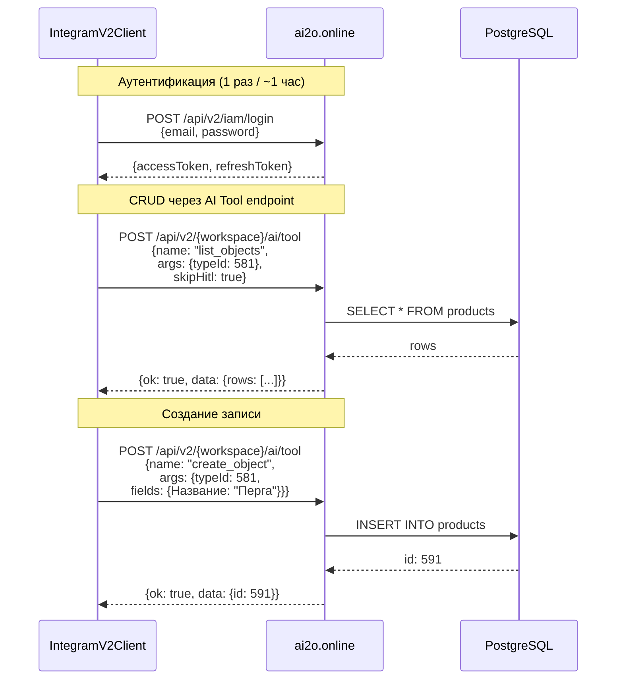
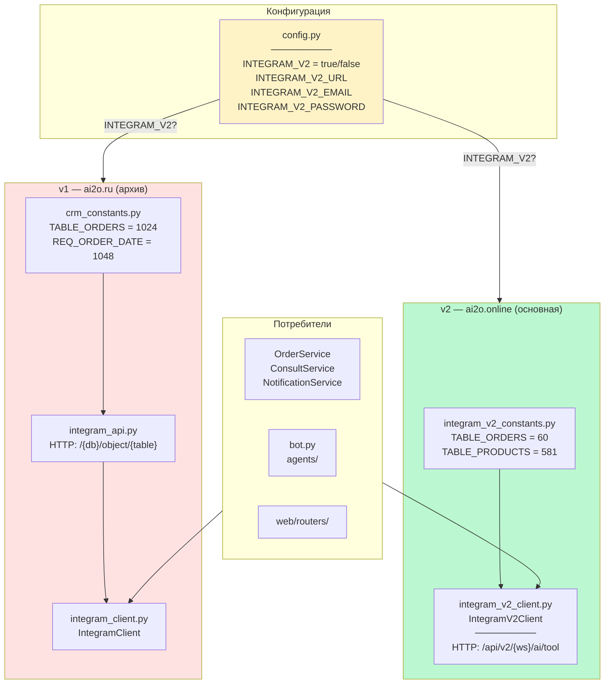
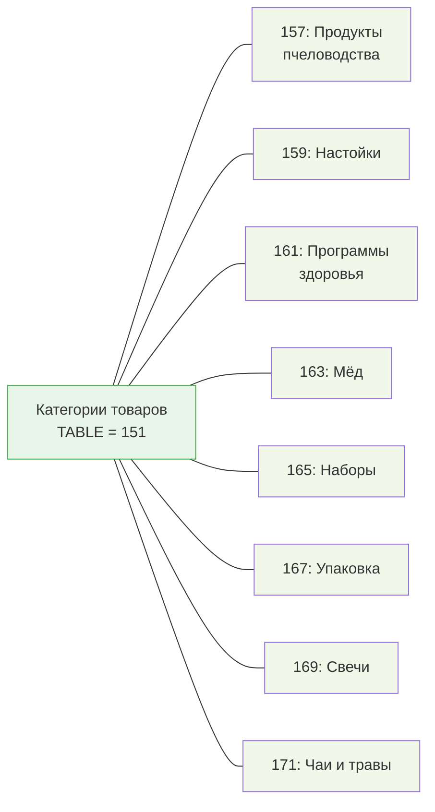
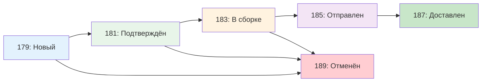
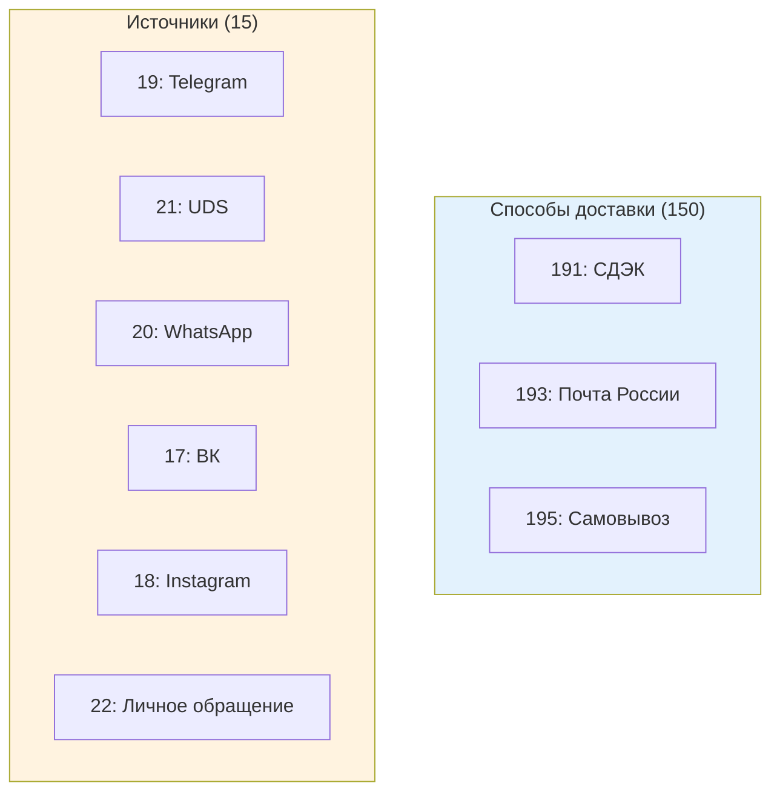
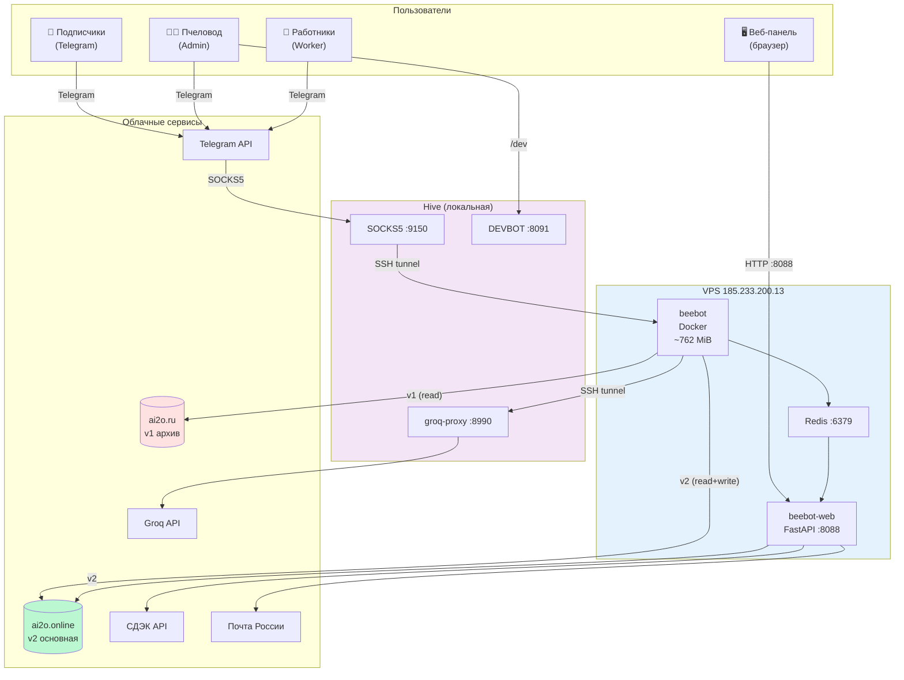
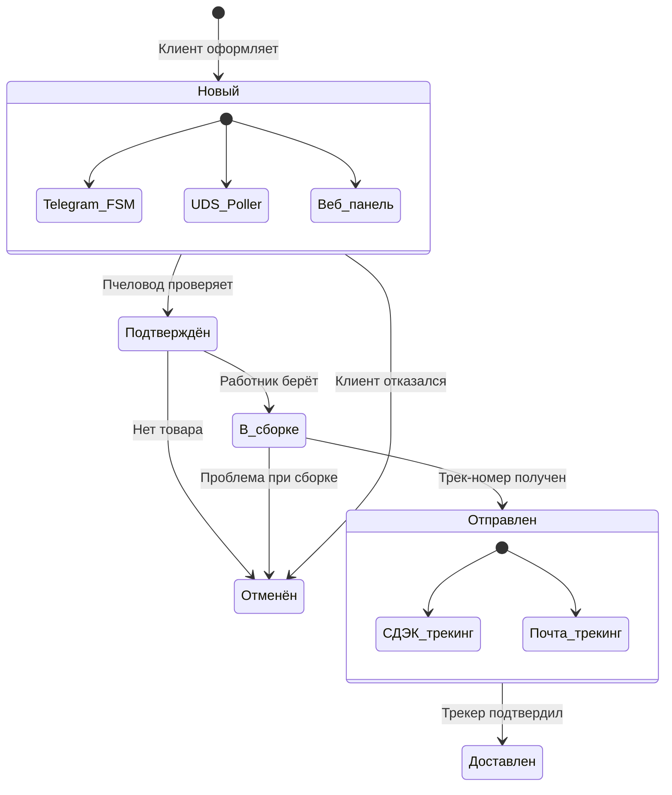
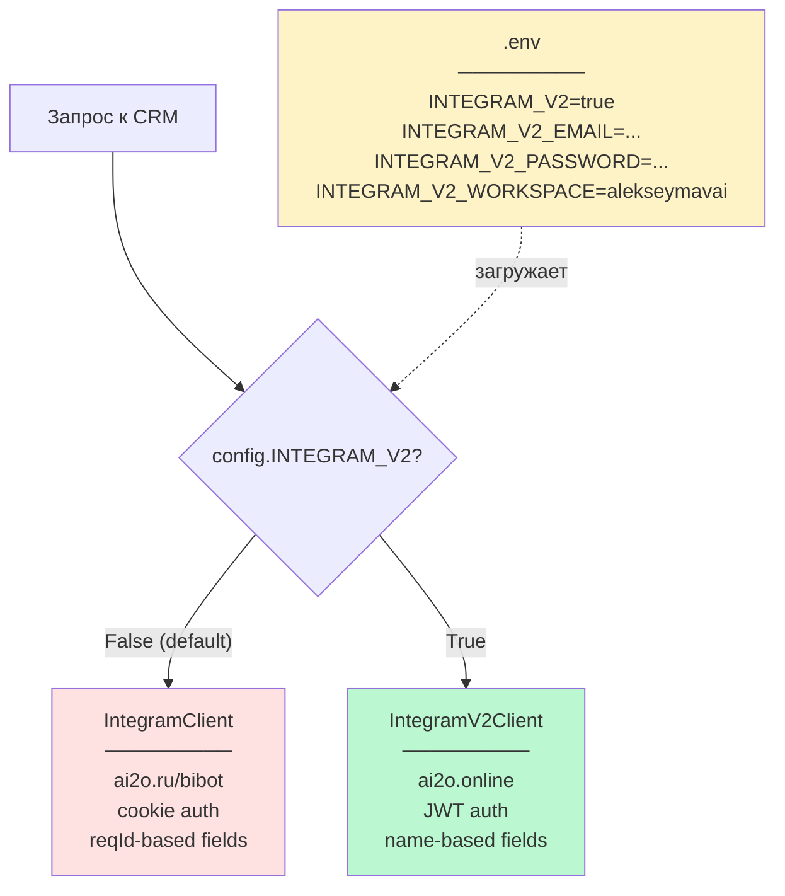

# BEEBOT — Архитектура v2 (CRM-миграция)

> **Версия:** 2 апреля 2026
> **Ключевое изменение:** переход с ai2o.ru (Integram v1) на ai2o.online (Integram v2)

---

## 1. Общая картина: два CRM-контура

---

## 2. CRM v2: схема таблиц и связей

---

## 3. API v2: протокол взаимодействия

---

## 4. Файловая структура CRM-слоя

---

## 5. Справочники: ID записей

### Категории товаров (таблица 151)

### Статусы заказов (таблица 152)

### Способы доставки и Источники

---

## 6. Колонки и реквизиты: полная карта

### Товары (таблица 581)

| Колонка | REQ ID | Тип | REF |
|---------|--------|-----|-----|
| Название | 582 | string | — |
| Категория | 583 | ref | → 151 (Категории) |
| Цена | 584 | number | — |
| Вес | 585 | number | — |
| Описание | 586 | memo | — |
| В наличии | 587 | bool | — |
| Артикул UDS | 588 | string | — |
| Короткое название | 589 | string | — |
| Остаток | 590 | number | — |

### Клиенты (таблица 52)

| Колонка | REQ ID | Тип | REF |
|---------|--------|-----|-----|
| ФИО | 206 | string | — |
| Телефон | 207 | string | — |
| Telegram ID | 208 | number | — |
| Telegram Username | 209 | string | — |
| Адрес | 210 | memo | — |
| Город | 211 | string | — |
| Комментарий | 212 | memo | — |
| Источник | 213 | ref | → 15 (Источники) |

### Заказы (таблица 60)

| Колонка | REQ ID | Тип | REF |
|---------|--------|-----|-----|
| Дата | 214 | datetime | — |
| Адрес доставки | 215 | memo | — |
| Стоимость доставки | 216 | number | — |
| Сумма товаров | 217 | number | — |
| Итого | 218 | number | — |
| Трек-номер | 219 | string | — |
| Комментарий | 220 | memo | — |
| Клиент | 221 | ref | → 52 (Клиенты) |
| Статус | 222 | ref | → 152 (Статусы) |
| Способ доставки | 223 | ref | → 150 (Доставка) |
| Источник | 224 | ref | → 15 (Источники) |
| Мессенджер | 225 | string | — |
| Дата отправки | 226 | datetime | — |
| Дата доставки | 227 | datetime | — |

### Позиции заказа (таблица 78)

| Колонка | REQ ID | Тип | REF |
|---------|--------|-----|-----|
| Количество | 228 | number | — |
| Цена за шт. | 229 | number | — |
| Сумма | 230 | number | — |
| Заказ | 232 | ref | → 60 (Заказы) |
| Товар | 628 | ref | → 581 (Товары) |

---

## 7. Инфраструктура: полная топология

---

## 8. Жизненный цикл заказа

---

## 9. v1 vs v2: сравнительная таблица

| Параметр | v1 (ai2o.ru) | v2 (ai2o.online) |
|----------|-------------|-----------------|
| URL | `https://ai2o.ru` | `https://ai2o.online` |
| Auth | `/{db}/auth?JSON` (cookie) | `/api/v2/iam/login` (JWT) |
| CRUD | `/{db}/object/{table}?JSON` | `/api/v2/{ws}/ai/tool` |
| Формат полей | `reqId → value` (числовые ID) | `column_name → value` (по имени) |
| REF-поля | `set_reference_field(id, reqId, refId)` | `fields: {"Статус": 179}` |
| Клиент Python | `IntegramClient` | `IntegramV2Client` |
| Константы | `crm_constants.py` | `integram_v2_constants.py` |
| Workspace | `bibot` (база данных) | `alekseymavai` (workspace slug) |
| Данные | 1924 клиента, 1915 заказов (грязные) | 85 товаров (чистые), 0 заказов |
| Статус | **read-only архив** | **основная CRM** |

---

## 10. Переключение: feature flag

---

*Связанные документы:*
- *[architecture.md](architecture.md) — архитектура бота (Hexagonal, Redis, Service Layer)*
- *[../analysis.md](../analysis.md) — анализ проблем*
- *[../plan.md](../plan.md) — план развития*
- *[../src/integram_v2_constants.py](../src/integram_v2_constants.py) — все ID таблиц и колонок*
