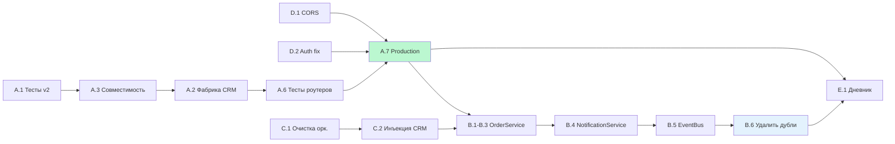

# BEEBOT — План развития

> **Дата:** 2 апреля 2026
> **Основан на:** [analysis.md](analysis.md)

---

## Принципы выполнения

1. **Test-first** — сначала тесты, потом код. Ни один рефакторинг без зелёных тестов до и после.
2. **Один PR = одна задача** — атомарные коммиты, ревью-friendly. Squash-мерж.
3. **Feature flags** — новый код за флагом, переключение без деплоя образов.
4. **Backward compatible** — v1 клиент работает до полного переключения на v2.
5. **Не ломать production** — бот остановлен, но веб-панель на VPS живая. Каждый мерж проверяется.
6. **Документация = код** — обновлять CLAUDE.md, analysis.md, plan.md при каждом структурном изменении.

---

## Фаза 1: Стабилизация (неделя 1-2)

> **Цель:** CRM v2 в production, критические баги закрыты, тесты зелёные.

### Спринт 1.1 — CRM v2 тесты и совместимость (2-3 дня)

| # | Задача | Что делать | Критерий готовности | Файлы |
|---|--------|-----------|-------------------|-------|
| A.1 | Тесты IntegramV2Client | Написать unit-тесты: auth, get_products, get_clients, get_orders, create_order, update_order_status. Mock HTTP через `respx`. | `pytest tests/test_integram_v2_client.py` — 15+ тестов, все зелёные | tests/test_integram_v2_client.py |
| A.3 | Совместимость интерфейсов | Сравнить сигнатуры v1/v2: get_products, get_clients, get_orders, create_order, update_order_status, get_order_items. Найти расхождения. Добавить недостающие методы в v2. | Каждый публичный метод v1 имеет аналог в v2 с тем же return type | src/integram_v2_client.py |
| A.2 | Фабрика CRM-клиента | `get_crm_client()` → if `INTEGRAM_V2` → `IntegramV2Client` else `IntegramClient`. Один import point для всего проекта. | Все потребители используют фабрику. `pytest` зелёные с обоими флагами. | src/crm_factory.py, src/web/deps.py, src/bot.py |

**Как проверять:** `INTEGRAM_V2=false pytest` — все старые тесты зелёные. `INTEGRAM_V2=true pytest tests/test_integram_v2_client.py` — новые зелёные.

### Спринт 1.2 — Переключение и безопасность (2-3 дня)

| # | Задача | Что делать | Критерий готовности | Файлы |
|---|--------|-----------|-------------------|-------|
| A.6 | Тесты роутеров с v2 | Прогнать `test_web_api.py` с `INTEGRAM_V2=true`. Исправить сломанные. | Все 680 строк web-тестов зелёные с v2 | tests/test_web_api.py |
| D.1 | CORS из .env | Вынести CORS_ORIGINS в config.py, читать из `CORS_ORIGINS` env var (comma-separated). | Hardcoded origins удалены из api.py | src/web/api.py, src/config.py |
| D.2 | Убрать fallback-авторизацию | Удалить WEB_USERNAME/WEB_PASSWORD fallback в auth.py. Только CRM-авторизация. | Нет env-fallback, невозможно обойти CRM auth | src/web/routers/auth.py |
| A.7 | Production: INTEGRAM_V2=true | Обновить .env на VPS. Пересобрать Docker. Проверить веб-панель. | Веб-панель работает на v2 CRM | .env, docker-compose |

**Порядок:** D.1 → D.2 → A.6 → A.7. Безопасность ДО переключения production.

### Спринт 1.3 — Данные CRM v2 (1-2 дня)

| # | Задача | Что делать | Критерий готовности | Файлы |
|---|--------|-----------|-------------------|-------|
| A.4 | Догрузить товары | Дождаться сброса rate limit (или temp-table trick). Загрузить 78 товаров в таблицу 581. | 85 товаров в одной таблице 581 | scripts/ |
| A.5 | Колонка Источник | Добавить ref-колонку Источник (→15) к Клиентам (52) и Заказам (60) через MCP. Обновить constants. | get_table_schema показывает Источник в обеих таблицах | src/integram_v2_constants.py |

---

## Фаза 2: Рефакторинг (неделя 3-4)

> **Цель:** Удалить мёртвый код, унифицировать паттерны, устранить N+1.

### Спринт 2.1 — Очистка оркестратора и агентов (2-3 дня)

| # | Задача | Что делать | Критерий готовности | Файлы |
|---|--------|-----------|-------------------|-------|
| C.1 | Мёртвые узлы оркестратора | Удалить `_logist` (не используется), `_node_logist()` (пустой), `_node_passthrough()` (пустой). Убрать edit/track/inspect из LangGraph (они обрабатываются роутерами). | Граф: classify → beebot/analyst/greeting. Остальные → END. Тесты зелёные. | src/orchestrator.py |
| C.2 | Унифицировать инъекцию CRM | Все агенты: `agent.set_crm(client)` через единый метод. Убрать `logist._crm = ...` и `analyst._crm = ...`. Базовый класс или протокол `CrmAware`. | Grep `\._crm\s*=` — 0 результатов вне set_crm() | src/agents/*.py, src/bot.py |
| C.7 | N+1 в AnalystAgent | Заменить fallback `get_order_items(id)` на обязательный `get_order_items_bulk()`. Убрать цикл по одному заказу. | Аналитика загружает все позиции одним запросом | src/agents/analyst.py |
| C.6 | Private API access | В batches.py заменить `crm._api.get_batches()` на публичный метод `crm.get_batches()`. Добавить метод в v2 клиент если отсутствует. | Grep `\._api` в роутерах — 0 результатов | src/web/routers/batches.py |

**Как проверять:** Перед каждым изменением — `pytest`. После — `pytest`. Diff должен быть negative (удаление > добавление).

### Спринт 2.2 — Утилиты и промпты (2 дня)

| # | Задача | Что делать | Критерий готовности | Файлы |
|---|--------|-----------|-------------------|-------|
| C.3 | Утилита парсинга дат | `src/utils.py: parse_date(val) → datetime`. Заменить 6 мест с DD.MM.YYYY парсингом. | Один парсер, 6 мест используют его. Тест с edge cases. | src/utils.py, analyst.py, admin_chat.py, integram_api.py |
| C.4 | Русские месяцы | `src/utils.py: RU_MONTHS = {...}`. Удалить дубли из analyst и admin_chat. | Один словарь, все потребители импортируют | src/utils.py |
| C.5 | Централизация промптов | `src/prompts.py` — все системные промпты. Каждый агент импортирует свой промпт оттуда. | Grep `_SYSTEM\s*=` в agents/ — 0 результатов (кроме imports) | src/prompts.py, agents/*.py |

---

## Фаза 3: Service Layer (неделя 5-6)

> **Цель:** Единый OrderService для всех путей создания заказа. EventBus для cross-process коммуникации.

### Спринт 3.1 — OrderService activation (3-4 дня)

| # | Задача | Что делать | Критерий готовности | Файлы |
|---|--------|-----------|-------------------|-------|
| B.1 | OrderService → logist.py | Logist вызывает `order_service.create_order()` вместо прямого CRM. OrderService делает: CRM create + уведомление + история статусов. | `logist.py` не импортирует `IntegramClient` напрямую | src/agents/logist.py, src/services/order_service.py |
| B.2 | OrderService → orders.py | Web-роутер вызывает `order_service.create_order()`. Удалить дублированную логику. | `orders.py` не вызывает `crm.create_order()` напрямую | src/web/routers/orders.py |
| B.3 | OrderService → uds.py | UDS-поллер вызывает `order_service.create_order()`. Единые уведомления. | UDS-заказы уведомляют пчеловода и работников (как Telegram) | src/integrations/uds.py |
| B.4 | NotificationService | Активировать: все уведомления (пчеловод, клиент, работники) через один сервис. Удалить разрозненные notify_beekeeper, notify_workers из logist. | Grep `notify_beekeeper\|notify_workers` — только в NotificationService | src/services/notification_service.py, src/notifications.py |

**Правило:** Каждый шаг — отдельный PR. Тесты до и после. Не менять два файла одновременно без тестов.

### Спринт 3.2 — EventBus (2-3 дня)

| # | Задача | Что делать | Критерий готовности | Файлы |
|---|--------|-----------|-------------------|-------|
| B.5 | EventBus через Redis Streams | Подключить `bus.py` к `web/api.py` startup. OrderService публикует `order_created`, `status_changed`. Bot подписывается и отправляет уведомления. | `docker compose logs beebot-web` показывает EventBus connected | src/bus.py, src/web/api.py, src/web/bus_handlers.py |
| B.6 | Удалить дублирование | Убрать всю inline-логику уведомлений из logist, orders.py, uds.py. Только OrderService → NotificationService → EventBus. | Logist/orders/uds содержат только бизнес-данные, не UI-логику | agents/logist.py, web/routers/orders.py, integrations/uds.py |

---

## Фаза 4: CI/CD и качество (неделя 7)

> **Цель:** Автоматические проверки типов, безопасности, стиля.

| # | Задача | Что делать | Критерий готовности | Файлы |
|---|--------|-----------|-------------------|-------|
| D.3 | mypy в CI | Добавить `mypy src/ --ignore-missing-imports` в workflow. Исправить критические ошибки типов. | CI зелёный с mypy (допустимо `--warn-return-any`) | .github/workflows/ci.yml, mypy.ini |
| D.4 | bandit в CI | Добавить `bandit -r src/ -ll` (low severity skip). Исправить найденные уязвимости. | CI зелёный с bandit | .github/workflows/ci.yml |
| D.5 | Расширить ruff | Добавить правила: E501 (длина строк), I (import order), UP (pyupgrade). Автофикс. | `ruff check src/` — 0 ошибок с расширенным набором | pyproject.toml |
| D.6 | Deploy через reset | В CI: `git fetch origin main && git reset --hard origin/main` вместо `git merge`. Избежать конфликтов от squash-мержей. | Deploy не падает при diverged history | .github/workflows/ci.yml |

---

## Фаза 5: Новые возможности (неделя 8+)

> **Цель:** Развитие продукта после стабилизации.

### 5.1 Пасечный дневник (E.1) — P2

| Шаг | Что делать | Результат |
|-----|-----------|-----------|
| 1 | Таблица «Осмотры» в CRM v2 (дата, улей, наблюдения, фото, рекомендации) | Таблица создана, constants обновлены |
| 2 | `/diary` команда — текстовый ввод → сохранение в CRM | Пчеловод пишет наблюдение, бот сохраняет |
| 3 | Фото-ввод — пользователь отправляет фото, бот описывает через vision API | Фото → текстовое описание → CRM |
| 4 | Голосовой ввод — Whisper API → текст → CRM | Голосовое → транскрипция → сохранение |
| 5 | `/diary_history` — просмотр записей по дате/улью | Пчеловод видит историю осмотров |

### 5.2 Offline mode (E.2) — P2

| Шаг | Что делать | Результат |
|-----|-----------|-----------|
| 1 | Активировать `offline.js` (уже написан) | IndexedDB кеширует данные |
| 2 | Service Worker перехватывает запросы | Страницы работают без сети |
| 3 | Sync queue — при восстановлении сети отправить накопленные изменения | Работник на пасеке собирает заказы offline |

### 5.3 Расчёт доставки в веб-панели (E.3) — P2

| Шаг | Что делать | Результат |
|-----|-----------|-----------|
| 1 | POST /api/delivery/calculate — эндпоинт калькулятора | Веб-панель вызывает API |
| 2 | Интеграция в NewOrderView.vue | При создании заказа автоматический расчёт |
| 3 | Кеширование тарифов (TTL 1 час) | Без лишних запросов к СДЭК/Почте |

### 5.4 KB-поиск в веб-панели (E.4) — P3

| Шаг | Что делать | Результат |
|-----|-----------|-----------|
| 1 | GET /api/kb/search?q=перга — эндпоинт | Поиск по базе знаний через API |
| 2 | KBSearchView.vue — страница поиска | Пчеловод ищет информацию через веб |

### 5.5 Бекап (E.5) — P3

| Шаг | Что делать | Результат |
|-----|-----------|-----------|
| 1 | Ежедневный экспорт CRM → JSON | Резервная копия данных |
| 2 | Загрузка на Яндекс.Диск (YADISK_TOKEN уже в config) | Внешнее хранение |
| 3 | Алерт пчеловоду при ошибке бекапа | Контроль целостности |

### 5.6 Мониторинг (E.6) — P3

| Шаг | Что делать | Результат |
|-----|-----------|-----------|
| 1 | Prometheus метрики: request_count, latency, error_rate | FastAPI middleware |
| 2 | Grafana дашборд | Визуализация здоровья системы |
| 3 | Алерты: RAM > 1.5 GB, error_rate > 5%, CRM unavailable | Реактивный мониторинг |

### 5.7 AgentBus (E.7) — P3

| Шаг | Что делать | Результат |
|-----|-----------|-----------|
| 1 | Регистрация BEEBOT в шине агентов (AGENT_BUS_URL) | BEEBOT виден другим агентам |
| 2 | Экспорт инструментов: kb_search, order_status, product_info | Другие агенты могут запрашивать данные |
| 3 | Импорт инструментов от других агентов | BEEBOT расширяет возможности |

---

## Сводная таблица

```
Фаза 1 (нед. 1-2):  A.1 → A.3 → A.2 → D.1 → D.2 → A.6 → A.7 → A.4 → A.5
                     ├─ Тесты v2 ─┤  ├─ Безопасность ─┤  ├─ Production ─┤
                     
Фаза 2 (нед. 3-4):  C.1 → C.2 → C.7 → C.6 → C.3 → C.4 → C.5
                     ├─ Мёртвый код ──┤  ├─── Утилиты ────┤

Фаза 3 (нед. 5-6):  B.1 → B.2 → B.3 → B.4 → B.5 → B.6
                     ├── OrderService ──────┤  ├ EventBus ┤

Фаза 4 (нед. 7):    D.3 → D.4 → D.5 → D.6
                     ├────── CI/CD ────────┤

Фаза 5 (нед. 8+):   E.1 → E.2 → E.3 → E.4 → E.5 → E.6 → E.7
                     ├── Дневник ──┤  ├ Доставка ┤  ├ Мониторинг ┤
```

### Зависимости между задачами



---

## Метрики успеха

| Метрика | Сейчас | После фазы 1 | После фазы 3 | После фазы 5 |
|---------|--------|-------------|-------------|-------------|
| Мёртвый код (строки) | ~1 170 | ~1 000 | **0** | 0 |
| Дублирование (создание заказа) | 3 места | 3 | **1** (OrderService) | 1 |
| Тестовое покрытие v2 | 0% | 80% | 80% | 80% |
| CRM | v1 only | **v2 production** | v2 | v2 |
| CI проверки | ruff + pytest | + CORS fix | + mypy + bandit | + ruff extended |
| Безопасность (уязвимости) | 5 | **2** | 1 | 0 |
| Страниц веб-панели | 14 | 14 | 14 | **16+** (дневник, KB) |

---

*Связанные документы: [analysis.md](analysis.md) | [docs/architecture.md](docs/architecture.md) | [README.md](README.md)*
